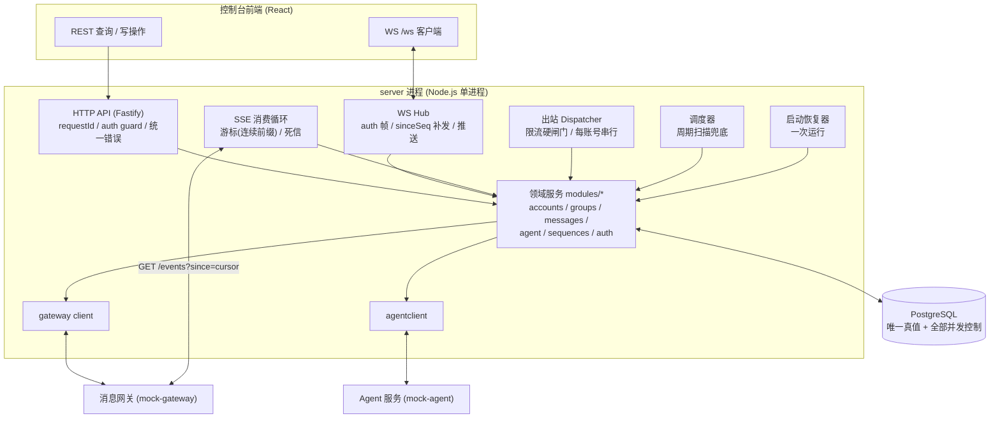
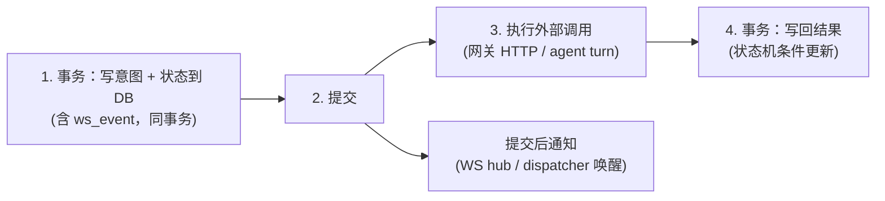
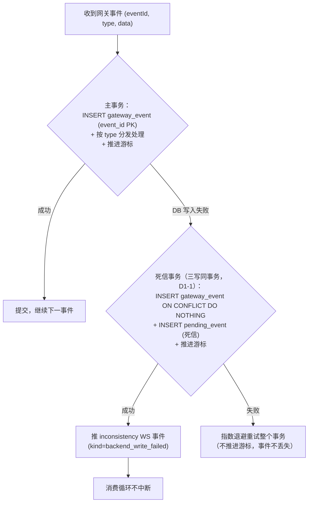
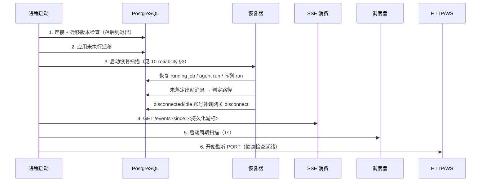

# 01 · 总体架构

> 本文定义 `server` 包的进程模型、模块划分、数据流与横切面。
> 契约依据：[requirement.md](../requirement.md) §1–§2.3；行为基准：[analysis/10-quick-reference.md](../analysis/10-quick-reference.md)。

## 1. 架构选型与理由

| 决策 | 选择 | 理由 |
|---|---|---|
| 架构模式 | **模块化单体（modular monolith），单进程** | 题目是单后端服务 + 单数据库；无独立扩展任一子域的需求。微服务拆分只会引入分布式事务问题，违反奥卡姆剃刀。多实例部署的正确性**不靠拆分**，靠数据库约束（见 §5） |
| HTTP 框架 | Fastify | 内置 JSON schema 校验（对齐 `VALIDATION_ERROR` 语义）、中间件钩子适合 requestId / 统一错误格式；生态成熟 |
| WebSocket | `ws` 库挂同一 HTTP server | 与 HTTP 共享端口 `/ws`，不引入额外依赖 |
| DB 访问 | `node-postgres (pg)` + 手写 SQL + 薄事务助手 | 本项目的核心正确性全部依赖精确的事务边界、条件更新（CAS）、advisory lock 与部分唯一索引；ORM 会把这些关键语义藏起来。强类型用 `pg` 的 TypeScript 泛型 + 自定义 row 类型覆盖 |
| 迁移 | 自研 runner + `schema_migrations` 表 | 需求只有「可重复执行 + 落后拒绝启动」两点，引入 knex/umzug 不必要；runner 逻辑约 100 行，可测试 |
| 定时/调度 | 进程内调度器 + **数据库为真值的周期扫描兜底** | 见 §4.6：任何「到时刻该发生的事」（限流到期、unknown 落定、join 超时）都以 DB 时间戳为准，调度器只是加速器；重启/漏拍由扫描兜底 |
| 时间 | 内部一律 epoch 毫秒（`BIGINT`/`timestamptz`），对外 ISO 8601 UTC 字符串，无值 `null` | 契约 §2.3；比较运算绝不用字符串 |

## 2. 进程内模块划分

单进程内按领域分包，包之间只通过显式接口（导出的 service 函数）与数据库交互，禁止跨包直接 import 内部实现：

```
server/src/
├── config/            环境变量加载与校验（PORT / DATABASE_URL / GATEWAY_URL / AGENT_URL / 各超时项）
├── db/                pg Pool、事务助手 tx()、迁移 runner、cursor 分页工具
├── http/              Fastify 实例、插件（requestId、错误映射、auth guard）、REST 路由注册
├── ws/                WS hub：auth 帧、sinceSeq 补发、连接管理、事件推送
├── events/            SSE 消费循环：游标管理、事件分发、死信（pending_event）重试
├── scheduler/         周期扫描：限流到期、unknown 判定推进、join 超时、死信重试、ws_event 清理
├── recovery/          启动恢复扫描（见 10-reliability.md）
├── gateway/           网关 HTTP client（connect/join/promote/kick/leave/send/by-client-id/members/invite/createGroup）
├── agentclient/       Agent 服务 client（/agent/turn、/agent/audit）
└── modules/
    ├── auth/          登录会话、token 状态、权限守卫（09-auth-module.md）
    ├── accounts/      账号状态机、connect、transition、终态原子副作用、限流登记（03-account-module.md）
    ├── groups/        建群 job、leave-all job、成员投影、群状态（04-group-module.md）
    ├── messages/      出站发送管线（dispatcher + unknown 判定器）、时间线查询、入站投影（05-messaging-module.md）
    ├── agent/         触发、run executor、turn 循环、工具执行、审计、幂等 key（06-agent-module.md）
    └── sequences/     序列定义、预检、启动互斥、链式排期（07-sequence-module.md）
```

依赖方向（上层依赖下层，禁止反向）：

```
http / ws / events / scheduler / recovery
        │
        ▼
   modules/*（领域服务，所有业务规则在此）
        │
        ▼
db / gateway / agentclient / config（基础设施）
```

## 3. 运行时组件与数据流总图

进程内有 6 个长期运行的组件。**除 HTTP handler 外，全部是「数据库驱动」的循环**：它们从数据库取工作项，执行外部调用后把结果写回数据库——组件本身崩溃不丢工作，重启后从数据库重新加载。



各组件职责：

| 组件 | 触发方式 | 职责 | 详见 |
|---|---|---|---|
| HTTP API | 请求驱动 | REST 端点；写操作只做「校验 + 落库建立意图」，重活交给异步组件 | 04–07 各章 |
| WS Hub | 事件驱动 | auth 帧验证；`sinceSeq` 补发；把已持久化的 `ws_event` 推给订阅者 | [08](08-realtime-module.md) |
| SSE 消费 | 常驻循环 | 消费网关事件流；游标推进；分发到领域服务；DB 写失败进死信 | [08](08-realtime-module.md) |
| 出站 Dispatcher | 常驻循环 + 通知 | 捞 `queued` 消息，经限流硬闸门后调网关 `send`；维护每账号串行 | [05](05-messaging-module.md) |
| 调度器 | 定时（1s 粒度） | 限流到期转移、`unknown` 判定推进、join 10s 超时、`member_joined` 等待、死信重试、`ws_event` 清理 | 各章 |
| 启动恢复器 | 进程启动一次 | 迁移版本检查；恢复 running 的 job / agent run / 序列 run / 未落定消息 | [10](10-reliability.md) |

## 4. 核心设计原则（贯穿所有模块）

### 4.1 先持久化，后产生外部效果（项目宪法 §3-1）

每一类外部效果都有明确的「持久化点」，全部列在 [10-reliability.md](10-reliability.md) §1。总模式：



崩溃在任何一步，重启后世界都一致：
- 崩溃在 1–2：意图未提交或已提交但外部无效果 → 恢复器按「意图已落库但未完成」处理；
- 崩溃在 3（外部效果可能已发生、结果未知）：靠**发送尝试时间戳**（`first_attempt_at`）把消息转入 `unknown` 判定路径，而不是盲目重发——详见 [05](05-messaging-module.md) §2；
- 崩溃在 4：外部效果已发生 → 恢复器从外部可观察状态（by-client-id 查询、成员列表）反推结果。

### 4.2 唯一性与互斥全部落在数据库

| 不变量 | 数据库机制 |
|---|---|
| 入站事件去重 `(groupId, msgId)` | `message` 表部分唯一索引（msg_id 非空时） |
| 网关事件去重（at-least-once） | `gateway_event.event_id` PRIMARY KEY，`ON CONFLICT DO NOTHING` |
| 出站一条记录至多一条网关消息 | `client_msg_id` 全局唯一 + 发送前落 `first_attempt_at` + 恢复走判定路径不重发 |
| 每群至多一个 running agent run | `agent_run` 部分唯一索引 `(group_id) WHERE status='running'` |
| 每群至多一个 running 序列 | `sequence_run` 部分唯一索引 `(group_id) WHERE status='running'` |
| 账号 CAS | `UPDATE ... WHERE id=? AND status=?`（rowcount 判定），见 [03](03-account-module.md) |
| run 执行器互斥（多实例/恢复竞争） | PostgreSQL advisory lock：`pg_try_advisory_lock(hashtext('agent-run:' ‖ runId))`，执行器会话持有，连接断开自动释放 |
| 状态机非法转移 | 条件更新 WHERE 带合法前置状态集合，rowcount=0 → 按语义返回 `ILLEGAL_TRANSITION` / `CAS_CONFLICT` / 静默 |

**进程内变量只做缓存与去重加速，绝不承担正确性。** 判定某个约束是否成立，一律以事务内的 SQL 结果为准。

### 4.3 所有状态机收敛为一个函数族

每个实体（账号 / 消息 / 群 / run / 序列 run / 序列 step / job）的转移规则集中在一个 `transitions.ts` 文件里定义合法边集合，所有入口（HTTP、SSE 事件、调度器、恢复器）调用同一函数 `applyTransition(tx, id, from, to, payload)`。没有第二个地方能改状态。非法转移在函数内被拒绝，而不是靠调用方自觉。

### 4.4 时间预算与超时统一管理

- 所有外部 HTTP 调用（网关、agent）都显式配置超时：网关普通调用 10s、kick 6s（契约 1–5s 响应 + 余量）、send 8s（202 本身可能 1–2s + 余量）、by-client-id 5s、`/agent/turn` 可配 10–15s（默认 12s）、`/agent/audit` 5s。
- 数字出处全部标注在 [10-quick-reference.md](../analysis/10-quick-reference.md)；代码中以命名常量集中定义，禁止散落魔数。

### 4.5 入站事件处理幂等且不中断

SSE 事件处理管线（详见 [08](08-realtime-module.md) §2）：



- 游标推进与事件处理在同一事务：处理失败则游标不动（回退到重试路径），死信路径是「处理失败但必须放行」的显式出口。
- 死信事务必须**同时补写账本行**（`ON CONFLICT DO NOTHING`）+ 死信行 + 游标：主事务回滚时账本行也没了，只写死信会因 `pending_event.event_id` 外键违例而失败，永久性错误下消费循环无限空转——详见 [08](08-realtime-module.md) §1.2。
- 死信由调度器周期重试（重试成功后标记 done 并补推 WS 事件）；事件内容因此**永不丢失**。
- `inconsistency` 事件的 `payload` 设计：`{ kind: 'db_write_failed' | 'dead_letter', ref: '<event_type>:<eventId>', message }`（字段结构题目未规定，此为设计值）。

### 4.6 数据库驱动的调度（防漏拍）

所有「到时刻 T 该发生」的行为，其时刻 T 都持久化在业务表里（`rate_limited_until`、`unknown_deadline_at`、`join_deadline_at`、`scheduled_at`…）。调度器每秒扫描到期行并触发。这意味着：
- 进程暂停/重启导致的漏拍，重启后第一轮扫描即可补上；
- 精确性要求不高的场景（秒级）不需要每行一个 timer；
- 唯一需要进程内精确计时的地方是 agent run 的 60s 墙钟与 turn 超时（执行器内部计时 + 落库 `consumed_ms`，见 [06](06-agent-module.md) §5）——进程内计时只做**加速器**，其失效兜底是租约：executor 周期续租 `agent_run.lease_until`，租约过期的 running run 由调度器**观测**（error 日志 + inconsistency，O1 裁剪；处置=重启进程触发 [06](06-agent-module.md) §9.1 恢复）——「进程活着但 executor 挂死」可被发现且可恢复。
- 多实例下调度器/消费者的扫描互斥可用 `SELECT ... FOR UPDATE SKIP LOCKED` 替代或配合 advisory lock（【实现选项，非当前必做】：单实例下 advisory lock 已足够；SKIP LOCKED 的优势是扫描行集时天然跳过同行竞争者）。

### 4.7 WS 事件 = 数据库表，推送 = 表的投递

任何想推 WS 事件的代码，都在**业务事务内** `INSERT INTO ws_event (type, payload)`；事务提交后由 hub 投递（单实例=默认形态，直接内存通知；多实例的 PostgreSQL `LISTEN/NOTIFY` 通道为**预留接口，本期不实现**——O4 裁剪：契约对多实例的唯一硬要求是 DB 约束下的正确性，投递通道属优化；单实例演示为主，启用多实例时再加）。`seq` 由 `BIGSERIAL` 生成，天然全局单调。`sinceSeq` 补发 = 查表回放。详见 [08](08-realtime-module.md) §3。

## 5. 多实例部署的正确性边界

题目要求「多实例部署时每群单飞行也成立」。本设计的立场：

1. **所有唯一性/互斥判定**（§4.2 表）在数据库层完成，多实例天然成立；
2. **每账号出站串行**：dispatcher 用 `pg_try_advisory_lock('outbox:account:' ‖ accountId)` 保证同一账号同一时刻只有一个实例在发；
3. **agent run / 序列 run 执行器**：advisory lock 按 runId 抢占，单执行者；
4. **SSE 消费**：advisory lock `events:consumer` 全局单飞（同一账号的事件流被两个进程重复消费没有意义，且游标是单值）；
5. WS hub 与调度器可多实例共存（hub 各推各的连接；调度器的动作全部是条件更新，重复触发被状态机吸收）。

开发与演示默认**单实例**运行；上述机制保证水平扩展时不需要改代码。

## 6. 横切面

### 6.1 配置（`config/`）

启动时一次性读取并校验环境变量，缺失即拒绝启动：

| 变量 | 必填 | 默认 | 说明 |
|---|---|---|---|
| `PORT` | 是 | — | HTTP + WS 监听端口 |
| `DATABASE_URL` | 是 | — | PostgreSQL 连接串 |
| `GATEWAY_URL` | 是 | — | 消息网关基址 |
| `AGENT_URL` | 是 | — | Agent 服务基址 |
| `AGENT_TURN_TIMEOUT_MS` | 否 | 12000 | `/agent/turn` 单轮超时，契约区间 10–15s（A5-2） |
| `AGENT_MAX_CONCURRENT_RUNS` | 否 | 50 | agent run 全局并发闸：只限制 executor 拾取、不限制 run 行创建（[06](06-agent-module.md) §2.1）；实现为**进程内计数信号量**（O2 裁剪：不做调度器重试拾取编排）；**系统真实并发容量 = 该值**（[13](13-capacity.md) §4）【设计值】 |
| `MEDIA_RETENTION_DAYS` | 否 | 30 | C1 媒体保留期 |
| `WS_EVENT_RETENTION_MINUTES` | 否 | 30 | `ws_event` 保留窗口（远大于 B4 的 3s 补齐要求） |

### 6.2 requestId 与结构化日志

- HTTP 中间件为每个请求生成 `requestId`（UUID v4，透传 `X-Request-ID`），挂到请求上下文与每条日志；
- SSE / 调度器 / 执行器等后台路径用各自的组件名 + 业务键（eventId / runId / clientMsgId）作为日志锚点；
- 日志器：pino，JSON 行格式；日志一律英文。错误日志必须带 `err`（含 stack）与上下文字段，禁止吞错。

### 6.3 统一错误处理（`http/`）

- 领域层抛带 `code` 的 `AppError`（code ∈ 速查表 §4 的枚举）；
- 错误中间件统一映射为 `{ error: { code, message, requestId, ...业务字段 } }`；`401 → UNAUTHORIZED`、`403 → FORBIDDEN` 固定；
- 未知异常 → `500 { error: { code: 'INTERNAL', message, requestId } }` 并记录 error 日志；
- Fastify schema 校验失败 → `400 VALIDATION_ERROR`。

### 6.4 迁移与启动检查（`db/`）

- `schema_migrations(version PRIMARY KEY, applied_at)`：runner 逐个应用未执行迁移文件（`server/migrations/*.sql`，只增不改），事务内「应用 + 记录」原子完成 → 可重复执行；
- 启动时对比代码内注册的最新版本与 DB 已应用版本：DB 落后 → **拒绝启动**（进程退出，错误日志说明缺失版本）；DB 超前（代码回滚）→ 同样拒绝；
- `GET /api/health` 返回 `{ ok: true, schemaVersion: <int> }`。

### 6.5 与外部服务的边界（`gateway/`、`agentclient/`）

- 两个 client 是**唯一**允许触碰 `GATEWAY_URL` / `AGENT_URL` 的代码；
- client 不做业务决策，只做：超时、HTTP 错误 → 带 `{ status, code, body }` 的类型化异常、响应形状的浅校验；
- 网关错误按契约分类：`RATE_LIMITED`（带 `retryAfterSeconds`）、同步 4xx 码、`504 NETWORK_TIMEOUT`、`503 UNAVAILABLE`（可重试类）；
- Agent 响应校验三段式（详见 [06](06-agent-module.md) §6）：HTTP 状态层 → JSON 解析层（含 markdown 围栏/夹文）→ 形状层（stop_reason、块数、块类型一致性）；
- 对端服务的模拟与 C2 真实 LLM 接入：mock-agent 单包双 provider（scripted / anthropic），后端只改 `AGENT_URL` 即可切换——设计见 [12-agent-service.md](12-agent-service.md)。

## 7. 启动时序



> 顺序刻意安排：**先恢复世界一致性，再开放流量**。HTTP 监听放最后，避免在未恢复时接受写操作。
>
> **「先恢复」的精确语义（D3-2）**：恢复扫描完成的是**登记与交接**——未落定工作项交给出站 dispatcher / unknown 判定器 / executor **异步**接管，SSE 消费异步启动（长时间停机后的 `since` 补拉可能耗时数秒）；**不是**同步等待 SSE 追平或全部 run 恢复完成。扫描登记完成后 HTTP 立即监听，`/api/health` 随监听即可用——外部收口由各常驻组件按 DB 真值继续推进（「DB 驱动调度」的固有形态：登记完成即世界一致，进度由组件追赶）。

## 8. 与外部服务交互协议汇总

| 方向 | 通道 | 可靠性假设 | 我方对策 |
|---|---|---|---|
| 我方 → 网关（控制/发送） | HTTP | 202/200 只是受理或即时结果；504 结果未知；503 整体不可用；网关**不按 clientMsgId 去重** | 发送前落意图；504 → `unknown` 判定路径；503 → 延迟重试（指数退避，不放弃）；唯一性由我方 `client_msg_id` 唯一约束保证 |
| 网关 → 我方（事件） | SSE at-least-once，乱序 ≤1s，补投不受窗口限制，保留全部历史 | 每事件幂等处理；游标=连续前缀；重连 `since` 独占语义补拉 | 见 [08](08-realtime-module.md) §2 |
| 我方 → Agent | HTTP `/agent/turn` `/agent/audit` | 响应可能坏 JSON / 未知工具 / 重复 id / 超时 / 永不返回；Agent 按 runId 记会话状态（会话键——无状态全量历史语义，权威历史在我方 `messages`，见 [06](06-agent-module.md) §12 规约与 [12](12-agent-service.md) §2.1） | 三段式响应校验；两类协议错误分流（A5-3）；会话历史我方持久化；对端模拟/C2 切换见 [12-agent-service.md](12-agent-service.md) | 

## 9. 本设计的取舍记录

- **不引入消息队列 / Redis**：所有异步语义（outbox、死信、事件日志）用 PostgreSQL 表实现。数据量（笔试规模）与吞吐完全够，少两个运维组件。
- **不引入 ORM**：关键正确性在 SQL 语义（部分唯一索引、条件更新、advisory lock），手写 SQL + 类型化 row 是最短路径。
- **access token 选 opaque + DB 状态而非 JWT**：B3 要求 logout 后 access 立即失效、refresh 复用作废整会话，两者都需要服务端状态查询；JWT 的无状态优势在此场景不成立，opaque token 实现更少、语义更直白（见 [09](09-auth-module.md)）。
