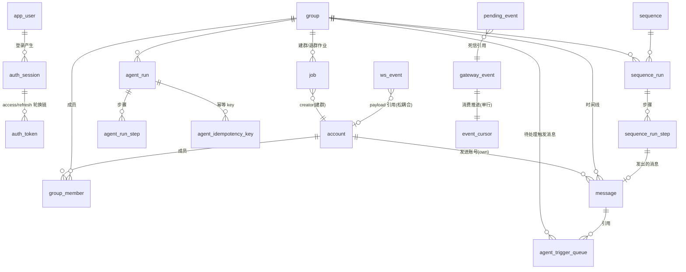

# 02 · 数据库设计

> PostgreSQL ≥ 16。所有约束、索引、状态枚举以本文为准。
> 命名约定：表 / 列 `snake_case`；时间列 `timestamptz`（对外输出 ISO 8601 UTC，无值 `null`）；状态列用 `text` + `CHECK` 约束（不依赖 enum 类型，便于迁移演进）。

## 0. 全局 ER 图



> `ws_event`、`pending_event` 与业务表无外键（事件 payload 是 JSON 快照），图中的连线仅示意引用关系。

## 1. 基础设施表

### 1.1 `schema_migrations` — 迁移账本

| 列 | 类型 | 说明 |
|---|---|---|
| `version` | `int PRIMARY KEY` | 单调递增版本号 |
| `name` | `text NOT NULL` | 迁移文件名 |
| `applied_at` | `timestamptz NOT NULL DEFAULT now()` | |

- runner 事务内「执行 SQL + 插入版本」；已应用版本跳过 → **可重复执行**（A0）。
- 启动检查：DB 最新版本 ≠ 代码注册的最新版本 → 拒绝启动（落后与超前都拒绝）。

### 1.2 `event_cursor` — SSE 消费游标（单行表）

| 列 | 类型 | 说明 |
|---|---|---|
| `id` | `int PRIMARY KEY DEFAULT 1 CHECK (id = 1)` | 恒为 1，保证单行 |
| `last_event_id` | `bigint NOT NULL DEFAULT 0` | **连续前缀游标**：所有 `eventId ≤ last_event_id` 的事件均已入库（见 [08](08-realtime-module.md) §2.2） |
| `updated_at` | `timestamptz NOT NULL DEFAULT now()` | |

### 1.3 `gateway_event` — 网关事件去重账本

| 列 | 类型 | 说明 |
|---|---|---|
| `event_id` | `bigint PRIMARY KEY` | 网关 eventId，天然去重键（at-least-once 防重） |
| `type` | `text NOT NULL` | `message / message_sent / message_failed / member_joined / member_left / account_status` |
| `payload` | `jsonb NOT NULL` | 事件原始 data（重试 / 审计依据） |
| `received_at` | `timestamptz NOT NULL DEFAULT now()` | |

- **入站幂等的第一道闸**：`INSERT ... ON CONFLICT (event_id) DO NOTHING`，重复推送在此被吸收（S2）。
- 无外键、无清理（笔试规模保留全部；`event_id` 单调，表可按范围分区——本期不做）。

### 1.4 `pending_event` — 死信（DB 写入失败的事件）

| 列 | 类型 | 说明 |
|---|---|---|
| `id` | `bigserial PRIMARY KEY` | |
| `event_id` | `bigint NOT NULL UNIQUE REFERENCES gateway_event(event_id)` | 对应事件已入账本 |
| `type` | `text NOT NULL` | 冗余存储，便于重试 |
| `payload` | `jsonb NOT NULL` | |
| `error` | `text NOT NULL` | 首次失败原因（英文） |
| `status` | `text NOT NULL DEFAULT 'pending' CHECK (status IN ('pending','done'))` | 调度器周期重试 |
| `attempts` | `int NOT NULL DEFAULT 0` | |
| `next_retry_at` | `timestamptz NOT NULL DEFAULT now()` | 指数退避 |
| `created_at` / `updated_at` | `timestamptz` | |

- 实现 A2「DB 写失败不中断、不丢失」：主事务（账本 + 业务 + 游标）失败时，死信事务以**三写同事务**收口——`INSERT gateway_event(E) ON CONFLICT DO NOTHING`（主事务回滚后账本无行，此处补上，外键因此恒可满足）+ `INSERT pending_event` + 推进游标（[08](08-realtime-module.md) §1.2，D1-1）。业务处理失败进死信，消费循环继续。
- `status='done'` 的行保留供审计，可定期清理（保留 7 天，调度器执行）。

### 1.5 `ws_event` — WS 事件日志（seq 单调 + sinceSeq 补发的真值）

| 列 | 类型 | 说明 |
|---|---|---|
| `seq` | `bigserial PRIMARY KEY` | **全局单调递增**（A4/B4） |
| `type` | `text NOT NULL` | 六类 + 扩展（见 [08](08-realtime-module.md) §3） |
| `payload` | `jsonb NOT NULL` | |
| `created_at` | `timestamptz NOT NULL DEFAULT now()` | |

- 索引：`(created_at)`（清理用）。
- 保留窗口默认 30 分钟（远大于 B4 的 3 秒补齐要求），调度器删除过期行。
- **写入位置：永远在业务事务内 INSERT**（先持久化后推送，宪法 §3-1）；hub 投递只读此表。

## 2. 认证域

### 2.1 `app_user`

| 列 | 类型 | 说明 |
|---|---|---|
| `id` | `uuid PRIMARY KEY DEFAULT gen_random_uuid()` | |
| `username` | `text UNIQUE NOT NULL` | `admin` / `viewer`（seed 预置） |
| `password_hash` | `text NOT NULL` | bcrypt（seed：`admin/admin`、`viewer/viewer`） |
| `role` | `text NOT NULL CHECK (role IN ('admin','viewer'))` | 权限矩阵见 [09](09-auth-module.md) §4 |

### 2.2 `auth_session` — 会话（轮换链之根）

| 列 | 类型 | 说明 |
|---|---|---|
| `id` | `uuid PRIMARY KEY` | |
| `user_id` | `uuid NOT NULL REFERENCES app_user(id)` | |
| `status` | `text NOT NULL DEFAULT 'active' CHECK (status IN ('active','revoked','logged_out'))` | `revoked`=复用检测作废；`logged_out`=主动登出 |
| `current_generation` | `int NOT NULL DEFAULT 0` | refresh 轮换代际 |
| `created_at` / `ended_at` | `timestamptz` | `ended_at` = 作废/登出时刻，无则 `NULL` |

### 2.3 `auth_token` — access / refresh token 状态

| 列 | 类型 | 说明 |
|---|---|---|
| `id` | `uuid PRIMARY KEY` | |
| `session_id` | `uuid NOT NULL REFERENCES auth_session(id)` | |
| `kind` | `text NOT NULL CHECK (kind IN ('access','refresh'))` | |
| `token_hash` | `text NOT NULL UNIQUE` | SHA-256(token)，原文不落库 |
| `generation` | `int NOT NULL` | 所属代际 |
| `status` | `text NOT NULL DEFAULT 'active' CHECK (status IN ('active','used','expired','revoked'))` | refresh 用后 → `used`；会话作废/登出 → 全部 `revoked` |
| `expires_at` | `timestamptz NOT NULL` | access 15 分钟；refresh 7 天（设计值，题目未规定） |
| `created_at` / `used_at` | `timestamptz` | `used_at` 标记 refresh 被使用的时刻（复用检测依据） |

索引：`(session_id)`、`(token_hash)`（唯一）。

- **轮换链语义**（B3）：refresh 使用 → 同事务 {旧 token `used`、新 refresh `active`(generation+1)、新 access、`session.current_generation+1`}；旧 refresh 再次出现（status=`used`）→ 同事务把 session 置 `revoked` + 该 session 全部 token 置 `revoked` → 整会话立即失效。详见 [09](09-auth-module.md) §3。
- **logout 立即失效**（B3）：logout → session `logged_out` + 该 session 全部 token `revoked`；access 验证必查 DB → 立即失效。

## 3. 账号域

### 3.1 `account`

| 列 | 类型 | 说明 |
|---|---|---|
| `id` | `text PRIMARY KEY` | 预置服务账号 id（migration/seed 定义，如 `acc-01`） |
| `status` | `text NOT NULL DEFAULT 'idle' CHECK (status IN ('idle','online','rate_limited','disconnected','suspended','session_expired'))` | 状态机见 [03](03-account-module.md) §2 |
| `platform_user_id` | `text` | 首次 connect 后写入，`NULL`=未连接 |
| `rate_limited_until` | `timestamptz` | `rate_limited` 时的到期时刻；非 `rate_limited` 态恒为 `NULL` |
| `terminal_at` | `timestamptz` | 进入终态时刻（幂等判定：非 NULL 即已执行过终态副作用） |
| `created_at` / `updated_at` | `timestamptz` | |

索引：`(rate_limited_until) WHERE status = 'rate_limited'`（到期扫描）。

> **CAS 实现说明**：所有状态转移用 `UPDATE account SET status=$to, ... WHERE id=$id AND status=$expectedFrom`，rowcount=0 即冲突——比通用 version 列更贴合 `expectedFrom` 语义（A1）。不设 `version` 乐观锁列（O3 裁剪）：`platform_user_id` 写入无并发对手（connect 幂等、前置状态集合守卫），留一列没人用的版本号只给读者埋疑问。

## 4. 群域

### 4.1 `group`

| 列 | 类型 | 说明 |
|---|---|---|
| `id` | `uuid PRIMARY KEY` | 对外 groupId |
| `gateway_group_id` | `text` | 网关侧 groupId；建群成功后写入，`NULL`=建群中 |
| `status` | `text NOT NULL DEFAULT 'active' CHECK (status IN ('active','unreachable','left'))` | 状态机见 [04](04-group-module.md) §5 |
| `creator_account_id` | `text NOT NULL REFERENCES account(id)` | |
| `agent_enabled` | `boolean NOT NULL DEFAULT false` | 建群默认 false（§2.3） |
| `auto_kick_enabled` | `boolean NOT NULL DEFAULT false` | 同上 |
| `created_at` / `updated_at` | `timestamptz` | |

索引：`(status)`。

### 4.2 `group_member`

| 列 | 类型 | 说明 |
|---|---|---|
| `id` | `bigserial PRIMARY KEY` | |
| `group_id` | `uuid NOT NULL REFERENCES group(id) ON DELETE CASCADE` | |
| `account_id` | `text NOT NULL REFERENCES account(id)` | **只存服务账号**；外部成员不建行（见下） |
| `platform_user_id` | `text NOT NULL` | 网关侧身份 |
| `role` | `text NOT NULL CHECK (role IN ('creator','admin','member'))` | 服务账号角色 |
| `joined_at` / `left_at` | `timestamptz` | `left_at` 非 NULL = 历史成员（时间线上下文保留）；无活跃行而 `member_left` 先到时插入**墓碑行**（`left_at=now()`，D2-1） |
| `last_event_id` | `bigint NOT NULL DEFAULT 0` | 最近一次改变活跃性的成员事件 id——活跃性只随事件 id 单调推进，迟到的小 id `member_joined` 只补 `joined_at` 不复活（[04](04-group-module.md) §4，D2-1） |
| `UNIQUE` | `(group_id, account_id)` | 一账号一群一行 |
| `UNIQUE` | `(group_id, platform_user_id)` | 事件投影幂等键 |

- 活跃成员查询：`WHERE group_id=? AND left_at IS NULL`。
- **成员表是网关状态的投影，且只投影服务账号**：写入时机严格按 A3（creator 建群成功即写；其他成员收到 `member_joined` 才写；例外：ALREADY_MEMBER 分支由 job 事务 UPSERT 兜底——D2-2，[04](04-group-module.md) §2.2/§4），离开按 `member_left` / 账号终态 / leave-all 结果驱动——详见 [04](04-group-module.md) §4。
- **外部成员不建模**（容量决策，[13-capacity.md](13-capacity.md) §3 轴 3）：外部成员只以 `message.sender_platform_user_id` 字符串与 `gateway_event` 账本事件的形式存在，不建成员实体行——`member_joined` / `member_left` 对外部成员仅入账本；kick 收敛判定查网关成员列表（[06](06-agent-module.md) §8.5），不依赖本表。

## 5. 消息域

### 5.1 `message`

| 列 | 类型 | 说明 |
|---|---|---|
| `id` | `bigserial PRIMARY KEY` | |
| `group_id` | `uuid NOT NULL REFERENCES group(id)` | |
| `msg_id` | `text` | 网关 msgId；`NULL`=出站未落定（queued/unknown 阶段） |
| `client_msg_id` | `text` | 我方生成，出站幂等键；入站外部消息为 `NULL` |
| `sender_platform_user_id` | `text NOT NULL` | |
| `is_own` | `boolean NOT NULL DEFAULT false` | 我方服务账号发出（含序列/agent/操作员三种来源） |
| `source` | `text NOT NULL DEFAULT 'inbound' CHECK (source IN ('inbound','operator','sequence','agent'))` | 出站来源（审计用，题目未要求，便于排查） |
| `text` | `text NOT NULL` | |
| `sent_at` | `timestamptz NOT NULL` | 出站先记受理时刻；`message_sent` 后**改为网关 sentAt**（§2.3） |
| `delivery_status` | `text CHECK (delivery_status IN ('queued','accepted','sent','failed','unknown','cancelled'))` | 仅 `is_own=true` 有意义；入站外部消息为 `NULL` |
| `fail_code` | `text` | `failed/cancelled` 时必填：网关错误码或 `ACCOUNT_TERMINAL` / `GROUP_UNREACHABLE` |
| `account_id` | `text REFERENCES account(id)` | 出站消息的发送账号（终态取消、每账号串行都要用） |
| `first_attempt_at` | `timestamptz` | **第一次调网关 send 的尝试时刻**（发送前落库，崩溃恢复判据，见 [05](05-messaging-module.md) §2.3） |
| `last_attempt_at` | `timestamptz` | 最近一次尝试 |
| `resend_count` | `int NOT NULL DEFAULT 0 CHECK (resend_count IN (0,1))` | 504 确认未发出后的重发次数，**至多 1**（A2） |
| `unknown_since` | `timestamptz` | 进入 `unknown` 的时刻（5 秒落定期限起点） |
| `unknown_deadline_at` | `timestamptz` | 判定截止（`unknown_since + 5s`；调度器扫描） |
| `media_url` / `local_file_path` | `text` | C1 选做 |
| `sort_key` | `text NOT NULL` | **生成列** `COALESCE(msg_id, client_msg_id)`：分页复合游标的第二键（msg_id 为 NULL 时用 client_msg_id 补位，保证 queued 行可排序） |
| `created_at` / `updated_at` | `timestamptz` | |

**约束与索引（本表是全系统约束最密集的表）**：

```sql
-- 入站去重：(groupId, msgId) 唯一（A2；msg_id 可 NULL，部分索引）
CREATE UNIQUE INDEX uq_message_group_msg
  ON message(group_id, msg_id) WHERE msg_id IS NOT NULL;

-- 出站唯一：一条出站记录至多对应一条网关消息（A2；网关不去重，唯一性全在我方）
CREATE UNIQUE INDEX uq_message_client_msg
  ON message(client_msg_id) WHERE client_msg_id IS NOT NULL;

-- 时间线分页：keyset 复合游标（sentAt 倒序 + 同毫秒多行的稳定次序）
CREATE INDEX idx_message_timeline
  ON message(group_id, sent_at DESC, sort_key DESC);
```

- `delivery_status` 状态机与更新守卫见 [05](05-messaging-module.md) §3：每次更新都带前置状态集合（如 `WHERE delivery_status IN ('queued','unknown')`），乱序/重复事件不会倒退状态。
- **一行原则**（§2.3「一条消息只有一行」）：出站受理即 INSERT 一行；`message_sent` 按 `client_msg_id` 定位同一行回填 `msg_id/sent_at/sent`；回流的 `message` 事件按 `(group_id, msg_id)` 冲突吸收；「回流先到、message_sent 后到」的乱序合并路径见 [05](05-messaging-module.md) §4.3。

## 6. 作业域（建群 / leave-all）

### 6.1 `job`

| 列 | 类型 | 说明 |
|---|---|---|
| `id` | `uuid PRIMARY KEY` | 对外 jobId |
| `type` | `text NOT NULL CHECK (type IN ('create_group','leave_all'))` | |
| `status` | `text NOT NULL DEFAULT 'running' CHECK (status IN ('running','finished','failed'))` | `errors` 非空即 `failed`（§2.3） |
| `group_id` | `uuid REFERENCES group(id)` | 建群 job 在建群成功后回填；leave-all 必有 |
| `payload` | `jsonb NOT NULL` | 入参快照（creatorAccountId、memberAccountIds…） |
| `phase` | `text NOT NULL` | 内部执行阶段（恢复器断点续传依据）：`create / invite / joining / waiting_joins / promote / leaving` 等 |
| `context` | `jsonb NOT NULL DEFAULT '{}'` | 阶段状态：inviteLink、各成员 join 状态、promote 调用计数等 |
| `errors` | `jsonb NOT NULL DEFAULT '[]'` | `[{ step, code }]`；`step ∈ create|invite|join:<accountId>|promote|leave:<accountId>` |
| `join_deadline_at` | `timestamptz` | waiting_joins 阶段的 10s 超时锚点（A2：JOIN_TIMEOUT） |
| `created_at` / `updated_at` / `finished_at` | `timestamptz` | |

索引：`(status) WHERE status='running'`（恢复扫描）、`(join_deadline_at) WHERE status='running'`。

- **job 表即建群/退群的 outbox**：每个外部调用（join/promote/leave）之前，其意图与上下文先写进 `phase`/`context` 再发起；恢复器按 `phase` 续传。详见 [04](04-group-module.md)。

## 7. Agent 域

### 7.1 `agent_run`

| 列 | 类型 | 说明 |
|---|---|---|
| `id` | `uuid PRIMARY KEY` | 即 `runId`（对外暴露、传给 `/agent/turn`） |
| `group_id` | `uuid NOT NULL REFERENCES group(id)` | |
| `status` | `text NOT NULL DEFAULT 'running' CHECK (status IN ('running','finished','failed','blocked','cancelled'))` | |
| `end_reason` | `text CHECK (end_reason IN ('final','budget_exhausted','wall_clock','protocol_errors','audit_blocked','cancelled'))` | `status='running'` 时恒 `NULL` |
| `summary` | `text` | finish/end_turn 的 summary |
| `trigger_context` | `jsonb NOT NULL` | `messages[0]` 的触发上下文 JSON（groupId/triggerMessages/policy/ownPlatformUserIds） |
| `step_count` | `int NOT NULL DEFAULT 0` | 已消耗步数（上限 12，含结束步） |
| `protocol_error_streak` | `int NOT NULL DEFAULT 0` | 连续协议错误计数（≥3 终止；任何合法响应清零） |
| `wall_deadline_at` | `timestamptz` | 60s 墙钟截止；恢复时重算为「恢复时刻 + 剩余预算」（A5-2） |
| `wall_consumed_ms` | `bigint NOT NULL DEFAULT 0` | 已消耗墙钟（不含停机时间） |
| `resume_at` | `timestamptz` | 最近一次（重）启动时刻，墙钟累计算的锚 |
| `claimed_by` | `text` | 执行器实例标识（advisory lock 之外的观测字段） |
| `lease_until` | `timestamptz` | 执行器租约到期：executor 持锁期间周期续租（[06](06-agent-module.md) §2.1）；`status='running' AND lease_until < now()` = 孤儿 run（进程活着但 executor 挂死）——调度器仅观测（error 日志 + inconsistency，O1 裁剪），处置为重启进程触发 [06](06-agent-module.md) §9.4 恢复。索引：`(lease_until) WHERE status='running'` |
| `created_at` / `updated_at` / `ended_at` | `timestamptz` | |

**每群单飞行（A5-1，多实例成立）**：

```sql
CREATE UNIQUE INDEX uq_agent_run_single_flight
  ON agent_run(group_id) WHERE status = 'running';
```

### 7.2 `agent_run_step` — 步骤 + 会话历史

| 列 | 类型 | 说明 |
|---|---|---|
| `id` | `bigserial PRIMARY KEY` | |
| `run_id` | `uuid NOT NULL REFERENCES agent_run(id) ON DELETE CASCADE` | |
| `seq` | `int NOT NULL` | 步骤序号（1 起）；`UNIQUE(run_id, seq)` |
| `kind` | `text NOT NULL CHECK (kind IN ('tool_use','final','protocol_error'))` | 协议错误步 `tool_use_id/name/input` 为 NULL（§2.3） |
| `tool_use_id` | `text` | agent 给的 id；`DUPLICATE_TOOL_USE_ID` 检测依据：`UNIQUE(run_id, tool_use_id) WHERE tool_use_id IS NOT NULL` |
| `name` | `text` | 工具名（`get_recent_messages / send_message / kick_user / finish / <未知名>`） |
| `input` | `jsonb` | 入参原文 |
| `result_summary` | `text` | ≤200 字（A5-9） |
| `is_error` | `boolean NOT NULL DEFAULT false` | `true` 时 `error_code` 必填 |
| `error_code` | `text` | 13 个 tool_result 错误码之一 |
| `audit_verdict` | `text CHECK (audit_verdict IN ('pass','fail','unresolved'))` | 审计结论（send_message/kick_user 步） |
| `raw_response` | `text` | Agent 原始响应体，**截断 2KB**（§2.3） |
| `appended_blocks` | `jsonb NOT NULL` | **本步追加进会话历史的块数组**（assistant tool_use 块 / user tool_result 块 / user PROTOCOL_ERROR text 块）——崩溃恢复时重建 `messages` 的唯一来源 |
| `status` | `text NOT NULL DEFAULT 'pending' CHECK (status IN ('pending','turn_dispatched','turn_received','tool_dispatched','done'))` | 执行器断点状态机（见 [06](06-agent-module.md) §7） |
| `dispatch_payload` | `jsonb` | turn 请求快照（`status='turn_dispatched'` 崩溃恢复重发依据） |
| `client_msg_id` | `text` | send_message 步关联的出站消息（恢复时查消息现状生成结果，不重发） |
| `kick_target` | `text` | kick_user 步的目标 platformUserId（恢复时查成员列表判定结果） |
| `created_at` / `updated_at` | `timestamptz` | |

索引：`(run_id, seq)` 唯一；`(status) WHERE status IN ('turn_dispatched','tool_dispatched')`（恢复扫描）。

### 7.3 `agent_idempotency_key` — 幂等 key 台账（A5-7）

| 列 | 类型 | 说明 |
|---|---|---|
| `run_id` | `uuid NOT NULL REFERENCES agent_run(id) ON DELETE CASCADE` | |
| `idempotency_key` | `text NOT NULL` | |
| `client_msg_id` | `text NOT NULL` | 关联 `message.client_msg_id` |
| `consumed_at` | `timestamptz NOT NULL DEFAULT now()` | |
| `PRIMARY KEY` | `(run_id, idempotency_key)` | |

- **消耗时机**：审计 `pass` 且真正创建出站消息的**同一事务**内插入——被 `AUDIT_REJECTED` / `POLICY_DENIED` 拒绝的调用不落此表（key 未消耗）。
- 第二次同 key 调用：查此表命中 → 直接返回对应 `client_msg_id` 的当前 `deliveryStatus`，不审计、不发送（S5）。

### 7.4 `agent_trigger_queue` — 待处理触发消息（A5-1 后半）

| 列 | 类型 | 说明 |
|---|---|---|
| `id` | `bigserial PRIMARY KEY` | |
| `group_id` | `uuid NOT NULL REFERENCES group(id)` | |
| `message_id` | `bigint NOT NULL REFERENCES message(id)` | 触发消息（非自己的入站消息） |
| `created_at` | `timestamptz NOT NULL DEFAULT now()` | |
| `UNIQUE` | `(group_id, message_id)` | 事件重复推送防重 |

- run 进行期间到达的非自己消息插入此表；run 结束事务里若有积压 → 原子地「结束旧 run + 创建新 run（triggerMessages=全部积压，按 sentAt 升序）+ 删除积压行」。
- 兜底：调度器扫描「有积压但无 running run」的群补建 run（防事务边界外崩溃遗漏）。

## 8. 序列域

### 8.1 `sequence`

| 列 | 类型 | 说明 |
|---|---|---|
| `id` | `uuid PRIMARY KEY` | |
| `name` | `text NOT NULL` | |
| `steps` | `jsonb NOT NULL` | `[{ index, accountRole, text, delaySeconds }]`（B1 格式原样保存，定义时校验） |
| `created_at` | `timestamptz` | |

### 8.2 `sequence_run`

| 列 | 类型 | 说明 |
|---|---|---|
| `id` | `uuid PRIMARY KEY` | 对外 runId |
| `group_id` | `uuid NOT NULL REFERENCES group(id)` | |
| `sequence_id` | `uuid NOT NULL REFERENCES sequence(id)` | |
| `status` | `text NOT NULL DEFAULT 'running' CHECK (status IN ('running','finished','failed','stopped'))` | `stopped` = 群 `unreachable`（§2.3） |
| `vars` | `jsonb NOT NULL DEFAULT '{}'` | 启动参数快照 |
| `step_vars` | `jsonb NOT NULL DEFAULT '{}'` | 启动参数快照 |
| `current_step_index` | `int NOT NULL DEFAULT 0` | 最近推进到的步骤 index |
| `created_at` / `updated_at` / `ended_at` | `timestamptz` | |

**每群单飞行（B1，并发启动恰好一个 201 一个 409 = S7）**：

```sql
CREATE UNIQUE INDEX uq_sequence_run_single_flight
  ON sequence_run(group_id) WHERE status = 'running';
```

启动事务：预检全部通过后 `INSERT ... status='running'`；唯一冲突 → `409 SEQUENCE_ALREADY_RUNNING`。

### 8.3 `sequence_run_step`

| 列 | 类型 | 说明 |
|---|---|---|
| `id` | `bigserial PRIMARY KEY` | |
| `run_id` | `uuid NOT NULL REFERENCES sequence_run(id) ON DELETE CASCADE` | |
| `index` | `int NOT NULL` | 步骤 index；`UNIQUE(run_id, index)` |
| `status` | `text NOT NULL DEFAULT 'pending' CHECK (status IN ('pending','accepted','sent','skipped','failed'))` | |
| `account_id` | `text REFERENCES account(id)` | 发送时刻选定的账号；未选定为 `NULL` |
| `account_role` | `text NOT NULL` | 快照：`admin|member`（定义时的 accountRole） |
| `text_template` | `text NOT NULL` | 快照：原始模板 |
| `delay_seconds` | `int NOT NULL` | 快照 |
| `scheduled_at` | `timestamptz` | 当前计划发送时刻（链式推进时回填；`NULL`=未排期） |
| `sent_at` | `timestamptz` | 「发出」=收到 `message_sent` 的时刻；**skipped 步=跳过时刻**（B1 排期锚点） |
| `skipped_at` / `failed_at` | `timestamptz` | 时间戳要求（B1：skipped 有时间戳） |
| `client_msg_id` | `text` | 关联出站消息 |
| `resolved_vars` | `jsonb NOT NULL` | 该步最终取值（预检产物，启动时全量算好快照） |
| `var_sources` | `jsonb NOT NULL` | 每个.key → `default` 或 `step:<index>`（**最初给出者**） |
| `created_at` / `updated_at` | `timestamptz` | |

索引：`(run_id, scheduled_at) WHERE status='pending' AND scheduled_at IS NOT NULL`（到期扫描）。

## 9. 约束清单（需求 → 数据库机制对照）

| 需求 | 机制 | 表 |
|---|---|---|
| 入站 `(groupId, msgId)` 去重（A2） | 部分唯一索引 `uq_message_group_msg` | message |
| 同一 `sentAt` 毫秒多条的稳定排序（§2.1） | 复合键 `(sent_at, sort_key)`，`sort_key=COALESCE(msg_id, client_msg_id)` 生成列 | message |
| 一条出站记录至多一条网关消息（A2） | `uq_message_client_msg` + `first_attempt_at` 恢复判定 + `resend_count ≤ 1` | message |
| `clientMsgId` 我方唯一（§2.3） | 同上唯一索引 | message |
| 账号 CAS，后写不覆盖先写（A1） | `UPDATE ... WHERE status=$expectedFrom`（rowcount 判定） | account |
| 终态副作用原子（A1） | 单事务：状态 + 成员移除 + 未尝试 queued 消息 cancelled（在途行转 unknown 判定）+ 步骤 skipped + ws_event | account/message/group_member/sequence_run_step |
| 每群至多一个 running agent run（A5-1） | `uq_agent_run_single_flight` 部分唯一索引 | agent_run |
| 每群至多一个 running 序列（B1/S7） | `uq_sequence_run_single_flight` 部分唯一索引 | sequence_run |
| 重复 `tool_use.id` 检测（§2.2） | `UNIQUE(run_id, tool_use_id)` | agent_run_step |
| 幂等 key 一个 run 内唯一（A5-7） | `PK(run_id, idempotency_key)`，消耗时机=过审创建消息同事务 | agent_idempotency_key |
| SSE at-least-once 去重（§2.1） | `gateway_event.event_id` PK | gateway_event |
| WS seq 全局单调 + sinceSeq（§2.3/B4） | `ws_event.seq BIGSERIAL` | ws_event |
| refresh 轮换链与复用作废（B3） | `auth_token.status/generation` + `auth_session.status` 事务联动 | auth_token/auth_session |
| 事件不丢（A2 写失败） | `gateway_event`（已入账）+ `pending_event`（死信重试） | pending_event |

## 10. 迁移与 seed 策略

- 迁移文件只增不改（项目宪法 §5）；每张表及其索引、约束、生成列都出自一个迁移，版本号连续。
- seed（幂等，`ON CONFLICT DO NOTHING`）：`app_user` 两个用户（admin/viewer）；`account` 预置 4 个（`acc-01`…`acc-04`，`status='idle'`、`platform_user_id=NULL`，满足 §2.1「migration/seed 预置」）。
- `GET /api/health` 的 `schemaVersion` = `schema_migrations` 最新版本号。
