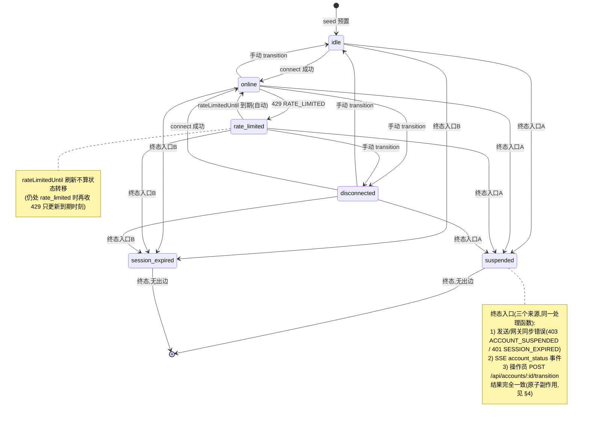
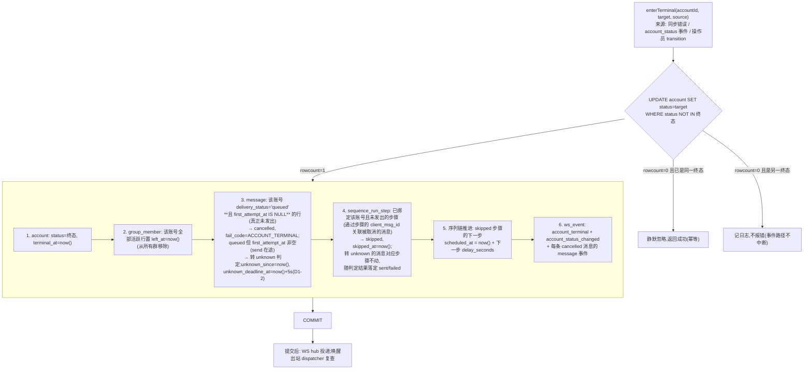
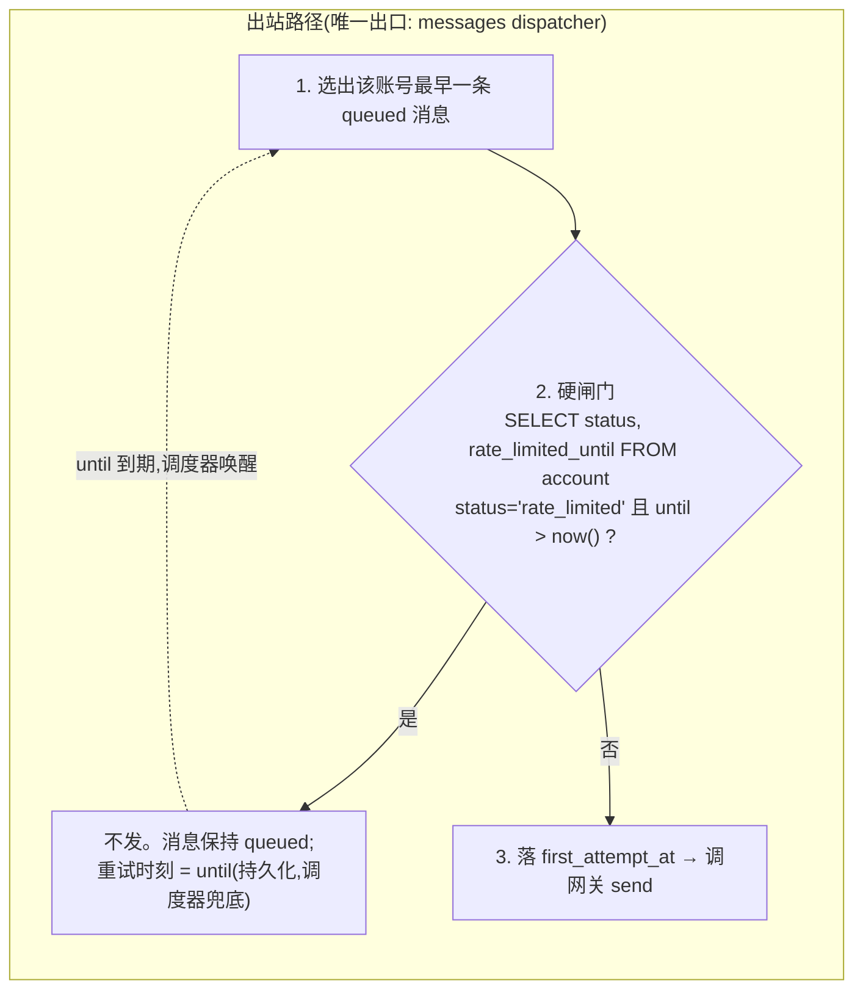

# 03 · 账号域设计

> 覆盖：A1 全部、A2 错误表中账号相关行、§2.3 账号端点。
> 契约依据：[analysis/05-requirements-A.md](../analysis/05-requirements-A.md) A1；[analysis/10-quick-reference.md](../analysis/10-quick-reference.md) §2/§4/§6。

## 1. 状态机（A1 转移表，逐格照抄）

合法转移 15 条；其余（含同态→同态）一律 `ILLEGAL_TRANSITION`。



**终态入口的统一实现**：三个来源汇聚到唯一的 `enterTerminal(tx, accountId, target, source)`。入口处先做幂等检查：

```sql
UPDATE account SET status=$target, terminal_at=now(), updated_at=now()
WHERE id=$accountId AND status NOT IN ('suspended','session_expired')
```

- rowcount=1 → 首次进入终态 → 同事务执行 §4 的原子副作用；
- rowcount=0 且当前已是**同一**终态 → **静默忽略**（A1：重复进入同一终态静默忽略，不重放副作用、不影响后续事件）；
- rowcount=0 且当前是**另一个**终态 → 终态间无转移边 → `ILLEGAL_TRANSITION`（调用方吞掉并记日志，事件路径不中断）。

**非法转移的显式拒绝**：任何目标不是终态的转移，走 §3 的 `applyTransition`，先查转移表（合法边集合硬编码于 `transitions.ts`，与上图一一对应），不合法直接拒绝，不产生任何写。

## 2. connect（`POST /api/accounts/:id/connect`）

前置状态集合：`{idle, disconnected}`（§2.3 明文「从 idle / disconnected 变为 online」；`rate_limited` 不在列——它是临时态、物理会话仍在，到期自动回 `online`，操作员此时重连按钮不出现）。【解读】此为对原文的从严解释，实现按此执行。

```mermaid
sequenceDiagram
    participant OP as 操作员
    participant API as HTTP handler
    participant GW as gateway client
    participant DB as PostgreSQL
    participant WS as WS hub

    OP->>API: POST /api/accounts/:id/connect
    API->>DB: SELECT status (前置 ∈ idle/disconnected,否则 409 ILLEGAL_TRANSITION)
    API->>GW: POST /accounts/:id/connect
    GW-->>API: 200 { platformUserId }
    Note over API,DB: 网关 connect 幂等(同 accountId 同 platformUserId),<br/>先调外部是安全的:崩溃后重点一次结果不变
    API->>DB: 事务 { UPDATE account SET status='online',<br/>platform_user_id=$puid WHERE id=? AND status IN ('idle','disconnected');<br/>INSERT ws_event(account_status_changed) }
    alt rowcount=0 (状态已被并发改变)
        API-->>OP: 409 CAS_CONFLICT
    else 成功
        API->>WS: 提交后投递 ws_event
        API-->>OP: 200 { status: 'online', platformUserId }
    end
```

- 网关返回 403 `ACCOUNT_SUSPENDED` / 401 `SESSION_EXPIRED` → 进入终态流程（§4），接口按错误原码返回。
- 「推给前端的状态事件必须对应已保存的状态」（A1）：`ws_event` 在同一事务内 INSERT，提交后投递——不可能出现事件先于状态。

## 3. transition（`POST /api/accounts/:id/transition { to, expectedFrom }`）

```mermaid
sequenceDiagram
    participant OP as 操作员
    participant API as HTTP handler
    participant DB as PostgreSQL
    participant GW as gateway client

    OP->>API: POST transition { to, expectedFrom }
    API->>API: 参数校验 (to/expectedFrom ∈ 6 状态枚举)<br/>失败 → 400 VALIDATION_ERROR
    API->>DB: SELECT * FROM account WHERE id=?
    alt 不存在
        API-->>OP: 404 ACCOUNT_NOT_FOUND
    end
    API->>API: 查转移表 (expectedFrom → to)
    alt 不在合法边集合
        API-->>OP: 409 ILLEGAL_TRANSITION
    end
    alt to ∈ 终态
        API->>DB: 事务见 §4 (expectedFrom 即条件,被并发抢先→409 CAS_CONFLICT)
    else to = disconnected 或 idle
        API->>DB: 事务 { UPDATE account SET status=to<br/>WHERE id=? AND status=expectedFrom;<br/>INSERT ws_event }
        alt rowcount=0
            API-->>OP: 409 CAS_CONFLICT
        else 成功
            API->>GW: POST /accounts/:id/disconnect
            Note over API,GW: 先落库后调外部;崩溃窗口由启动恢复器补调<br/>disconnect 幂等(离线账号再 disconnect 无害)
            API-->>OP: 200 { status: to }
        end
    else 其他非终态目标
        API->>DB: 同上条件 UPDATE + ws_event
        API-->>OP: 200 { status } / 409 CAS_CONFLICT
    end
```

- **CAS 三段式判定顺序**（对齐 §2.3 错误码语义）：
  1. `expectedFrom → to` 不在转移表 → `409 ILLEGAL_TRANSITION`（纯静态判定，不碰 DB 状态）；
  2. 合法但 `UPDATE ... WHERE status=expectedFrom` rowcount=0 → `409 CAS_CONFLICT`（当前状态已不是 expectedFrom，**后写不覆盖先写**）；
  3. 成功 → 200。
- 并发的自动转移（限流到期回 online、终态事件）与操作员 transition 竞争同一行：全部走条件 UPDATE，至多一个成功。
- **手动 `to='rate_limited'` 的入参要求**（D3-4，契约空隙由本设计定死）：`rate_limited` 是事件驱动态，transition API 本无 `retryAfterSeconds` 可言——规定该目标必须携带可选参数 `rateLimitedUntil`（ISO 8601 UTC 时刻，须 > 当前时间），缺省或非未来时刻 → `400 VALIDATION_ERROR`；转移语义与 429 路径一致（置 `rate_limited` + `rate_limited_until`，到期由调度器自动回 `online`）。不接受「无期限的手动限流」。

## 4. 终态原子副作用（A1 核心）

**单一事务**，六个动作要么全生效要么都不生效：



细节说明：

1. **第 3 步的取消范围**（D1-2）：只取消 `queued` **且 `first_attempt_at IS NULL`**（从未尝试发出）的消息；`first_attempt_at` 非空的在途行（dispatcher 已落尝试时刻、正在调网关 send）**转入 unknown 判定路径**（`unknown_since=now(), unknown_deadline_at=now()+5s`），由判定器按网关真相落定 sent/failed。理由：已交给网关的发送不再受我方控制，若终态事务把在途行强置 `cancelled`，则网关可能实际发出消息而我方记录停在 cancelled——随后 202 写回/`message_sent` 被更新守卫拒收，回流的 `message` 事件按 `(group_id, msg_id)` 查无此行而**插入第二行**，破坏 I1/I3。`accepted/unknown/sent` 的消息同样不动（网关已受理/已发出）。
   配套：dispatcher 收到 202 的写回守卫放宽为 `delivery_status IN ('queued','unknown')`（[05](05-messaging-module.md) §2.1）——终态事务可能在 send 在途时已把行转为 unknown，202 回写必须仍能落 `accepted`。契约措辞「排队中的发送变为 cancelled」按「从未交给网关的排队发送」解释声明（见 design/README 契约解释声明）。
2. **第 4 步的关联路径**：序列步骤到时刻 → 选定账号 → 创建 `queued` 消息（`client_msg_id` 双向关联）。因此「排队中的发送被取消」的步骤集合 = 其 `client_msg_id` 出现在第 3 步被取消集合中的步骤。尚未创建消息的 `pending` 步骤不受影响——到时刻重新选账号（此时该账号已被移出成员表，自然不会被选中）。
3. **第 5 步**保证「skipped 步骤进度照常推进」（B1）：skipped 视为在跳过时刻「发出」，链式排期继续。
4. **推给前端的 `account_terminal` 事件对应已保存的状态**：事件行与状态在同一事务，提交后投递。
5. job 中的 join 等待不受终态直接影响：账号被移出成员表后，若其 `member_joined` 永不到，10s 超时兜底 `JOIN_TIMEOUT`。

## 5. 限流：登记与硬闸门（A2 / S4）

### 5.1 进入限流（429 处理）

收到网关 `429 RATE_LIMITED { retryAfterSeconds }` 时（唯一入口：出站 dispatcher 的 send 调用，见 [05](05-messaging-module.md) §2）：

```sql
-- 单事务（状态守卫，D2-5：只允许 online / rate_limited 两个态写限流字段）
UPDATE account SET
  rate_limited_until = greatest(now(), rate_limited_until) + make_interval(secs => $retryAfterSeconds),
  status = CASE WHEN status = 'online' THEN 'rate_limited' ELSE status END,
  updated_at = now()
WHERE id = $accountId AND status IN ('online','rate_limited');
-- rowcount=0（账号已被并发置 disconnected/终态等）→ 记 warn 日志、不写字段——
-- 否则 CASE 保住了 status 却仍写出 rate_limited_until，破坏
-- 「非 rate_limited 态恒为 NULL」表级不变量（02 §3.1），
-- 且重连回 online 后 GET /api/accounts 会输出陈旧的 rateLimitedUntil
-- + INSERT ws_event(account_status_changed: online→rate_limited)
-- + 该条消息保持 delivery_status='queued'（原顺序保留）
```

- 仍处 `rate_limited` 时再收 429（理论上不应发生，防御性设计）：**只顺延 `rate_limited_until`，不算状态转移**（A1：`rateLimitedUntil` 的刷新不算转移）。
- `greatest(now(), rate_limited_until) + retryAfterSeconds`：从当前等待期结束点起算重置——「一次试探就会重置计时」的语义在**闸门侧**靠绝对不试探保证（§5.2），此公式只是最后防线。

### 5.2 硬闸门位置（宪法 §3-4：挡在出站路径最外层）



- 闸门在**每次** send 调用前逐条查询（不缓存进程内判定）；等待期内对网关的该账号 `send` 调用数恒为 0（S4 验收点）。
- `disconnect` / `leave` 不受限（A2 明文），它们不走本闸门。
- 限流期间到达的同账号新消息照常受理为 `queued`（`POST /api/groups/:id/send` 对 `rate_limited` 账号照常 202，§2.3）。

### 5.3 到期自动回 online（A1）

```mermaid
sequenceDiagram
    participant S as 调度器(每秒)
    participant DB as PostgreSQL
    participant WS as WS hub
    participant D as 出站 dispatcher

    loop 扫描到期行
        S->>DB: SELECT id, rate_limited_until FROM account<br/>WHERE status='rate_limited' AND rate_limited_until <= now()
        S->>DB: 事务 { UPDATE account SET status='online',<br/>rate_limited_until=NULL<br/>WHERE id=? AND status='rate_limited';<br/>INSERT ws_event(account_status_changed) }
        alt rowcount=1 (仍是 rate_limited)
            S->>WS: 投递状态事件
            S->>D: 唤醒:该账号的 queued 消息按原顺序发出
        else rowcount=0
            Note over S,DB: 到期时已不是 rate_limited(如被标记离线)<br/>→ 不做转移(A1 明文)
        end
    end
```

- 条件更新即「到期时已不是 rate_limited 则不转移」的准确实现。
- 消息顺序：`queued` 消息按 `id`（创建序）升序逐条发出，每账号串行（[05](05-messaging-module.md) §2.2）。

## 6. 端点与错误码对照

| 端点 | 成功 | 错误（码 / 条件） |
|---|---|---|
| `GET /api/accounts` | `[{ id, status, platformUserId, rateLimitedUntil }]` | 401 UNAUTHORIZED |
| `POST /api/accounts/:id/connect` | `200 { status, platformUserId }` | 409 ILLEGAL_TRANSITION（前置不是 idle/disconnected）；网关 403/401 → 触发终态后按原码返回；网关 503 → 503 UNAVAILABLE（不改变账号状态） |
| `POST /api/accounts/:id/transition` | `200 { status }` | 400 VALIDATION_ERROR（参数缺/非法，含 `to='rate_limited'` 未带合法 `rateLimitedUntil`，§3）；404 ACCOUNT_NOT_FOUND；409 ILLEGAL_TRANSITION（表上无此边）；409 CAS_CONFLICT（当前状态 ≠ expectedFrom） |

- viewer 对 connect / transition 一律 `403 FORBIDDEN`（[09](09-auth-module.md) §4 权限矩阵）。
- 所有响应时间字段 ISO 8601 UTC；`rateLimitedUntil` 无值为 `null`。

## 7. 设计取舍与风险

- **connect 先调网关后落库**：利用网关 connect 幂等性（同 accountId 同 platformUserId），崩溃窗口无害。若网关 connect 非幂等则需反过来先落「connecting 中间态」——契约保证了幂等，取简。
- **终态副作用不含「取消 agent 执行账号」**：agent 工具执行中账号变终态 → 该步 `SEND_FAILED`、run 继续（A5-5），由 agent 域在执行时感知（[06](06-agent-module.md) §8.4），账号域不主动打断。
- **风险点**：终态事务第 4/5 步耦合序列域逻辑（跨模块事务）。实现上由账号域发出领域事件、序列域在同一事务内注册回调处理（模块间通过 `TxContext` 传递），设计上可接受，编码时需注意事务脚本的可读性。
