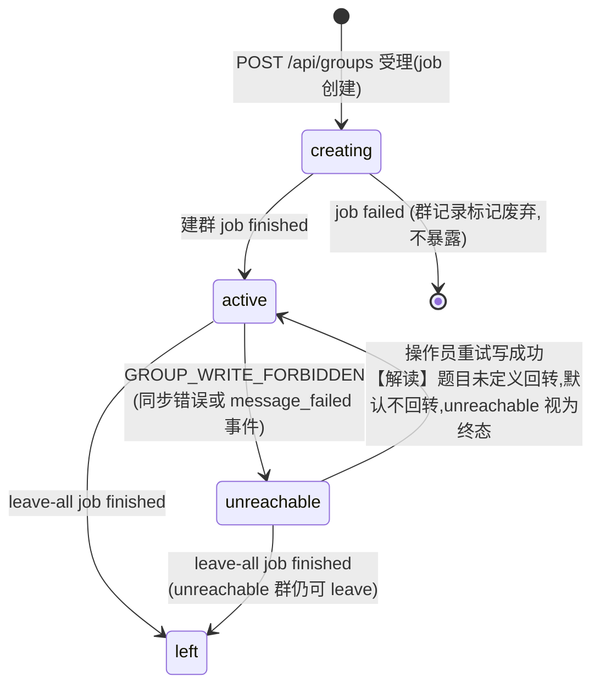
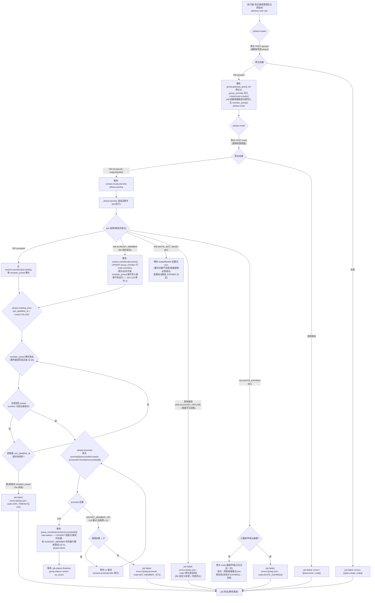
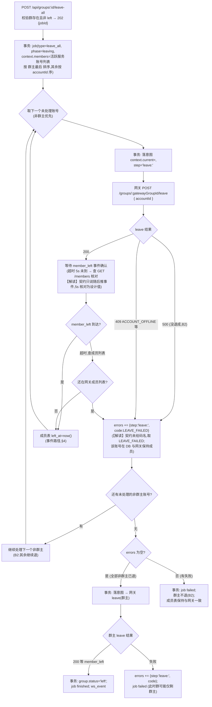
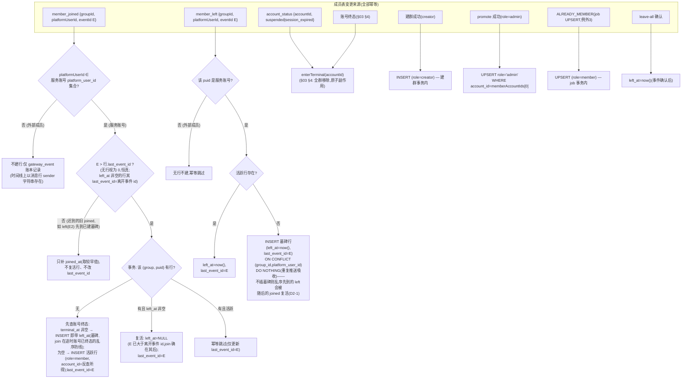

# 04 · 群域设计

> 覆盖：A3 建群、B2 群生命周期、A2 中群状态相关行、§2.3 群端点。
> 契约依据：[analysis/05-requirements-A.md](../analysis/05-requirements-A.md) A3；[analysis/06-requirements-B.md](../analysis/06-requirements-B.md) B2。

## 1. 群状态机



【解读】说明：`unreachable` 的回转题目未定义（网关侧「群解散或禁言」大概率不可逆）；本设计取「不可回转」，`GET /api/groups` 的 `status` 保持 `unreachable`。若实现中发现 mock 网关支持恢复场景，再补 `unreachable → active` 边（该取舍不影响 S1–S8）。

`GROUP_WRITE_FORBIDDEN` 的级联（单事务，A2）：

| 动作 | 实现 |
|---|---|
| `group.status = 'unreachable'` | 条件更新 `WHERE status='active'`（重复触发幂等） |
| 该群 running 序列 run → `stopped` | 条件更新 + `ws_event(sequence_run)` |
| 正在运行的 agent run → 当前步后 `cancelled` | 不在此事务打断，写「取消请求」标志（run executor 每步结束检查，A5-10「当前这一步结束后终止」）——见 [06](06-agent-module.md) §9 |
| agent 不再触发 | 触发判定前置条件 `group.status='active' AND agent_enabled=true` |
| 账号状态不变 | 不触碰 account 表 |

## 2. 建群 job 全流程（A3 / B2）

### 2.1 受理（`POST /api/groups`）

同步校验（全部通过才创建 job）：
1. 参数形状：`creatorAccountId` 非空、`memberAccountIds` ≥ 1 个、不含群主、无重复 → 否则 `400 VALIDATION_ERROR`；
2. 所有账号（creator + members）`status='online'` → 否则 `422 ACCOUNT_NOT_ONLINE`；
3. 事务：INSERT `group`（`status='creating'`）+ INSERT `job(type='create_group', phase='create', payload=入参快照)` + `ws_event` → 返回 `202 { jobId }`。

> `status='creating'` 是内部态，对外（`GET /api/groups`）只暴露契约三态；`creating` 中的群不出现在列表里（或标注，见 §6 端点设计）。job 失败时群记录保留（错误可查）但状态固定 `creating`，不影响契约语义。

### 2.2 执行主流程



要点核对（契约逐条）：
- **INVITE_NOT_READY**：等 `readyAfterMs` 后重试（B2）；等待重试不设上限（链接就绪是网关保证的必然事件），但每次重试前检查 job 仍 running。
- **INVITE_EXPIRED**：重新申请链接后**重试一次**；群和账号状态都不变（B2）。重新申请本身也可能失败 → `step=invite` 失败。
- **ALREADY_MEMBER**：视为成功，直接计入 joined（B2）；注意此时网关**不会**推 `member_joined`（§2.1），等待逻辑必须能区分「waiting」与「joined」。成员行由 job 事务 **UPSERT 兜底**（`role=member`，§4 例外 3，D2-2）——若不写，该账号在成员表永远缺行，promote 的 `UPDATE role='admin'` 命中 0 行静默落空、`GET /api/groups/:id` 缺成员，违反「建群完成时 memberAccountIds[0] 已是管理员」的可见结果。
- **member_joined 10s 超时** → `JOIN_TIMEOUT`，`errors[].step = join:<accountId>` 精确到超时的那个成员（A2）。
- **promote 调用总数 ≤ 2**（A2）：`context.promoteCalls` 计数持久化，崩溃恢复后继续累计；达到 2 次仍 `NOT_MEMBER_YET` → job failed（`step=promote`）。
- **成员表写入时机**（A3）：creator 在建群成功事务内写入；其余成员一律在 `member_joined` 事件处理路径写入（§4）——job 执行器**不直接写**非 creator 成员，只更新 job.context 状态。

### 2.3 建群时序图（正常路径）

```mermaid
sequenceDiagram
    participant OP as 操作员
    participant API as POST /api/groups
    participant JX as job 执行器
    participant GW as 网关
    participant SSE as SSE 消费
    participant DB as DB(成员表)

    OP->>API: { creatorAccountId: A, memberAccountIds: [B, C] }
    API->>API: 校验(online/参数) → 422/400
    API->>DB: 事务{group(creating) + job(phase=create)}
    API-->>OP: 202 { jobId }
    API->>JX: 唤醒执行器
    JX->>DB: phase=create (意图先行)
    JX->>GW: POST /groups { creatorAccountId: A }
    GW-->>JX: { groupId: G }
    JX->>DB: 事务{gateway_group_id=G; member(A, creator); phase=invite}
    JX->>GW: POST /groups/G/invite
    GW-->>JX: { inviteLink, readyAfterMs: 0 }
    JX->>DB: phase=joining, context.inviteLink
    par 成员 B
        JX->>GW: POST /groups/G/join { B, link }
        GW-->>JX: 202
    and 成员 C
        JX->>GW: POST /groups/G/join { C, link }
        GW-->>JX: 202
    end
    JX->>DB: waiting_joins; join_deadline_at=now()+10s
    Note over GW,SSE: 网关 100–1500ms 后推 member_joined
    SSE->>DB: 事务{INSERT gateway_event; member(B, member); job.context.B=joined}
    SSE->>DB: 事务{...; member(C, member); context.C=joined}
    SSE->>JX: 到齐通知(或执行器轮询 context)
    JX->>DB: phase=promote (意图先行)
    JX->>GW: POST /groups/G/promote { byAccountId: A, accountId: B }
    GW-->>JX: 200 {}
    JX->>DB: 事务{member(B).role=admin; job finished;<br/>group.status=active; ws_event}
```

> join 并行执行（成员互不依赖）；`ALREADY_MEMBER` / 超时路径按 §2.2 分支处理。

### 2.4 崩溃恢复

- job 执行器持有 advisory lock `job:<jobId>`；恢复器扫描 `status='running'` 的 job，按 `phase + context` 从断点续传：
  - `create` 前崩溃 → 重新建群（网关旧群成为孤儿，不影响正确性——我方 DB 未关联）；
  - `joining` 中崩溃 → 对 `context.members[x]` 仍 `waiting` 的成员**不重发 join**（申请可能已受理），等 `member_joined` 或 10s 超时；对尚未发出 join 的成员正常发；
  - `waiting_joins` 崩溃 → 重建 deadline（取原 `join_deadline_at` 与 `now()` 的 max，不重置超时窗口）；
  - `promote` 崩溃 → 重发 promote（幂等性依赖网关重复 promote 无害——契约未说幂等，但 promote 语义是设置管理员，重复设置结果一致；调用计数已持久化，总数不超 2）。

## 3. leave-all job（B2）

### 3.1 编排规则

- 顺序：**所有非群主服务账号先退（串行）**，全部成功后群主退。
- 非群主账号退群失败（leave 返回 500，或 409 ACCOUNT_OFFLINE 等错误）→ 记入 `errors[]`，**其余非群主账号继续退，群主不退**，job `failed`；失败账号在 DB 与网关里都仍是成员。
- 全部退完（群主最后）→ `group.status='left'`，活跃成员清空（`members=[]`）。

### 3.2 流程图



### 3.3 一致性要点

- **「完成后成员表与网关成员列表一致」**（B2）：成员表行只在 `member_left` 事件（或成员列表核对）确认后置 `left_at`；失败的账号两端都保持成员。leave-all 结束时执行一次 `GET /groups/:id/members` 对账：DB 活跃服务账号集合应与网关列表一致，不一致 → 推 `inconsistency` 事件（`kind='member_mismatch'`）。
  【解读】该句的对账范围是**服务账号**：leave-all 操作的正是我方服务账号，外部用户本来就不在我方成员表语义内（§4 只投影服务账号）——对账即「网关成员列表 ∩ 我方服务账号 platform_user_id 集合」与我方活跃成员行的一致性。
- 崩溃恢复：`context.current` 已落意图但未确认 → 按「结果未知」处理：查网关成员列表定结果（仍在=没退成=失败路径；不在=已退=确认路径），不重发 leave（避免对已退出账号重复调用的歧义——契约未定义重复 leave 的行为）。

## 4. 成员拓扑投影（事件驱动）

成员表是网关成员状态的本地投影，且**只投影服务账号**：`group_member` 只存服务账号（含 role）；**外部成员不建成员实体行**——只以消息行上的 `senderPlatformUserId` 字符串与 `gateway_event` 账本事件的形式存在（容量决策，见 [13-capacity.md](13-capacity.md) §3 轴 3）。契约依据：`GET /api/groups` 的 `members: [{accountId, platformUserId, role}]` 本来就只含服务账号；kick 的收敛判定直接查**网关**成员列表（[06](06-agent-module.md) §8.5，不受影响）；agent 触发上下文靠 `ownPlatformUserIds` 区分（[06](06-agent-module.md) §6），不依赖成员表。

**唯一写入源**是事件处理路径（join 之外）与三个例外（creator 建群成功、promote 提升角色、ALREADY_MEMBER 的 job UPSERT 兜底——D2-2）。

**乱序防线（D2-1）**：契约允许相邻成员事件乱序 ≤1s——`member_left`(E2) 可能先于 `member_joined`(E1) 到达（账号入群后 1s 内被踢/进终态）。若无防线，「left 无行→跳过；joined 无行→INSERT 活跃行」会把已离群账号投影成活跃成员。规则：**活跃性只随事件 id 单调推进**——`group_member.last_event_id` 记录最近一次改变活跃性的事件，成员事件仅在 `event_id > last_event_id` 时才允许改变活跃性；`member_left` 无行时插入**墓碑行**（`left_at=now(), last_event_id=E`）而非跳过，迟到的更小 id `member_joined` 只补 `joined_at`、不复活。



- **member_joined 重复推送**（S2）：`UNIQUE(group_id, platform_user_id)` + 活跃判定 → 幂等。
- **member_joined 的外部成员分支不影响建群 job**：job 等待的是服务账号成员（`context.members` 由入参 `memberAccountIds` 限定），外部成员事件在 `OWNF` 判定处即分流，不触碰 job。
- **account_status 事件与同步错误的并发**：`enterTerminal` 条件更新保证只执行一次副作用。
- **member_left 与账号终态并发**：网关在账号终态后自动移出并推 `member_left`（§2.1）——事件到达时终态事务已把既有活跃行置 `left_at` → 幂等跳过；行尚不存在（join 在途）时由墓碑分支兜底。
- **乱序只影响「有行」的服务账号**：外部成员不建行，墓碑/复活逻辑与其无关；`last_event_id` 的比较是确定性的（eventId 单调分配），与到达顺序无关。
- **群主 promote 之后 leave-all 之前**：role 快照在成员表，`activeSequenceRunId` 等查询实时 join。

## 5. 群查询端点（§2.3）

`GET /api/groups` / `GET /api/groups/:id` 响应组装：

```
{ id, gatewayGroupId, status, creatorAccountId, agentEnabled, autoKickEnabled,
  members: [{ accountId, platformUserId, role }],     // 活跃服务账号成员(left_at IS NULL,只含服务账号 §4),按 role 排序输出
  activeSequenceRunId, activeAgentRunId }
```

- `activeAgentRunId` = `SELECT id FROM agent_run WHERE group_id=? AND status='running' LIMIT 1`（部分唯一索引保证至多一行）；
- `activeSequenceRunId` 同理查 `sequence_run`；
- `status='left'` 时 `members=[]`（leave-all 完成）；`creating` 状态的群不出现在列表（内部态，见 §1 解读）。

`PATCH /api/groups/:id { agentEnabled?, autoKickEnabled? }`：
- 事务：条件更新 + `ws_event(group_updated)`（扩展事件类型，供前端刷新）；
- **关闭 agentEnabled 时**若该群有 running agent run → 写取消请求（run 当前步后 `cancelled`，A5-10，由 executor 在步结束检查 `group.agent_enabled`），不在 PATCH 事务里直接改 run 状态（尊重「当前这一步结束后」语义）。

## 6. 设计取舍

- **join 并行、leave 串行**：join 各成员独立失败独立重试，并行缩短建群时长；leave 串行使「群主最后」的次序确定、失败语义清晰。
- **job.context 存 jsonb 而非拆表**：job 是短生命周期编排状态，无需查询内部字段；断点续传整块读写最简单。
- **外部成员不建行**（容量决策，[13](13-capacity.md) §3 轴 3）：成员表只服务账号；外部成员的事件只入 `gateway_event` 账本——契约 `members` 字段、kick 收敛判定（查网关）、agent 触发（`ownPlatformUserIds`）均不依赖外部成员行。
- **风险**：member_joined 事件写成员表（SSE 路径）与 job 执行器更新 context 是两个事务，「到齐」判定存在短暂窗口（最后一行写入与 job 推进之间）——由 job 执行器轮询/被通知后重查 DB 兜底，不依赖内存信号。

## 7. 任务查询端点（§2.3）

`GET /api/jobs/:jobId` → `{ status, errors: [{ step, code }] }`：

- 直接映射 `job` 表（[02](02-data-model.md) §6.1）：`status ∈ running|finished|failed`；`errors` 非空即 `failed`（写路径保证：置 failed 与追加 error 同事务）；
- `step` 取值域在建群流程为 `create | invite | join:<accountId> | promote`，leave-all 为 `leave:<accountId>`（§2.2 / §3.2 落库时已按此格式写入）；
- 404：job 不存在 → `404 { error: { code:'JOB_NOT_FOUND', … } }`【解读】契约未定义该码，实现自定并在 README 声明。
