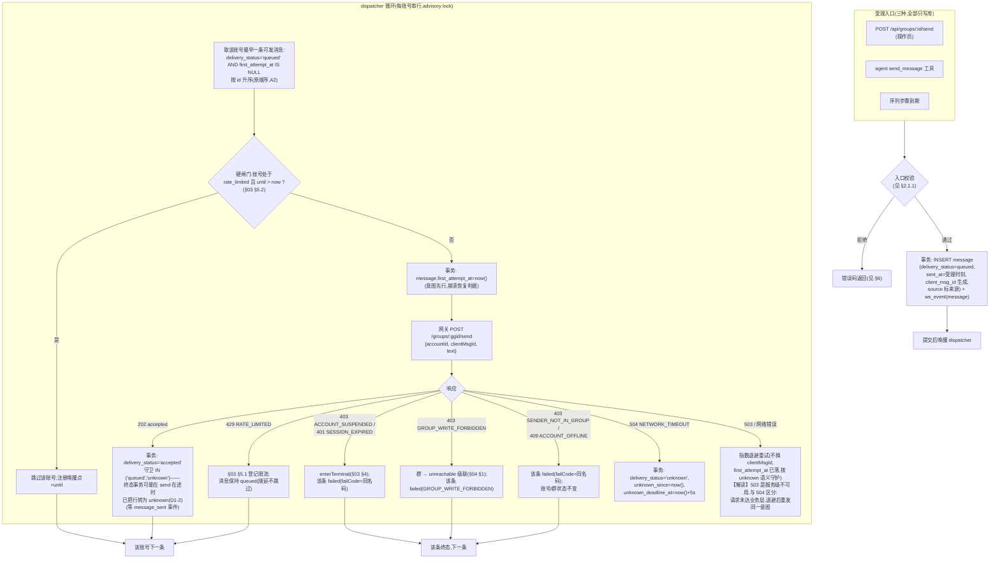
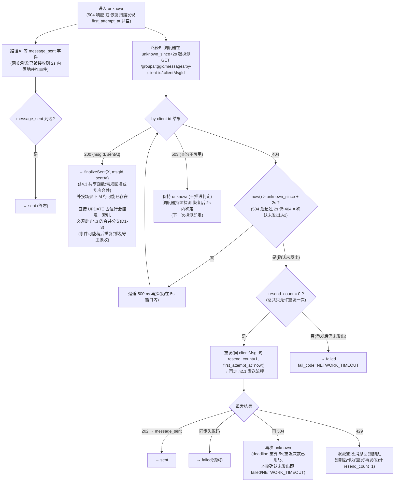
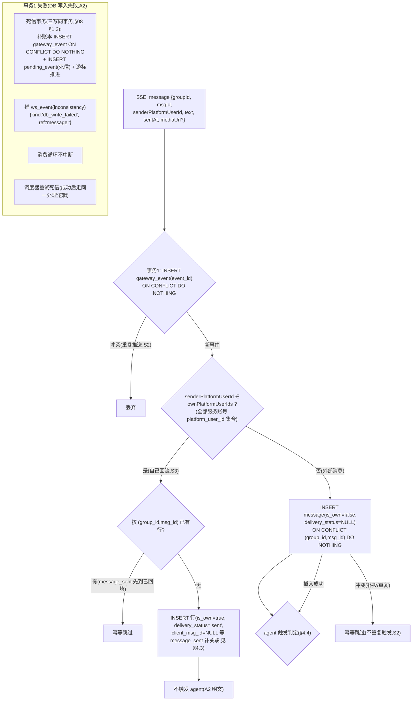
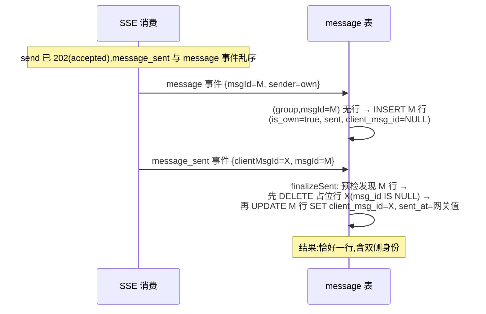

# 05 · 消息域设计

> 覆盖：A2 出站/入站、A4 时间线分页、§2.3 消息端点、S1/S2/S3/S4 场景。
> 契约依据：[analysis/05-requirements-A.md](../analysis/05-requirements-A.md) A2/A4；[analysis/02-gateway-contract.md](../analysis/02-gateway-contract.md)。

## 1. deliveryStatus 状态机

```mermaid
stateDiagram-v2
    [*] --> queued : 受理(操作员 send / agent 工具 / 序列步骤)<br/>INSERT message 行(client_msg_id, sent_at=受理时刻)

    queued --> accepted : 网关 send 返回 202
    queued --> cancelled : 账号终态(ACCOUNT_TERMINAL)<br/>(仅从未尝试:first_attempt_at IS NULL,<br/>在途行转 unknown 判定;§03 §4)
    queued --> unknown : first_attempt_at 非空,结果未知<br>(崩溃恢复 或 终态事务转入,§03 §4)
    queued --> failed : 同步错误<br/>SENDER_NOT_IN_GROUP / ACCOUNT_OFFLINE /<br/>GROUP_WRITE_FORBIDDEN / ACCOUNT_SUSPENDED

    accepted --> sent : message_sent 事件<br/>(回填 msg_id + 网关 sentAt)
    accepted --> failed : message_failed 事件<br/>(GROUP_WRITE_FORBIDDEN / ACCOUNT_SUSPENDED)

    unknown --> sent : message_sent 事件(≤2s 内落地)
    unknown --> accepted : message_sent 之外的确认途径<br>【解读】见 §2.4 判定表
    unknown --> failed : 确认未发出 → 重发一次(同 clientMsgId)<br/>→ 重发后仍未发出(NETWORK_TIMEOUT)<br/>或确认过程发现同步失败码

    sent --> [*]
    failed --> [*]
    cancelled --> [*]

    note right of unknown
        504 NETWORK_TIMEOUT → unknown
        从收到 504 起 5 秒内必须落定(A2)
        by-client-id 不可用(503)期间保持 unknown,
        恢复后 2 秒内确定
    end note
```



**更新守卫**：每次状态写入都带前置状态集合，例如

```sql
UPDATE message SET delivery_status='sent', msg_id=$msgId, sent_at=$sentAt, ...
WHERE client_msg_id=$clientMsgId AND delivery_status IN ('queued','accepted','unknown');
```

重复事件（S2）、乱序到达的 `message_failed`/`message_sent` 不会使状态倒退（`sent` 是吸收态，`failed/cancelled` 只能来自未落定态）。

## 2. 出站发送管线

### 2.1 总体流程



#### 2.1.1 各入口的受理校验

| 入口 | 校验（拒绝条件） |
|---|---|
| 操作员 `POST /api/groups/:id/send` | `text` 非空（trim 后长度 > 0）且 ≤ 2000 字符【设计值 `TEXT_MAX_LENGTH`，D3-6】→ 否则 `400 VALIDATION_ERROR`（序列步骤定义与 agent `send_message` 入参 schema 共用同一常量，[07](07-sequence-module.md) §1）；群存在且非 `left`；账号存在；账号在此群（`group_member` 活跃行）→ 否则 `409 ACCOUNT_NOT_IN_GROUP`；账号状态 ∈ {`idle`,`disconnected`,终态} → `409 ACCOUNT_UNAVAILABLE`；`rate_limited` → **照常受理**（§2.3）；群 `unreachable` → 受理后由 dispatcher 得到 `GROUP_WRITE_FORBIDDEN`（网关为准）【解读】也可同步 409，取「网关为准」简化判定，S 场景不涉及 |
| agent `send_message` 工具 | 幂等 key 检查（[06](06-agent-module.md) §8.2）；选账号（online 群成员）；无 → `NO_AVAILABLE_ACCOUNT` |
| 序列步骤 | 到期 + 选账号规则（[07](07-sequence-module.md) §4） |

### 2.2 每账号串行与顺序保证

- 同一账号同一时刻至多一条消息在「已尝试未落定」状态：dispatcher 处理账号 A 时，取 `first_attempt_at IS NULL` 的最早一条；该条进入 `accepted/unknown/failed/cancelled` 之一后（`queued` 且未尝试=还没轮到；`accepted` 后网关已受理，下一条可发），才发下一条。
- `accepted` 不是落定态但**网关已受理**，无需阻塞后续——顺序保证的是「发出的顺序」= 受理顺序。
- 多实例：`pg_try_advisory_lock('outbox:account:'+accountId)` 串行化。
- 崩溃恢复（`first_attempt_at` 非空、仍 `queued`）：请求可能已到网关（结果未知）→ **不重发**，直接转入下方判定流程（等价 504）。

### 2.3 「先持久化后外部效果」在本管线的体现

1. 受理 → INSERT（queued）——对外 API 的 202 在此之后返回；
2. 发送尝试 → `first_attempt_at` 落库 —— 网关调用在其后；
3. 每个结果（accepted/unknown/failed）→ 事务写回；
4. `message_sent` / `message_failed` 事件 → 事件事务写回。

崩溃在任何点：世界可恢复——「网关发出了、DB 没记录」不存在（记录先于尝试）；「一条记录多条网关消息」不存在（尝试时间戳守卫 + `resend_count ≤ 1` + 重发前置条件「确认未发出」）。

### 2.4 unknown 判定器（504 后 5 秒落定，A2）



时间约束核对（A2 / §2.1）：
- **5 秒落定**：`unknown_deadline_at = unknown_since + 5s` 由调度器扫描强制推进（到期仍无结论 → 若 by-client-id 持续 503 则顺延 deadline——「不可用期间保持 unknown，恢复后 2 秒内确定」优先于 5 秒；两者不矛盾：5s 是「网关可用时」的落定期限）；
- **2 秒确认线**：`unknown_since + 2s` 后仍 404 才判「未发出」；此前 404 不算数（消息可能正要落地）；
- **重发条件三合一**：确认未发出（2s+404）∧ `resend_count=0` ∧ 同一 `clientMsgId`；
- **重发后仍未发出 → `failed(NETWORK_TIMEOUT)`**（A2 明文）。

### 2.5 message_sent / message_failed 事件处理（出站确认）

```
message_sent { clientMsgId, msgId, sentAt }:
  事务 { finalizeSent(clientMsgId=X, msgId=M, sentAt=网关值)   ← §4.3 唯一收口
         (常规回填 / 乱序合并 / 幂等跳过,含序列步骤联动与 ws_event) }

message_failed { clientMsgId, code }:  -- code ∈ GROUP_WRITE_FORBIDDEN | ACCOUNT_SUSPENDED
  按码分流: GROUP_WRITE_FORBIDDEN → 群 unreachable 级联(§04 §1) + 该条 failed(code);
            ACCOUNT_SUSPENDED → enterTerminal + 该条 failed(code)
  序列步骤联动: status='failed', 该序列 run 是否 failed 见 §07 §6
```

- `finalizeSent`（§4.3）是出站确认的**唯一**写路径：`message_sent` 事件、by-client-id 200（§2.4）、未来任何确认途径都走它——序列步骤置 sent / 下一步排期 / `ws_event(message)` 在函数内统一执行，合并路径与常规路径的联动不再分叉（D1-3）。

## 3. 入站事件处理管线（SSE `message` 事件）



要点：
- **去重键 `(groupId, msgId)`**：DB 唯一索引是判定真值；`INSERT ... ON CONFLICT DO NOTHING` 天然幂等。
- **排序不由到达顺序决定**：时间线查询一律 `ORDER BY sent_at DESC, sort_key DESC`（索引支撑）；补投消息（`sentAt` 任意早）落在正确位置。
- **事件本体永不丢失**：主事务（账本 + 业务 + 游标）失败时，死信事务补写账本行并落死信（[08](08-realtime-module.md) §1.2 三写同事务，D1-1）——失败现场可无限重试，满足「不能丢」。

## 4. 时间线与「一条消息一行」

### 4.1 一行原则的实现

出站消息生命周期中，行的身份变迁：

| 阶段 | 行内容 |
|---|---|
| 受理 | INSERT：`client_msg_id=X, msg_id=NULL, delivery_status='queued', sent_at=受理时刻, is_own=true` |
| 202 | 同一行 `queued→accepted` |
| `message_sent` | **同一行**回填 `msg_id=M, sent_at=网关sentAt, →sent` |
| 回流 `message` | `ON CONFLICT (group_id, msg_id=M)` 命中已回填的行 → 吸收，不插第二行（S3） |

### 4.2 为什么回流不会产生两行

`(group_id, msg_id)` 唯一索引在 `message_sent` 回填 `msg_id` 后即覆盖该行；回流的 `message` 事件携带相同 `msgId`，冲突被吸收。唯一例外是乱序窗口内「回流先到」：

### 4.3 `finalizeSent`：出站确认的唯一收口（含乱序合并，D1-3）

所有「出站消息确认已发出」的途径——`message_sent` 事件（§2.5）、by-client-id 200（§2.4）、未来的任何确认来源——都调用**同一个函数**，同事务完成：

```
finalizeSent(clientMsgId=X, msgId=M, sentAt=网关值, tx):
  1. 预检: SELECT id, client_msg_id FROM message WHERE group_id=$g AND msg_id=M
     (显式预检比「撞唯一违例再回退」可读;两个分支的条件谓词使重复调用幂等)
  2a. 无行(常规路径):
      UPDATE message SET delivery_status='sent', msg_id=M, sent_at=$sentAt
        WHERE client_msg_id=X AND delivery_status IN ('queued','accepted','unknown');
  2b. 有行 M(乱序窗口内回流 message 先到,已按 §3 插入):
      i.  先 DELETE 占位行:
          DELETE FROM message WHERE client_msg_id=X AND msg_id IS NULL
            AND delivery_status IN ('queued','accepted','unknown');
          -- 先删占位行,腾出 uq_message_client_msg 的 X 键:
          -- 若先给 M 行 SET client_msg_id=X 会撞该唯一索引;
          -- 反之若常规 UPDATE 占位行 SET msg_id=M 会撞 uq_message_group_msg
          -- (M 行已持有该键)——这正是旧设计按图施工必然报唯一违例的地方
      ii. 再 UPDATE M 行:
          UPDATE message SET client_msg_id=X, delivery_status='sent', sent_at=$sentAt,
            is_own=true, account_id/source/first_attempt_at/last_attempt_at/resend_count
              ← 占位行对应值   -- 审计字段随行迁移,出站身份不丢
          WHERE group_id=$g AND msg_id=M AND client_msg_id IS NULL;
  3. 序列联动(2a/2b 统一执行):
      UPDATE sequence_run_step SET status='sent', sent_at=$sentAt
        WHERE client_msg_id=X AND status IN ('pending','accepted');
      → 触发下一步排期([07](07-sequence-module.md) §3)
  4. ws_event(message)
```

乱序窗口（`message` 先于 `message_sent` 到达，≤1s）的典型时序：



- **为什么 2b 必须先删后改**：占位行 X（`client_msg_id=X, msg_id=NULL`）与回流行 M（`msg_id=M, client_msg_id=NULL`）并存时，直接给任一行补另一侧身份都会撞对方的唯一索引——唯一无冲突的次序是先删占位行、再更新 M 行（D1-3）。
- **已知瞬态（D3-5）**：乱序窗口（≤1s）内时间线短暂出现两行（占位行 + M 行）是本方案的固有瞬态——契约「一条消息只有一行」按**稳态**解释；配「稳态一行」集成测试（窗口结束后断言恰好一行且含双侧身份）。
- agent `send_message` 的 5s 等待按 `client_msg_id` 查询（[06](06-agent-module.md) §8.2）——合并后的行仍持有 `client_msg_id=X`，等待路径对合并透明。

### 4.4 agent 触发判定（入口在此，编排在 [06](06-agent-module.md)）

入站外部消息插入成功后，同事务末尾：

```
IF group.status='active' AND group.agent_enabled=true THEN
  INSERT INTO agent_run (id, group_id, status='running', trigger_context=…)
  ON CONFLICT (group_id) WHERE status='running' DO NOTHING;
  IF conflict THEN INSERT INTO agent_trigger_queue (group_id, message_id)
                    ON CONFLICT DO NOTHING;
```

- 触发上下文的 `triggerMessages` 在创建 run 时从消息行读取；合并进 pending 的消息在 run 结束时全部进入下一次 `triggerMessages`（A5-1）。
- `message` 事件重复 → 插入冲突 → 不触发（S2）；自己回流 → 不触发（S3）。

## 5. 时间线游标分页（A4）

### 5.1 游标设计

- 游标 = base64(`sent_at_epoch_ms` + `.` + `sort_key`)，`sort_key = COALESCE(msg_id, client_msg_id)`；
- 查询：`WHERE group_id=? AND (sent_at, sort_key) < ($cursorSentAt, $cursorKey) ORDER BY sent_at DESC, sort_key DESC LIMIT $limit`（默认 50，§2.3）；
- `nextCursor` = 最后一条的游标；不足 limit → `nextCursor=null`。

### 5.2 两个难点的应对

**(a) 自己的消息 `sent_at` 会变（受理时刻 → 网关时刻，行位置上移）**：
- keyset 语义下，`sentAt` 变大的行不再满足 `< cursor` → **不会在后页重复出现**；
- 它也不会「遗漏」：该行本来就属于更早页（或前端已持有），位置上移属于「更新」方向，由 WS `message` 事件（`deliveryStatus` 流转时推）驱动前端原地更新——分页与更新两个通道职责分离。
- 极端情况：行从第 2 页区间上移到第 1 页区间，而用户正停留在第 2 页 → 前端持有旧快照 + WS 更新（按 `msgId/clientMsgId` 原地改），无重复无丢失。

**(b) 加载更早与新写入并发**：
- 新写入的行 `sentAt` 大（或补投的旧行落在任意位置），keyset 查询以 cursor 为唯一边界，天然不受写入影响——不重复、不遗漏（补投行若落在「更早」区间，会在后续翻页中出现，符合排序语义）。

### 5.3 响应组装

```
GET /api/groups/:id/messages?before=<cursor>&limit=50
→ { items: [{ msgId, clientMsgId, senderPlatformUserId, isOwn, text,
              sentAt, deliveryStatus, failCode }],
    nextCursor }
```

- `msgId`/`clientMsgId`/`deliveryStatus`/`failCode` 无值为 `null`（入站外部消息前三者均 null 语义不同：msgId 必有、clientMsgId=null、deliveryStatus=null）；
- `failed/cancelled` 时 `failCode` 必填由写路径保证（§1 状态机）。

## 6. 端点错误码对照

| 端点 | 成功 | 错误 |
|---|---|---|
| `POST /api/groups/:id/send` | `202 { clientMsgId }` | `409 ACCOUNT_NOT_IN_GROUP`（非活跃成员）；`409 ACCOUNT_UNAVAILABLE`（idle/disconnected/终态）；401/403 常规 |
| `GET /api/groups/:id/messages` | §5.3 | 401；`404 GROUP_NOT_FOUND`（群不存在） |

## 7. C1（选做）：媒体文件落盘与清理

数据模型已预留 `message.media_url / local_file_path`（[02](02-data-model.md) §5.1）。流程设计：

- **下载（入站 message 事件处理后，死信路径之外）**：`mediaUrl` 非空 → 异步任务（调度器驱动，扫描 `media_url IS NOT NULL AND local_file_path IS NULL`）：GET `mediaUrl` → 写 `media/<msgId>` → 事务回填 `local_file_path`。幂等：以 `msgId` 为文件名，重复任务覆盖写无害；404（过期）→ `local_file_path` 保持 NULL 并推 `inconsistency {kind:'media_expired'}`。
- **下载失败**（网络/503）：指数退避重试，不阻塞事件消费（与消息入库解耦）。
- **清理（调度器每日）**：删除 `created_at < now() - N 天`（`MEDIA_RETENTION_DAYS`，默认 30）且**不被任何 running agent run 引用**的文件（引用判定：该群存在 running run 时跳过该群全部待删文件——保守粒度【解读】，题目要求「仍被运行中的 run 用到的文件不删」）；删除文件与置空 `local_file_path` 同事务（「删除后不能留下指向已删文件的记录」）。

## 8. 设计取舍

- **503 与 504 的区分**：503 = 服务整体不可用（请求大概率未达业务层），退避后重试同一意图不算「重发」（`resend_count` 不变，`first_attempt_at` 保持首次）；504 = 业务层结果未知。两者的崩溃恢复语义一致（`first_attempt_at` 非空 → 结果未知判定），代码路径统一，仅调度策略不同。
- **判定器轮询而非常驻 timer**：探测节奏（2s 线 + 500ms 退避）由调度器统一扫描 `unknown_deadline_at` 驱动，漏拍由扫描兜底。
- **风险**：`finalizeSent`（§4.3）合并分支的「先删后改」——并发出现「第二个同 clientMsgId 的意图」不可能（唯一约束），但编码时须保证合并事务的隔离级别（默认 READ COMMITTED + 条件更新足够）。
