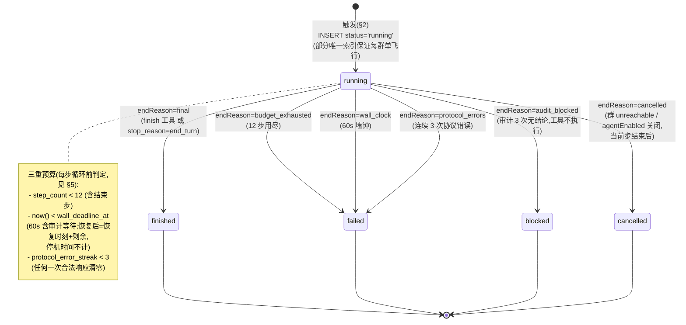
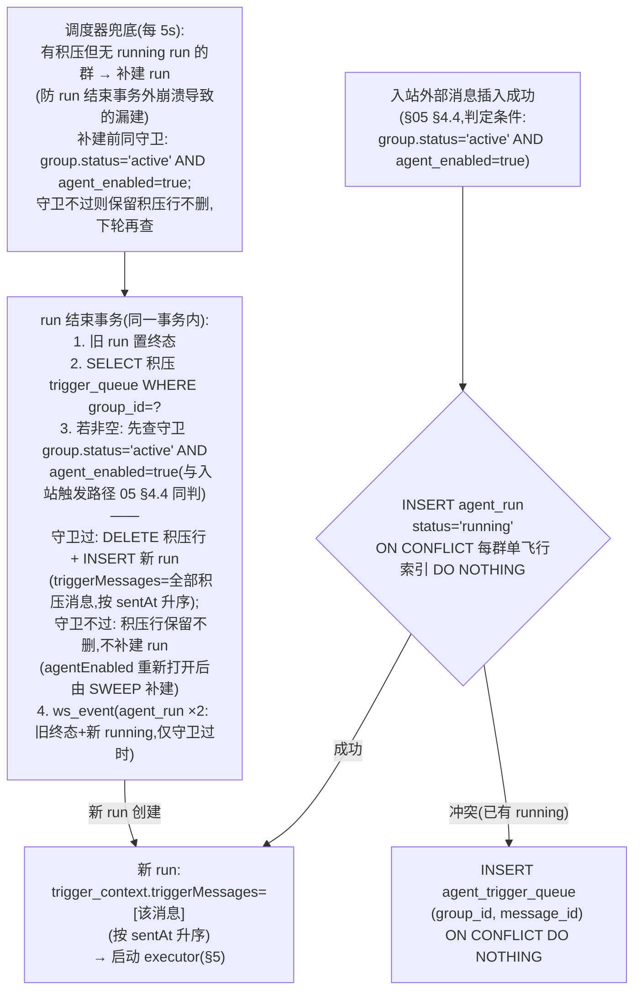
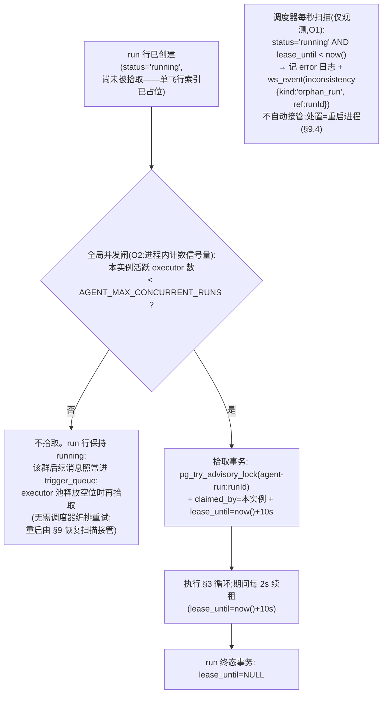
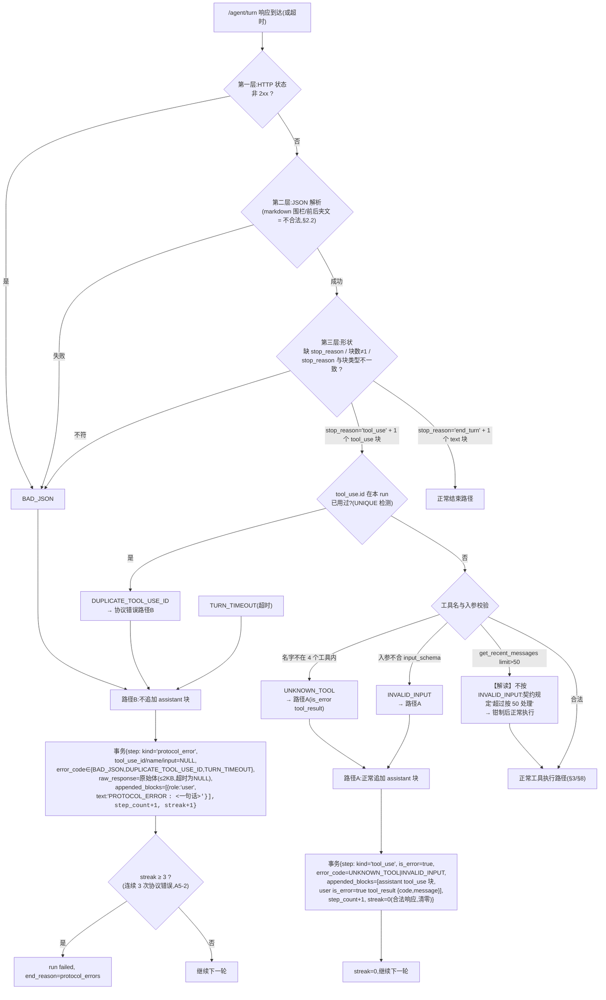
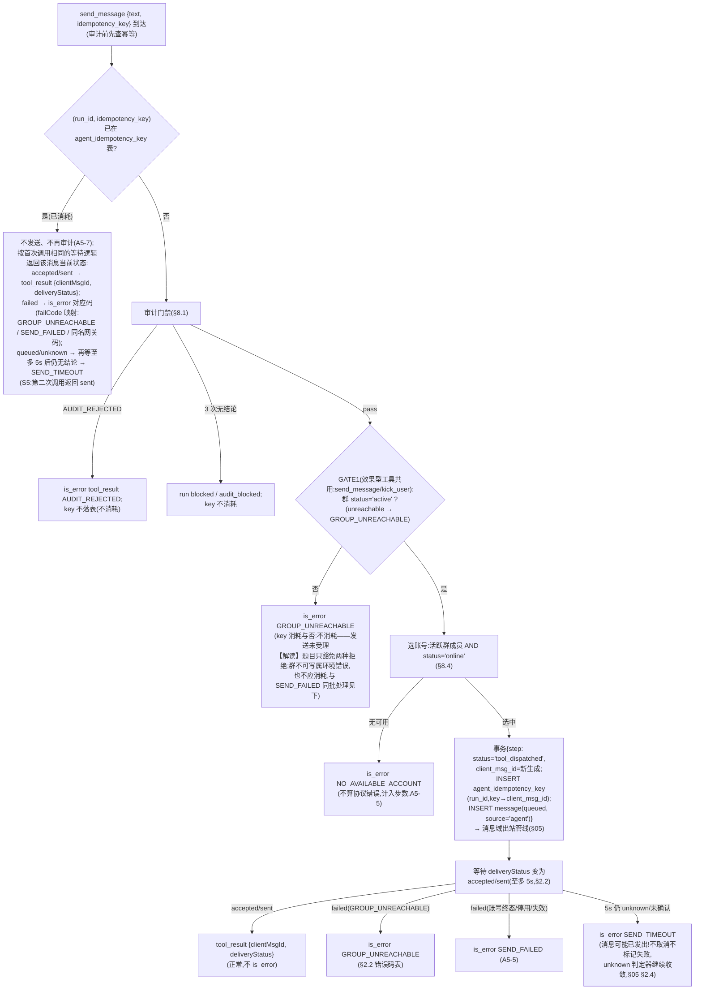
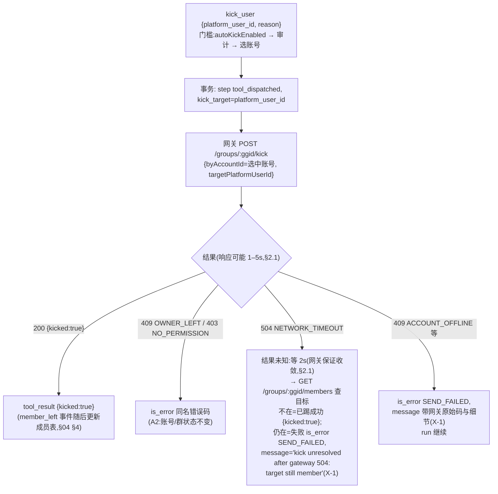
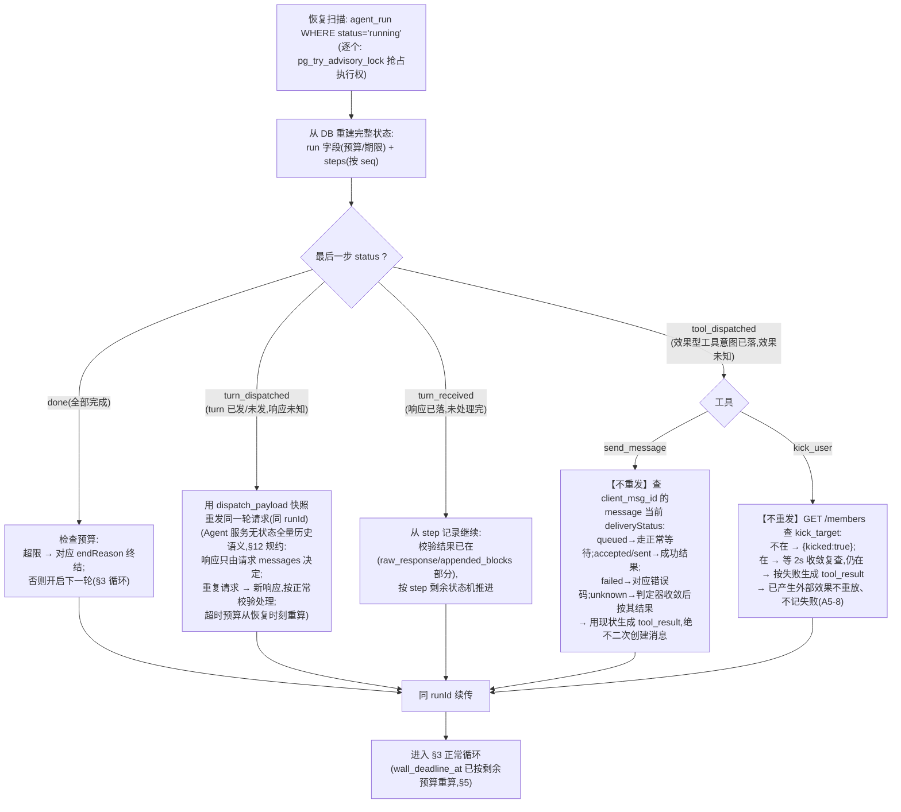
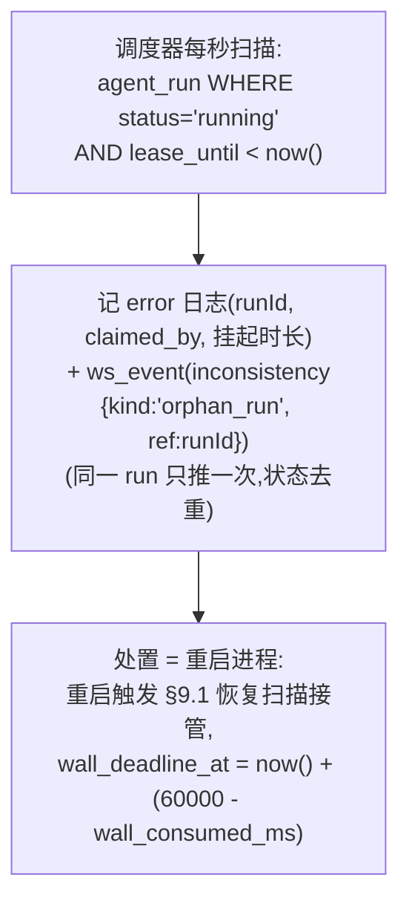

# 06 · Agent 编排域设计

> 覆盖：A5 全部 12 条、§2.2 协议防御、S5/S6 场景。
> 契约依据：[analysis/03-agent-contract.md](../analysis/03-agent-contract.md)；[analysis/05-requirements-A.md](../analysis/05-requirements-A.md) A5。

## 1. run 状态机与 endReason 映射



`endReason → status` 映射与 §2.3 逐字对齐：`final→finished`；`budget_exhausted|wall_clock|protocol_errors→failed`；`audit_blocked→blocked`；`cancelled→cancelled`。

## 2. 触发与单飞行（A5-1）



- 单飞行靠 `uq_agent_run_single_flight` 部分唯一索引——**多实例部署成立**（A5-1），进程内无任何判定。
- 「立即创建下一次 run」：结束与新建在同一事务，原子。
- **补建守卫（END2 第 3 步与 SWEEP 同判）**：补建 run 前复查 `group.status='active' AND agent_enabled=true`（与入站触发路径 [05](05-messaging-module.md) §4.4 同判）。守卫不过时**不补建 run，积压行保留不删**——run 因 unreachable / 关闭 agentEnabled 被 cancelled 后，积压不再立即催生「出生即取消」的 run；agentEnabled 重新打开后由 SWEEP 用积压补建，恰好实现「重新启用后补处理」（README 解释声明 #26）。
- executor 启动竞争（多实例/恢复并发）：`pg_try_advisory_lock('agent-run:'+runId)`，抢到的实例执行，抢不到的退出。

### 2.1 拾取、租约与全局并发闸（容量设计，[13](13-capacity.md) §3 轴 6）

run 行的**创建**与**拾取**（executor 开始执行）是两个步骤，中间可以有时差：



- **闸门语义（精确，O2 简化后）**：`AGENT_MAX_CONCURRENT_RUNS`（env，默认 50【设计值】）只限制 executor 的**拾取**，不限制 run 行的**创建**——A5-1「run 结束时若有待处理消息立即创建下一次 run」保持原语义（run 行可以是 running 但尚未被拾取；每群单飞行索引不受影响）。**实现形态为进程内计数信号量**：executor 结束释放空位时触发待拾取 run 的扫描，不做「调度器每秒重试拾取」的编排（考试规模并发 run ≤ 10，信号量足够；多实例下各实例闸门独立，上限语义=每实例）。**系统的真实并发容量 = 该配置值**（容量文档的核心配置项，[13](13-capacity.md) §4）叙事保留。
- **租约参数**：续租间隔 2s、租期 10s（> 2× 续租间隔，容忍一次续租抖动）——均【设计值】。
- **租约的定位（O1 裁剪后）**：advisory lock 防的是「两个 executor」（互斥），启动恢复扫描防的是「进程死了」（重启触发）；两者都覆盖不了**进程活着但 executor 挂死**（如事件循环卡死）。租约对该缺口降级为**观测**：调度器发现 `lease_until` 过期的 running run → 记 error 日志 + 推 `inconsistency`，**不做 terminate + 自动接管编排**——所有外呼已带超时（挂死的主要来源被堵住，§01 §4.4），事件循环整体卡死时 health check 也会暴露；真发生挂死，重启进程即触发 §9.1 既有恢复扫描。原「`pg_terminate_backend` 强杀持锁会话 + 两租期误杀窗口辩护」的编排是全场最 exotic 的路径，裁剪依据见 review §2.4 O1。

## 3. turn 循环总时序（正常路径 + 审计）

```mermaid
sequenceDiagram
    participant EX as run executor
    participant DB as DB(run/step 表)
    participant AG as Agent 服务
    participant AU as /agent/audit
    participant MSG as 消息域(§05)

    Note over EX: 预算预检: step_count<12 且 now()<wall_deadline_at
    EX->>DB: 事务{INSERT step(seq=n, kind, status='turn_dispatched',<br/>dispatch_payload=请求体快照)}
    Note over EX,DB: 意图先行:崩溃恢复按快照重发本轮
    EX->>AG: POST /agent/turn {runId, tools×4, messages}
    alt 超时(10–15s 可配,默认 12s)
        EX->>EX: AbortController 取消;超时后才到的响应丢弃(A5-2)
        EX->>DB: 事务{step: kind='protocol_error', error_code=TURN_TIMEOUT,<br/>raw_response=NULL, appended_blocks=[{role:user,text:<br/>"PROTOCOL_ERROR TURN_TIMEOUT: …"}], streak+1, done}
    else 响应到达
        EX->>EX: 三段式校验(§4): HTTP状态 → JSON → 形状
        EX->>DB: 事务{step: raw_response=原始体(≤2KB), status='turn_received'}
        alt stop_reason=end_turn
            EX->>DB: 事务{step: kind='final', appended_blocks=[assistant text];<br/>run: status='finished', end_reason='final',<br/>summary=text(不发群), step_count+1}
        else 合法 tool_use
            EX->>EX: tool_use_id 重复检测(UNIQUE(run_id,tool_use_id))
            EX->>DB: 事务{step: kind='tool_use', tool_use_id, name, input;<br/>appended_blocks+=[assistant tool_use 块]}
            alt 工具是 finish
                EX->>DB: 事务{step: kind='final', result_summary='ok';<br/>run finished/final, summary=input.summary; done}
            else 工具是 get_recent_messages
                EX->>DB: 查最近消息(§7.1) → 组装 content(≤8KB,截断置truncated)
                EX->>DB: 事务{step: appended_blocks+=[user tool_result],<br/>result_summary(≤200字), done}
            else 工具是 send_message / kick_user(效果型,先审计)
                loop 审计至多 3 次(单次失败不返回agent/不计步,A5-4)
                    EX->>AU: POST /agent/audit {text, groupId}
                    alt verdict=pass
                        EX->>EX: 审计通过
                    else verdict=fail
                        EX->>DB: 事务{step: is_error=true, error_code=AUDIT_REJECTED,<br/>audit_verdict='fail', appended_blocks+=[is_error tool_result]; done}<br/>(key 不消耗,A5-7;run 继续)
                    else 无结论(500/坏JSON/超时)
                        EX->>EX: 重试(计入 60s 墙钟)
                    end
                end
                Note over EX: 3 次都无结论 → run blocked(§8.3)
                EX->>DB: 事务{step: audit_verdict='pass', status='tool_dispatched',<br/>工具执行意图落库(§8)}
                EX->>MSG: 执行工具(创建出站消息 / kick)
                EX->>DB: 事务{step: appended_blocks+=[tool_result(§8 各码)],<br/>result_summary, done}
            end
        else 校验失败/未知工具(§4)
            EX->>DB: 对应协议错误分支(§4)
        end
    end
    EX->>EX: 合法响应 → streak=0;循环回到预算预检
```

**每步事务的固定结构**（崩溃恢复的基石）：
1. step 行先以 `status='turn_dispatched'` 落库（带请求快照）→ 才发 HTTP；
2. 响应/超时/校验结果以条件更新写回（`WHERE status='turn_dispatched'`）；
3. 效果型工具在执行前落 `status='tool_dispatched'` + 执行参数；
4. 工具结果与 `appended_blocks` 同事务写回 → `status='done'`；
5. run 级字段（step_count/streak/wall_consumed_ms）随步骤事务同步累加。

## 4. 协议错误分类处理（A5-3，S6）



关键语义：
- **路径 A（未知工具 / schema 不符）**：响应本身是合法 JSON 形状 → assistant 的 tool_use 块**照常追加**进会话历史，再追加 `is_error:true` 的 tool_result（`UNKNOWN_TOOL`/`INVALID_INPUT`）；这是「合法响应」（清零 streak）。
- **路径 B（BAD_JSON / 重复 tool_use.id / 超时）**：**不追加 assistant 块**，只追加一条 `role:'user'` 的 text 块 `PROTOCOL_ERROR <code>: <一句话>`；计入步数、计入 streak。
- 两类都计步（A5-2「一步 = 一次往返，无论返回的是什么」）；协议错误步的 `toolUseId/name/input` 为 `NULL`（§2.3）。

## 5. 三重预算与墙钟（A5-2）

| 预算 | 存储 | 判定时机 | 超限动作 |
|---|---|---|---|
| 12 步 | `step_count` | 每轮循环开始前 | run `failed / budget_exhausted`（若第 12 步恰好 finish → `final`，上限含结束步） |
| 60s 墙钟 | `wall_deadline_at` + `wall_consumed_ms` | 每轮循环开始前 + 审计每次重试前 + send_message 等待中 | run `failed / wall_clock` |
| 连续 3 次协议错误 | `protocol_error_streak` | 协议错误落库后 | run `failed / protocol_errors` |

墙钟的崩溃语义（「重启后从恢复时刻继续累计，停机时间不计」）：

```
新 run:   wall_deadline_at = created_at + 60s
每步事务: wall_consumed_ms += now() - greatest(resume_at, 本步开始)
          resume_at = 本步事务时刻
恢复时:   wall_deadline_at = now() + (60000 - wall_consumed_ms)
```

- 60s **含等审计的时间**：审计重试循环内每次重试前检查 deadline，超限立即 `wall_clock` 结束（而非无限重试到 3 次）。
- `send_message` 工具的 5s 等待同样计入。

## 6. `/agent/turn` 请求组装与响应校验细节

- **tools 数组**：4 个工具的 name/description/input_schema 硬编码常量；`input_schema.required` 覆盖全部入参（§2.2 要求，否则 Agent 服务 400 TOOLS_INVALID——我方保证永不触发）。
- **messages 组装**：`[ {role:'user', content:[{type:'text', text: trigger_context JSON 串}]} ]` + 按 `seq` 顺序拼接各 step 的 `appended_blocks`。会话历史**完全由 DB 重建**，executor 无内存状态依赖（A5-8 恢复的基础）。
- **runId**：即 `agent_run.id`，恢复续传沿用同一 id（Agent 服务按 runId 记会话状态，§2.2）。
- **超时后才到的响应丢弃**（A5-2）：AbortController 取消 + 该轮 step 已按 TURN_TIMEOUT 落库（条件更新 `WHERE status='turn_dispatched'`）→ 晚到响应写回时 rowcount=0，直接丢弃。

## 7. 工具实现

### 7.1 `get_recent_messages { limit }`

- `limit = min(limit, 50)`（超 50 按 50 处理，§2.2）；非正数 → `INVALID_INPUT`（schema 校验）。
- 查询：该群 `is_own` 任意、按 `sent_at ASC, sort_key ASC` 取最近 N 条；**包含触发消息本身和 run 期间新到的消息**（无时间过滤——查询时刻的快照）；
- 每条：`{ msgId, senderPlatformUserId, isOwn, text, sentAt }`；单条 `text` 超 500 字截断并置整体 `truncated: true`；
- 返回 content：`{"messages":[…],"truncated":bool}`，整体再过 8KB 截断闸（A5-9，截断置 `truncated:true`）。
- 连续重复同样入参调用（A5-11）：正常执行返回（内容可能因新消息而变）；模型若持续空转，12 步 / 60s 预算自然终结——不额外设防（题目允许自定，取最简）。【解读】

### 7.2 `send_message { text, idempotency_key }`

见 §8.2。

### 7.3 `kick_user { platform_user_id, reason }`

见 §8.5。

### 7.4 `finish { summary }`

- 不调 `/agent/turn`（§2.2）；事务：step `kind='final'`、`result_summary='ok'`、run `finished/final`、`summary=input.summary`。

## 8. 效果型工具执行（send_message / kick_user）

### 8.1 审计门禁（A5-4）

```
text 送审内容:
  send_message → 待发文本本身
  kick_user    → JSON.stringify({ action:'kick', platform_user_id, reason })
verdict 恰为 'pass' 才执行(合法 JSON 且字段精确匹配)
'fail' → AUDIT_REJECTED(is_error tool_result 返回 agent,run 继续,不执行,不消耗 key)
拿不到结论(非2xx/坏JSON/无verdict/verdict其他值/超时) → 重试,至多 3 次同一次工具调用
  · 单次失败不返回给 agent、不计步、不计协议错误
  · 耗时计入 60s 墙钟
  · 3 次都无结论 → run blocked / audit_blocked,该工具不执行,ws_event(agent_run) 通知操作员
```

### 8.2 send_message 完整流程（含幂等 key，A5-7 / S5）



**key 生命周期**（A5-7 逐条）：
- 消耗 = `agent_idempotency_key` 表落行，时机 = **审计 pass 且创建出站消息的同一事务**；
- `AUDIT_REJECTED` / `POLICY_DENIED`（kick）被拒 → 不落表 → 不消耗；
- 第二次同 key → 查表命中 → 返回当前状态，**不再审计**（S5 验收点）、不再发送；
- `SEND_TIMEOUT` 后 Agent 用同 key 重试（§2.2 列明的恶劣行为）→ 命中表 → 返回消息当前状态（可能已 `sent`）——恰好是 S5 的编排。

### 8.3 blocked 的执行位置

审计 3 次无结论：事务 {step 补记 `audit_verdict='unresolved'`（is_error=false、无 tool_result——run 直接终结）；run `status='blocked'`,`end_reason='audit_blocked'`;`ws_event(agent_run)`}。该工具不执行。

### 8.4 执行账号选择（A5-5/6）

| 工具 | 候选集合 | 选择规则 | 无候选 |
|---|---|---|---|
| `send_message` | `group_member` 活跃行 ∧ `account.status='online'` | 按 `account_id` 字典序取第一个【解读】（题目让我方决定；字典序确定性好测试） | `NO_AVAILABLE_ACCOUNT`（不计协议错误、计步） |
| `kick_user` | 同上 ∧ `role ∈ {creator, admin}` | 同上 | `NO_AVAILABLE_ACCOUNT` |

`kick_user` 前置门槛（顺序）：
1. `group.auto_kick_enabled=true`，否则 `POLICY_DENIED`（is_error tool_result，不执行、不进协议错误）；
2. 审计门禁；
3. 群状态门禁 GATE1（与 send_message 共用，§8.2）：`status≠'active'` → `GROUP_UNREACHABLE`（is_error tool_result 收尾——当前步合法完成，会话历史无悬挂 tool_use，X-2）；
4. 账号选择（须 creator/admin）。

**执行中途账号变终态**（A5-5）：send 在等待窗口内消息变 `failed`（`ACCOUNT_TERMINAL` 等终态取消码）→ 该步 `SEND_FAILED`，**run 继续**（executor 不因账号终态终止）。

### 8.5 kick_user 执行



- **错误码封闭性（X-1）**：tool_result 的 `code` 只能取 §2.2 的 13 个错误码——`NETWORK_TIMEOUT`（kick 504 收敛后目标仍在）与 `ACCOUNT_OFFLINE` 等**网关侧**码不在表内，一律映射 `SEND_FAILED`（语义=操作未成功），网关细节写入 tool_result 的 `message`。「Agent 服务根据 code 决定下一步」，表外码属于协议违约，我方校验器/测试按码表断言也会翻车。`OWNER_LEFT` / `NO_PERMISSION` 在表内且 A2 明文要求同名透传，保持透传。
- kick 是「已产生外部效果」的工具之一：崩溃恢复判定用 `kick_target` 查成员列表（§9）。

## 9. 崩溃恢复（A5-8，最重的正确性要求）

### 9.1 崩溃点分析与恢复动作



### 9.2 为什么「已产生外部效果的工具不重放不记失败」成立

| 效果 | 崩溃前已落库的凭据 | 恢复时的外部可观察状态 | 结论 |
|---|---|---|---|
| send_message | `step.client_msg_id` + `message` 行(queued) + 幂等 key 行 | `message.delivery_status` 及其后续收敛（判定器保证） | 从 DB 现状生成 tool_result；二次创建被 `(run_id,key)` PK 阻止 |
| kick_user | `step.kick_target` | 网关成员列表（2s 收敛） | 目标不在 → 成功；在 → 失败——两种都以 tool_result 回填，run 继续，不判定 run 失败 |

会话历史（`appended_blocks`）按 step 顺序拼接，重发 turn 时与崩溃前发出的请求内容一致（快照落库）；Agent 服务按无状态全量历史语义运行（§12 规约），重发不会使会话错位。

### 9.3 恢复不成立的兜底

- advisory lock 抢不到（另一实例在跑）→ 本实例跳过；
- executor 执行中再次崩溃 → 下次重启重复 §9.1（幂等）；
- 60s 墙钟在停机中流逝不计，恢复后从剩余预算继续（§5）——若剩余 ≤ 0，恢复后第一轮预检即 `wall_clock` 终结（合理：不能永远悬置 running run）。

### 9.4 孤儿租约的观测（O1 裁剪后的形态）

启动恢复只覆盖「进程死了」；**进程活着但 executor 挂死**（事件循环卡死、外呼泄漏）时 advisory lock 仍被持有、恢复扫描不会触发——run 会悬在 `running`。租约（§2.1）对这个缺口的覆盖是**观测 + 人工处置**（O1 裁剪：原「`pg_terminate_backend` 强杀持锁会话 + 自动接管」的编排删除——强杀是全场最 exotic 的操作，「两个租期 + 条件更新兜底」的误杀辩护逻辑本身说明复杂度超标）：



- 挂死的主要来源已被堵住：所有外呼显式超时（[01](01-architecture.md) §4.4）；事件循环整体卡死时 `/api/health` 与外部观测都会暴露——「重启进程」是低成本、可解释、无误杀风险的处置。
- **墙钟按停机语义重算**（保留原语义）：恢复接管时 `wall_deadline_at = now() + (60000 - wall_consumed_ms)`——挂死期间 run 未被推进，等价于停机（A5-2「停机时间不计」；若把挂死时间计入墙钟，恢复后可能立即 `wall_clock` 终结，剥夺其完成机会）。
- `lease_until` 字段、续租与扫描本身保留（近零成本、可观测性有价值）；删除的只是 terminate + 自动接管编排。

## 10. 外部状态变化 → cancelled（A5-10）

取消采用**协作式**：不掐断进行中的 turn / 工具执行（「当前这一步结束后终止」），检查点**只有一个**——每步循环开始前（X-2 修订：原「效果型工具执行前」检查点删除）：

```
检查点(每步循环开始前,发起本轮 turn 之前):
  SELECT status, agent_enabled FROM group WHERE id=?
  IF status='unreachable' OR agent_enabled=false THEN
    事务{run: status='cancelled', end_reason='cancelled';
        ws_event(agent_run)}      -- 此刻无进行中的步,无需补落 step
    executor 退出
```

- 触发源：`GROUP_WRITE_FORBIDDEN` 级联（§04 §1）与 `PATCH /api/groups/:id` 关闭开关（§04 §5）都不直接改 run——它们只改群状态，executor 检查点发现后自行终止。这保证了「当前这一步结束后」的精确语义，且崩溃安全（群状态是持久化真值）。
- **为什么不再需要「效果型工具执行前」检查点（X-2）**：群 unreachable 对发送的拦截已由 GATE1 覆盖（§8.2，kick_user 经 §8.4 第 3 门槛共用）——工具级检查让当前步以合法的 `GROUP_UNREACHABLE` 错误 tool_result 收尾（会话历史无悬挂 tool_use），**随后在循环顶部检查点 `cancelled`**，恰好实现 A5-10 的「当前步后 cancelled」。原第二检查点会把进行中的 send_message 步拦腰截断：turn 已返回 tool_use、工具不执行、无 tool_result——与契约「当前这一步结束后终止」相悖，且与「当前步照常落库（含 tool_result）」的原自述矛盾（工具没执行哪来 tool_result）。
- 检查点在**发起 turn 之前**判定：若本轮 turn 已发出、工具已开始执行，则等本步完整落库（`done`）后的下一个循环顶部再取消——不存在「半个步」。

## 11. 端点与查询（§2.3）

- `GET /api/agent-runs/:id` → run 字段 + `steps[]`（按 seq）逐字段映射：协议错误步 `toolUseId/name/input=null`；`rawResponse` 落库时已截断 2KB；`isError=true` 时 `errorCode` 必填由写路径保证。
- `GET /api/groups/:id/agent-runs` → 最近运行列表（`ORDER BY created_at DESC LIMIT 20`【解读】分页可选），不含 steps。
- `endReason` 仅 `status ≠ running` 时非 null——查询层直接映射列约束。

## 12. 设计取舍、实现规约与风险

- **executor 常驻进程内 + advisory lock**：而非「每步由调度器推进」。turn 是长交互（10–15s 超时、5s 工具等待、多轮），调度器粒度推进会把简单循环切成碎片状态机；executor + 断点落库已满足崩溃一致性。
- **实现规约（评审确认）：Agent 服务按「无状态全量历史」语义实现，同 runId 重发 turn 不是风险**。依据：§2.2 协议是全量历史形状——每次 `/agent/turn` 携带完整 `messages`，会话的权威历史在我方 DB（各 step 的 `appended_blocks`）；Agent 服务侧没有可被「推进两次」的增量状态，`runId` 只是会话键。turn 本身无外部效果，A5-8「不能再执行一次、也不能被记成失败」约束的对象是**工具调用**（send_message / kick_user，由 §9 的 `tool_dispatched` 分支守卫）。因此「同 runId + 同请求快照重发 turn」正是题目明文「使用同一个 runId 继续」的实现手段。由此对 mock-agent 与 C2 适配器（[12-agent-service.md](12-agent-service.md) §2）的硬性要求：**响应只由请求里的 `messages` 决定，不得把「收到几次请求」当对话轮次**；「同 runId 重复请求 → 返回新响应」列为故障开关测试项（开关 `same_runid_redispatch`，见 [12](12-agent-service.md) §7 清单）。
- **风险 1**：`appended_blocks` 的 JSON 形状必须与协议逐块一致（`tool_result` 在 user 消息里等），编码时用共享类型 + 快照测试锁定。
- **风险 2**：审计 3 次重试与 60s 墙钟的交互（重试中途墙钟到期 → `wall_clock` 而非 `audit_blocked`）需要测试覆盖两种交错。
