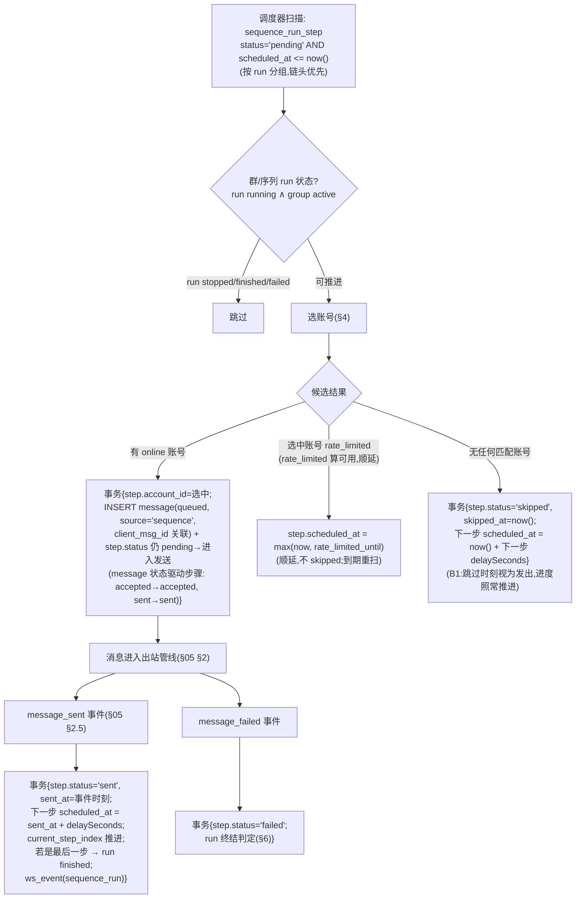
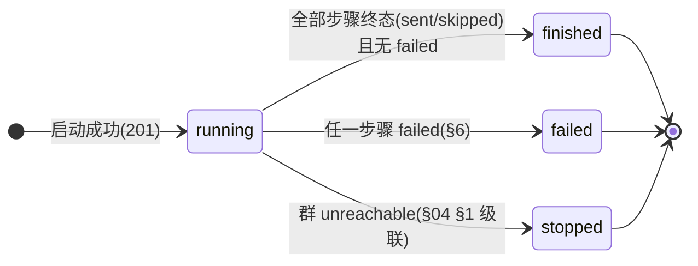
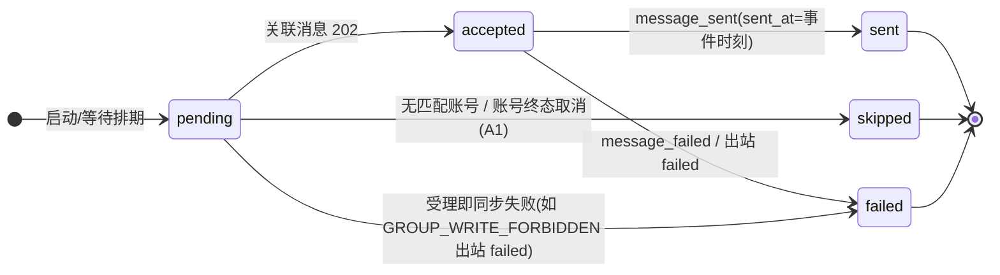
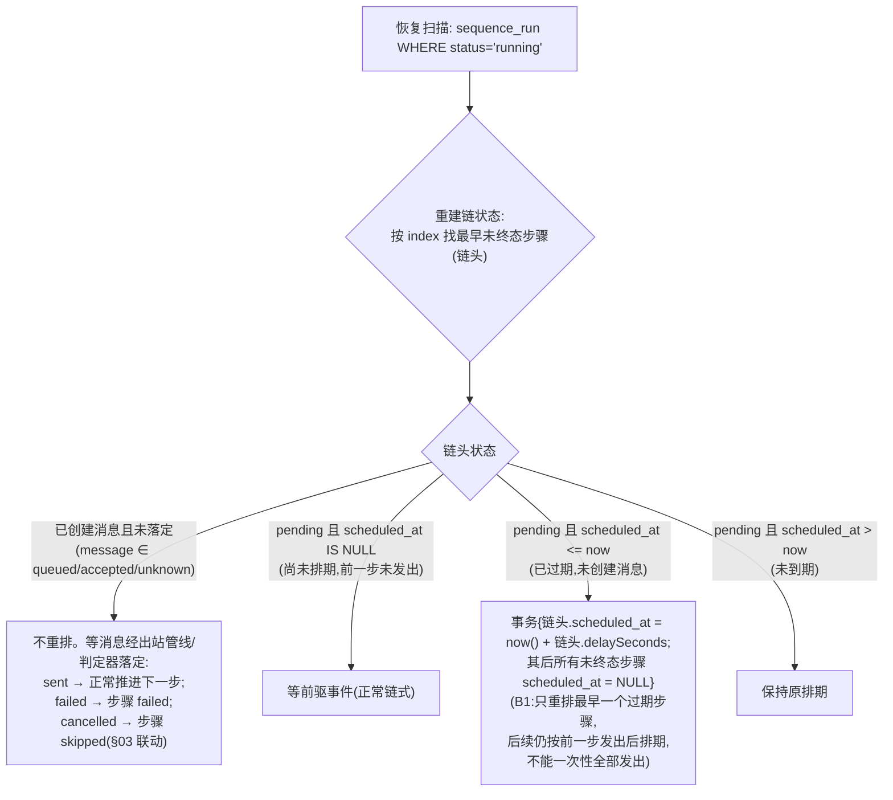

# 07 · 序列域设计

> 覆盖：B1 全部、S7/S8 场景、A1 终态对序列步骤的联动。
> 契约依据：[analysis/06-requirements-B.md](../analysis/06-requirements-B.md) B1。

## 1. 序列定义（`POST /api/sequences`）

入参校验（`400 VALIDATION_ERROR`）：
- `name` 非空字符串；
- `steps` 非空数组；每步 `index`（正整数、唯一、可不连续——运行按 index 升序）、`accountRole ∈ {admin, member}`、`text` 非空、`delaySeconds ≥ 0`；`text` 长度上限与操作员发送共用 `TEXT_MAX_LENGTH`（2000 字符【设计值】，[05](05-messaging-module.md) §2.1.1，D3-6）；
- 通过后原样存入 `sequence.steps`（jsonb 快照），返回 `{ id }`。定义阶段**不做**占位符校验（占位符与启动参数相关，预检在启动时做）。

## 2. 占位符解析与预检（B1 / S8）

### 2.1 解析规则

- 占位符语法：文本中 `{key}`，`key` 匹配 `[A-Za-z0-9_]+`；
- 扫描正则 `/\{([A-Za-z0-9_]+)\}/g`；不匹配该字符集的花括号（如 `{-}`、`{a b}`）视为普通文本【解读】——契约只定义了合法 key 的形态，其余按字面量处理；
- 替换时机：**发送时**解析（B1）；实际实现为启动预检时对每步算好 `resolved_vars` 快照存入步骤行（「发送时解析」的语义等价物：值在启动时全部确定、发送时只做字符串替换——B1 的变量规则不存在运行中再变的可能）。

### 2.2 变量合并语义（B1 取值规则）

设初始取值表 `cur = vars`（其中值为 `""` 的键**视为未提供**，即删除）。按 index 升序逐步推进：

```
for step in steps(升序):
  stepVars[i] 中 key→value (value ≠ "") 的项: cur[key] = value, source[key] = "step:<i>"
  stepVars[i] 中 value = "" 的项: 不改(继承当前值)
  resolved_vars[i] = cur 的快照; var_sources[i] = source 的快照
```

- `vars` 的 `""` = 未提供（该 key 若被占位符引用且无后续覆盖 → 预检失败）；
- `stepVars` 的 `""` = 这一步不改（继承）——两者语义相反；
- `var_sources` 标**最初给出该值的步**：后续步骤沿用时不改写 source（B1 明文）。

### 2.3 示例推演表（实现与测试的共同基准）

序列步骤 index 1–4，`text` 分别引用 `{event}` `{event} {location}` `{location}` `{time}`：

| 输入 | 值 |
|---|---|
| `vars` | `{ "event": "发布会", "location": "", "time": "" }` |
| `stepVars` | `{ "2": { "location": "共享盘/Q2" }, "3": { "location": "", "event": "" } }` |

逐步计算：

| step | 合并动作（stepVars[i]） | cur（该步 resolved_vars） | var_sources |
|---|---|---|---|
| 1 | 无 | `{event:"发布会"}`（location/time 因 `vars` 的 `""` 视为未提供而删除） | `{event:"default"}` |
| 2 | `location="共享盘/Q2"`（非空 → 覆盖） | `{event:"发布会", location:"共享盘/Q2"}` | `{event:"default", location:"step:2"}` |
| 3 | `location:""`（**不改**，继承）；`event:""`（**不改**，继承） | `{event:"发布会", location:"共享盘/Q2"}` | 沿用最初给出者：`{event:"default", location:"step:2"}` |
| 4 | 无 | `{event:"发布会", location:"共享盘/Q2"}` | 同上 |

预检结论：步骤 4 引用 `{time}`——`cur` 无 `time`（`vars` 的 `""` 视为未提供）→ **422**，`error = { code:'UNRESOLVED_PLACEHOLDER', message, requestId, stepIndex: 4, key: 'time' }`。

> S8 对照：第 3 步有解析不了的占位符 → `stepIndex=3`、`key` 为该占位符名——按 index 升序首个失败步骤返回。

### 2.4 预检失败的事务语义（S8）

```
启动事务:
  1. 预检(纯计算,无写) —— 任一 {key} 解析不到 → 抛 UNRESOLVED_PLACEHOLDER(stepIndex, key)
  2. INSERT sequence_run + 全部 sequence_run_step(resolved_vars/var_sources 快照)
  3. 第 1 步 scheduled_at = now() + steps[0].delaySeconds
  4. INSERT ws_event(sequence_run)
→ 201 { runId }
```

- 预检在任何 INSERT 之前 → **一条都不发、不留下运行记录**（S8：「之后可以正常启动」——下次启动从头预检）；
- 并发启动互斥：`uq_sequence_run_single_flight` 部分唯一索引；INSERT 冲突 → `409 SEQUENCE_ALREADY_RUNNING`（S7：恰好一个 201、一个 409——数据库仲裁，多实例成立）；
- 群前置：`group.status` ∈ {`active`,`unreachable`} 中仅 `active` 可启动（`unreachable` 群启动 → 409【解读】契约未明说；unreachable 群不可写，启动必然 stopped，取拒绝。错误码用 `SEQUENCE_ALREADY_RUNNING` 不合适——实现时用 `409 GROUP_UNREACHABLE`【解读】）。

## 3. 链式排期（B1）

### 3.1 排期规则

- 「发出」= **收到 `message_sent` 的时刻**（不是发送时刻）；
- 第 1 步：`scheduled_at = 启动时刻 + delaySeconds[1]`；
- 第 n 步：第 n-1 步 `sent_at`（message_sent 时刻）后 `delaySeconds[n]` → `scheduled_at = prev.sent_at + delaySeconds[n]`；
- **skipped 步骤视为在跳过时刻「发出」**：`sent_at = skipped_at`，下一步照样锚定它；
- 运行中的未来步骤**没有**绝对时刻——只有链头有 `scheduled_at`，后续步骤 `scheduled_at=NULL`（等前一步发出再排）。

### 3.2 步骤推进主循环（调度器每秒扫描）



要点：
- 步骤状态与消息状态联动：`queued`(未发)→`accepted`(202)→`sent`(message_sent)；`failed`(message_failed 或出站 failed)；账号终态取消 → `skipped`（A1 联动，§03 §4 第 4 步）；
- **rate_limited 顺延不跳过**：候选账号集合含 `rate_limited`（不算「没有」），选中的账号限流中 → `scheduled_at` 推到 `rate_limited_until` 之后重扫；
- `POST /api/groups/:id/send` 的操作员消息不受序列顺序约束（与序列共用出站管线但独立排队）。

### 3.3 选账号规则（B1）

| `accountRole` | 候选（活跃群成员 ∧ status ∈ {online, rate_limited}） | 选择 |
|---|---|---|
| `admin` | `role ∈ {creator, admin}` | **优先 role=admin**；admin 中多个取 accountId 字典序第一；无 admin 则 creator（多个 creator 不存在，唯一） |
| `member` | `role = 'member'` | `account_id` 字典序第一个 |

【解读】「优先 admin」的解释：候选集合先按 role 优先级排序再按字典序；`rate_limited` 的账号不因限流而被跳过（顺延语义），但若同优先级中既有 online 又有 rate_limited，取 online（立即可发，语义等价且不无谓拖延）。

### 3.4 启动时序（正常路径示例）

```mermaid
sequenceDiagram
    participant OP as 操作员
    participant API as POST /sequence-runs
    participant DB as DB
    participant SCH as 调度器
    participant MSG as 出站管线
    participant SSE as message_sent 事件

    OP->>API: { sequenceId, vars, stepVars }
    API->>API: 预检(§2.2/2.3) → 失败 422(stepIndex,key)
    API->>DB: 事务{run(running) + steps(resolved 快照);<br/>step1.scheduled_at=now()+10s}<br/>冲突 → 409 SEQUENCE_ALREADY_RUNNING
    API-->>OP: 201 { runId }
    Note over SCH: 10s 后
    SCH->>DB: 扫描到期 step1 → 选账号(admin 步骤)
    SCH->>DB: 事务{INSERT message(queued) 关联 step1}
    SCH->>MSG: 唤醒出站管线
    MSG->>DB: accepted(202) → step1.status='accepted'
    SSE->>DB: message_sent → step1.sent, sent_at=t1<br/>step2.scheduled_at = t1 + 5s
    Note over SCH: 5s 后
    SCH->>DB: step2 到期 → 选账号(member 字典序第一)…
```

## 4. 状态机（run / step）

序列运行（sequence run）状态机：



步骤（sequence step）状态机：



> step 无独立 `cancelled` 态：账号终态时排队消息 cancelled → 步骤映射为 `skipped`（A1 明文）。

## 5. 重启恢复（B1：只重排最早过期步骤）



- 恢复后链头之外的所有 pending 步骤 `scheduled_at=NULL`——即便它们在崩溃前已排期（那只可能发生在链头身上，链是串行的，同一时刻至多一个步骤有未来排期）；
- `now() + delaySeconds` 的语义：把「过期未发」当作「重启时刻才到期」重新排队，防重启风暴（B1 设计意图）。

## 6. run 终结判定

| 路径 | 动作（事务） |
|---|---|
| 最后一步终态且无 failed | `run.status='finished'`, `ended_at`; `ws_event(sequence_run)` |
| 任一步骤 `failed` | 【解读】B1 未细化 run failed 语义：本设计取「任一步 failed → run failed，**不再继续后续步骤**」（失败即停，剩余步骤保持 pending）；`ws_event` |
| 群 `unreachable`（§04 §1 级联） | `run.status='stopped'`（条件更新 WHERE status='running'）；链头消息若已发出/在途不强退——在途消息照常落定，步骤终态随消息；后续步骤不再排期 |

`GET /api/sequence-runs/:id` 响应组装：`{ status, currentStepIndex, steps: [{ index, status, scheduledAt, sentAt, clientMsgId, resolvedVars, varSources }] }`——时间字段 ISO 8601 UTC、无值 `null`（未排期的 `scheduledAt=null`、未发出的 `sentAt=null`）。

## 7. S7 / S8 对照

- **S7（并发启动）**：两个并发 `POST`——预检都可过，`INSERT run` 由部分唯一索引串行化：恰好一个成功 201、一个 `409 SEQUENCE_ALREADY_RUNNING`。多实例同样成立（约束在 DB）。
- **S8（预检失败）**：§2.4 事务时序保证「零消息发出（无任何 INSERT message）、零运行记录（无 run/step 行）」；`422` 响应体：`{ error: { code:'UNRESOLVED_PLACEHOLDER', message, requestId, stepIndex, key } }`；之后同一群可正常启动（无残留状态）。

## 8. 设计取舍与风险

- **每步的 resolved_vars 启动时快照**而非发送时实时计算：值的所有来源（vars/stepVars）在启动时封闭，快照 = 契约语义的等价实现，且让「预检弹窗显示值与来源」与实际发送严格一致（前端页面 5 直接复用）。
- **风险 1**：`""` 双语义（vars 未提供 vs stepVars 不改）是最高频实现错误——§2.3 推演表作为单元测试基准（4 步全分支覆盖）。
- **风险 2**：「无匹配账号 → skipped」与「rate_limited → 顺延」的判定次序：先按 role 过滤（含 rate_limited），无任何候选才 skipped；有候选但选中者限流则顺延。若实现把 rate_limited 排除出候选，会把顺延错做成 skipped（B1 明文禁止）。
