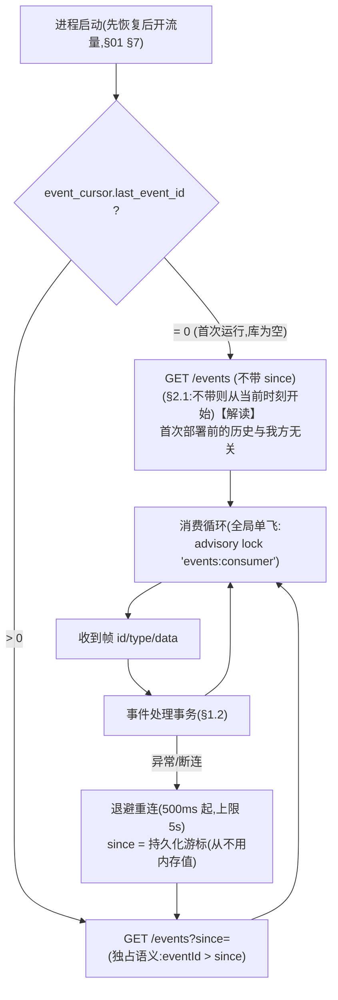
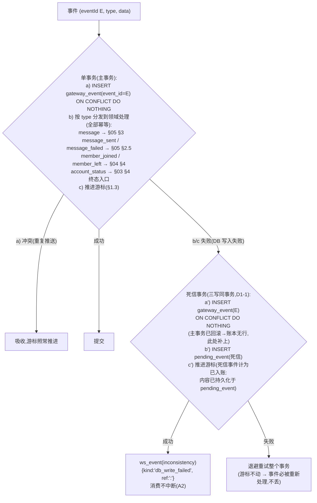

# 08 · 实时层设计：SSE 消费与 WS 网关

> 覆盖：A2 入站事件（at-least-once / 乱序 / 补投 / 停机补拉 / 写失败不丢）、A4 seq 单调、B4 断线 3 秒补齐、§2.3 WS 协议。
> 契约依据：[analysis/02-gateway-contract.md](../analysis/02-gateway-contract.md) §4；[analysis/11-gotchas.md](../analysis/11-gotchas.md) 事件流条目。

## 1. SSE 消费

### 1.1 消费循环



- 游标**只在事务内推进**（见下），重连永远读库——进程崩溃、断线、重启后停机期间的事件由 `since` 补拉全部处理（A2「停机或断开期间的事件恢复后都要处理到」）。
- 事件流在服务启动即开始消费（§2.1：与是否 connect 账号无关）。

### 1.2 事件处理事务与「乱序窗口」的正确应对



**死信事务为什么必须三写同事务（D1-1）**：主事务是 a+b+c 单事务，b/c 失败时**整个事务回滚，账本行也随之消失**。若死信事务只写 `pending_event` + 游标，则 `pending_event.event_id` 的外键（`REFERENCES gateway_event`）必然违例——死信事务自身失败 → 退避重试整个主事务 → 遇永久性错误（如孤儿群的 FK 失败）时在同一事件上无限空转，违反 A2「不能中断」。改为「补账本 + 死信 + 游标」三写同事务后：主事务成功 → 账本有行（§1.4 重试时 a) 冲突跳过、只重放 b)）；主事务失败 → 死信事务补上账本行。前缀游标把死信事件计为「已入账」——事件内容已持久化（`pending_event.payload` 同值），前缀语义不变。

**孤儿事件的分流规则（D3-1）**：`message` / `member_joined` / `member_left` 事件的 `groupId` 无法映射到任何 `group.gateway_group_id` 时分两路：
- **不在任何 running 建群 job 的关联窗口内**（典型来源：E1 崩溃窗口产生的孤儿网关群）→ 仅入账本 + 推一次 `inconsistency {kind:'unknown_group_event', ref:'<type>:<E>'}`，**不进死信**——群映射不存在，死信重试永远不会成功，只会空转 20 次后变成 `dead_letter_stuck` 噪音；
- **处于建群窗口内**（存在 running `create_group` job、网关侧建群结果未知）→ 走死信短重试（`gateway_group_id` 映射很快会出现）。

`account_status` 事件的 accountId 非我方预置账号时同理：入账本 + `inconsistency`，不进死信。

**乱序 ≤1s 的应对**：不试图按到达顺序处理出「顺序」——每个事件的处理都是**对数据库的幂等投影**，展示顺序由查询时的 `ORDER BY sent_at, sort_key` 决定。`message_failed` 先于 `message_sent` 到达（或反之）：消息状态更新守卫（§05 §1）保证只按合法转移生效，先到的重复事件被吸收。

**补投不受窗口限制的应对**：补投事件 `msgId/sentAt` 为原值、`eventId` 更大——去重键 `(groupId, msgId)` 命中已有行 → 幂等跳过；若是停机期间的真补投（首次见到）→ 正常插入，`sentAt` 落在时间线正确位置（keyset 排序天然正确）。

### 1.3 游标 = 连续前缀（乱序到达下不能简单取 max）

`eventId` 全局单调**分配**，但相邻事件**到达**可乱序（≤1s）。若游标 = 已见最大 id，会把「未到的更小 id」跳过（断线补拉 `since=max` 时永久丢失）。

**设计**：游标推进为「连续前缀」语义：

```
处理事件 E 成功后:
  seen = {已入库但 > cursor 的 eventId 集合} ∪ {E}   (重启后从 gateway_event 表重建)
  推进 cursor 到 max X: 所有 eventId ≤ X 均已入库
  UPDATE event_cursor SET last_event_id = X
```

- 正常运行时乱序窗口小（≤1s 的少量 id），`seen` 集合在内存维护、每事务落一次前缀；
- 断线重连：`since=cursor`（连续前缀）→ 网关补发 `eventId > cursor` 的**全部**事件 → 曾经 gap 的 id 现在到达、已入库的重复 id 被 `ON CONFLICT` 吸收——**无损**；
- 网关「保留全部历史事件」（§2.1）使该方案成立。

### 1.4 死信重试

- 调度器每 5s 扫 `pending_event.status='pending' AND next_retry_at<=now()`，按 §1.2 的 b) 步骤重新分发（a 步骤天然冲突跳过——账本行已由死信事务写入，§1.2 三写同事务的前提正在于此）；
- 成功 → `status='done'`；失败 → `attempts+1`，`next_retry_at` 指数退避（上限 5min）；
- 永不丢弃（A2「不能让事件的内容丢失」）；累计失败超过阈值（如 20 次）推 `inconsistency {kind:'dead_letter_stuck'}` 提示操作员。

## 2. WS 网关（`/ws`）

### 2.1 连接协议与生命周期

```mermaid
sequenceDiagram
    participant C as 前端 WS 客户端
    participant H as WS hub
    participant DB as DB
    participant B as 业务事务

    C->>H: 连接 /ws
    Note over H: 未 auth 前不推任何事件(§2.3)
    C->>H: { type:'auth', accessToken, sinceSeq? }
    H->>DB: 验证 access token(§09 §2:查 auth_token)
    alt token 无效/过期
        H-->>C: { type:'auth', success:false } 并关闭
    else 有效
        H-->>C: { type:'auth', success:true }
        opt sinceSeq 存在
            H->>DB: SELECT * FROM ws_event WHERE seq > sinceSeq ORDER BY seq
            loop 逐条补发
                H-->>C: { seq, type, payload }
            end
            Note over H: 补发完成前缓冲实时事件,<br/>补完后按 seq 续推(去重由 seq 保证)
        end
        H->>H: 进入实时模式(订阅本实例 hub)
    end
    B->>DB: 业务事务 INSERT ws_event(seq=BIGSERIAL)
    DB-->>H: 提交后通知<br/>(单实例:进程内通知;<br/>NOTIFY 为多实例预留通道,O4)
    H->>DB: SELECT 新增行(seq > 各连接已推水位)
    H-->>C: { seq, type, payload }
```

### 2.2 seq 单调与补齐（A4 / B4）

- `seq` 由 `ws_event.seq BIGSERIAL` 分配——**全局单调递增**，与业务无关、多实例安全；
- **先持久化后推送**：所有 WS 事件都在业务事务内 INSERT（宪法 §3-1 的直接应用），hub 只投递已提交的行——「推给前端的状态事件必须对应已经保存的状态」（A1）；
- **实时投递**：单实例（默认形态）内存通知直推；多实例的 `LISTEN/NOTIFY` + 兜底轮询为**预留接口，本期不实现**（O4 裁剪：契约对多实例的唯一硬要求是 DB 约束下的正确性，`ws_event` 表已是投递真值、sinceSeq 补发不受影响；演示与测试均为单实例）；
- **sinceSeq 补发**：`seq > sinceSeq` 升序回放（独占语义，与 SSE `since` 一致）；客户端按 `seq` 去重，补发与实时交叠不产生重复（B4「不重复」）；
- **3 秒补齐**（B4）：断线期间的事件已在 `ws_event` 表，重连 auth+补发为纯 DB 读——毫秒级完成；保留窗口 30 分钟（默认）远大于断线场景，过期清理由调度器执行；
- 超过保留窗口的 `sinceSeq`（表里已无该行）：回放从现存最小 seq 开始并先推一条 `inconsistency {kind:'ws_backlog_expired', ref:'sinceSeq'}`【解读】，客户端应整体刷新（页面级兜底）。

### 2.3 事件类型与触发点（§2.3 六类）

| type | payload | 触发点（同事务 INSERT） |
|---|---|---|
| `account_status_changed` | `{ accountId, from, to }` | 每次账号状态转移成功（§03 所有路径） |
| `account_terminal` | `{ accountId, status }` | 终态事务（§03 §4 第 6 步） |
| `inconsistency` | `{ kind, ref, message }` | DB 写失败死信（§1.2）、leave-all 对账不一致（§04 §3.3）、WS 积压过期 |
| `message` | `{ groupId, msgId, isOwn, clientMsgId?, deliveryStatus? }` | 新消息插入（入站/出站受理/回流合并）；出站 deliveryStatus 流转时也推（前端原地更新）。`msgId` 在 queued/accepted 阶段为 `null`（网关尚未分配，D3-3）；`clientMsgId`/`deliveryStatus` 仅 own 消息携带【解读】payload 增补 `clientMsgId`/`deliveryStatus` 便于前端按 clientMsgId 原地更新——契约只要求最低字段（`groupId/msgId/isOwn`），「多出的字段不影响」，null 判断在此写明 |
| `agent_run` | `{ runId, groupId, status, endReason }` | run 创建与每次状态变化（§06） |
| `sequence_run` | `{ runId, groupId, status, currentStepIndex }` | run 创建、步骤推进、终结（§07） |

扩展类型（题目未禁止、前端需要）：`group_updated`（PATCH 开关）、`job`（建群/退群进度）。

### 2.4 hub 实现要点

- 每连接维护 `lastSentSeq` 水位；投递按 seq 升序、逐连接串行（慢连接背压：队列超限（如 1000 条）则断开该连接，客户端重连带 `sinceSeq` 恢复）；
- auth token 过期处理：连接期间 token 过期**不断开**【解读】（WS 建立时验一次；实时性优先，断开由前端在 REST 401 后主动处理）；设计从简，契约未要求连接期续验；
- 心跳：ping/pong 30s，僵死连接清理。

## 3. 时间线实时性与 B4 的组合（前端视角）

前端时间线 = REST 首屏（keyset 分页，§05 §5）+ WS `message` 事件增量：

- 新消息（含自己 queued→accepted→sent 的流转）→ WS `message` 事件 → 按 `msgId/clientMsgId` 原地插入/更新；
- 断线 ≤ 保留窗口 → 重连 `sinceSeq` → 3 秒内补齐缺失事件，`seq` 去重保证不重复；
- 「加载更早」走独立 REST 游标，与 WS 增量正交（§05 §5.2 的两通道职责分离）。

## 4. 设计取舍

- **游标连续前缀 vs 简单 max**：多花了「重建 seen 集合」的逻辑，换来乱序窗口内断线的零丢失——这是 A2「恢复后都要处理到」在乱序语义下的正确解。
- **WS 投递以 `ws_event` 表为真值**（业务事务内写表 + 提交后通知投递）而非纯进程内直推：换来「先持久化后推送」的崩溃一致性与 sinceSeq 补齐的真值来源；通知通道单实例为进程内直推（多实例 NOTIFY+轮询为预留，O4）；代价是每事件一次 INSERT——笔试规模可忽略。
- **风险**：补发与实时通知交叠时，投递去重依赖 `lastSentSeq` 水位的原子性（单连接串行投递保证）；编码时用每连接发送队列串行化（多实例 NOTIFY 通道启用后同样适用）。
