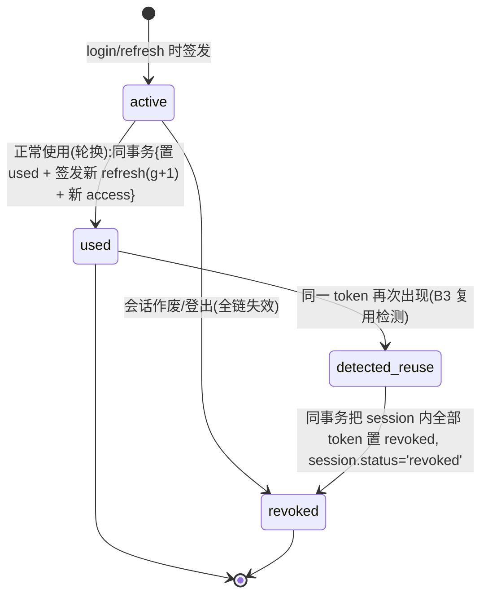
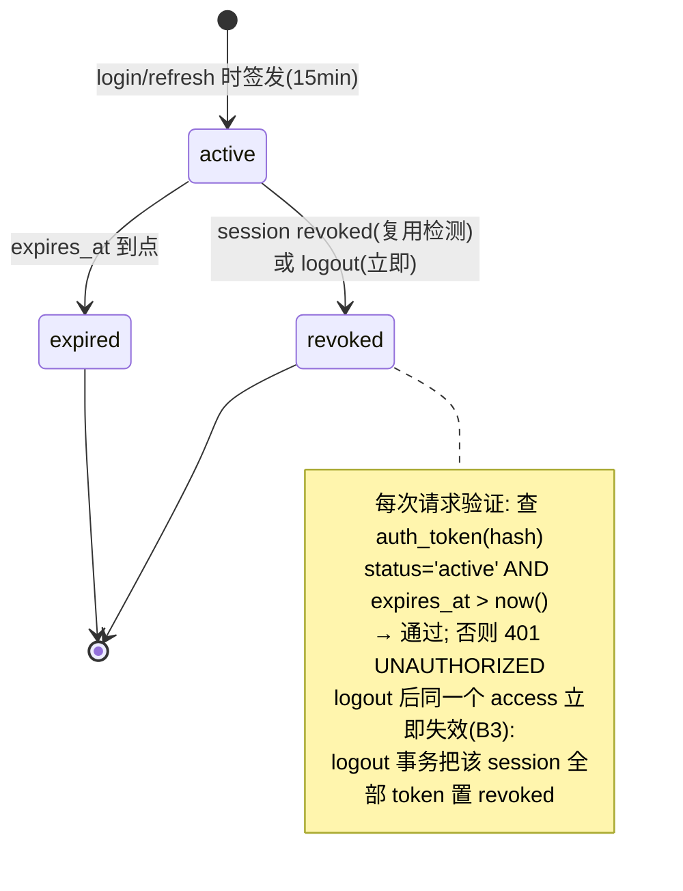

# 09 · 认证与会话设计

> 覆盖：A0（login / viewer 403）、B3（refresh 轮换链 / 复用作废 / logout 立即失效）、§2.3 auth 端点。
> 契约依据：[analysis/06-requirements-B.md](../analysis/06-requirements-B.md) B3；[analysis/10-quick-reference.md](../analysis/10-quick-reference.md) §4。

## 1. 设计立场

B3 的三条要求（refresh 复用 → 整会话作废、logout 后 access 立即失效、轮换）都要求**服务端可判定 token 状态**——纯无状态 JWT 无法满足。因此 access / refresh 均为 opaque 随机串（256bit，crypto.randomBytes），SHA-256 哈希落库，验证即查表（[02](02-data-model.md) §2.3）。单实例 + 小用户量下每次请求一次索引查询的代价可忽略。

## 2. 端点

| 端点 | 请求 | 成功响应 | 失败 |
|---|---|---|---|
| `POST /api/auth/login` | `{ username, password }` | `200 { accessToken }` + `Set-Cookie: rt=<httpOnly>` | `401 UNAUTHORIZED`（用户名或密码错误——不区分提示） |
| `POST /api/auth/refresh` | cookie 中的 refresh token | `200 { accessToken }` + 新 `Set-Cookie` | `401 UNAUTHORIZED`（无效/复用/过期；复用时整会话作废） |
| `POST /api/auth/logout` | access token（Bearer） | `204` | `401` |

- access token 有效期 **15 分钟**（§2.3）；refresh token 有效期 7 天【设计值，题目未规定】；
- Cookie 属性：`HttpOnly; Path=/api/auth; SameSite=Lax; Secure(生产)`——refresh 只通过 HttpOnly cookie 下发，**绝不进响应体**（B3）。

## 3. refresh 轮换链与复用检测（B3 核心）

### 3.1 token 生命周期状态图

refresh token 生命周期：



access token 生命周期：



### 3.2 refresh 时序（正常轮换 vs 复用检测）

```mermaid
sequenceDiagram
    participant C as 前端
    participant API as POST /api/auth/refresh
    participant DB as DB(auth_token/session)

    alt 正常轮换
        C->>API: Cookie: rt=T2(g=1)
        API->>DB: SELECT * FROM auth_token WHERE token_hash=sha(T2)
        DB-->>API: kind=refresh, status=active, session=S, g=1
        API->>DB: 事务{ T2→used; INSERT T3(refresh,g=2,active);<br/>INSERT A3(access,active);<br/>session.current_generation=2 }
        API-->>C: 200 { accessToken: A3 } + Set-Cookie: rt=T3
    else 复用检测(旧 token 再出现,B3)
        C->>API: Cookie: rt=T2(已被轮换)
        API->>DB: SELECT ... → status='used'
        API->>DB: 事务{ session S → status='revoked';<br/>S 的全部 auth_token(active/used) → revoked }
        API-->>C: 401 UNAUTHORIZED
        Note over DB: 之前轮换出的 T3/A3 全部 revoked<br/>→ 整个会话立即失效
    else 其他失败
        C->>API: 无 cookie / 未知 token / 过期 / session 非 active
        API-->>C: 401 UNAUTHORIZED
    end
```

并发细节：两个请求同时用同一 refresh token——`UPDATE auth_token SET status='used' WHERE id=? AND status='active'` 条件更新，恰好一个 rowcount=1（成功轮换），另一个读到 `used` → 走复用检测（这与 B3「旧的再被使用 → 作废」一致：并发重放视同复用）。

### 3.3 logout（B3）

```
POST /api/auth/logout (Bearer access 验证通过)
事务{ session.status='logged_out', ended_at=now();
      该 session 全部 auth_token → revoked }
→ 204
之后同一 access token 查表 status='revoked' → 401(立即生效)
```

### 3.4 前端单飞续期（B3 前端侧，此处定义后端配合语义）

- access 过期 → 任意请求 401 → 前端发一次 refresh（全局单飞 promise，并发 401 共享同一 promise）→ 重放原请求；
- refresh 也 401（会话作废）→ 跳登录页；
- 后端无需感知单飞——语义由「401 + 轮换」的幂等性保证：refresh 成功只发一次（并发第二次触发复用检测是**异常路径**，正常单飞不会发生；即便发生，行为符合 B3 定义）。

## 4. 权限矩阵（A0：viewer 只读，前后端双层）

| 端点 | admin | viewer |
|---|---|---|
| `POST /api/auth/login` / `refresh` / `logout` | ✓ | ✓（login/refresh 本身匿名或任意已登录；logout 需有效 token） |
| `GET /api/health` | ✓ | ✓（匿名） |
| `GET /api/accounts`、`GET /api/groups(/:id)`、`GET /api/jobs/:id`、`GET .../messages`、`GET /api/agent-runs(/:id)`、`GET .../agent-runs`、`GET /api/sequence-runs/:id` | ✓ | ✓（全部只读） |
| `POST /api/accounts/:id/connect` / `transition` | ✓ | **403 FORBIDDEN** |
| `POST /api/groups`、`PATCH /api/groups/:id`、`POST .../send`、`POST .../leave-all` | ✓ | **403 FORBIDDEN** |
| `POST /api/sequences`、`POST /api/groups/:id/sequence-runs` | ✓ | **403 FORBIDDEN** |
| `WS /ws` | ✓ | ✓（订阅事件也是只读） |

- **后端是兜底层**：auth guard 中间件按路由注册的 `write: true` 标记 + token 的 `user.role` 判定，viewer 写操作一律 `403 FORBIDDEN`——前端隐藏按钮只是展示层（页面 2 要求）；
- 判定顺序：401（未认证）先于 403（已认证无权限）。

## 5. 安全要点

- 密码 bcrypt（cost 10）；seed 预置 `admin/admin`、`viewer/viewer`（笔试约定，README 说明生产不可用）；
- token 原文不落库（仅 SHA-256 哈希）、不进日志；
- 登录失败统一 `401 UNAUTHORIZED`（不泄露用户存在性）；
- access 验证每请求一次 DB 索引点查；过期行由调度器定期删除（`expires_at < now() - 1d`）。

## 6. 设计取舍

- **opaque token + 查表 vs JWT**：见 §1。JWT + 黑名单表反而更复杂（仍要查表才能满足 B3）。
- **refresh 并发重放 = 复用**：取 B3 字面语义（「旧的再被使用」不区分意图），实现最简且安全侧稳妥；前端单飞避免误触发。
- **风险**：`Path=/api/auth` 的 cookie 限制使 refresh cookie 不随其他请求发送（缩小暴露面）；前端 refresh 请求必须带凭证（`credentials: 'include'`）——同源部署（Vite proxy）下无跨域问题。
