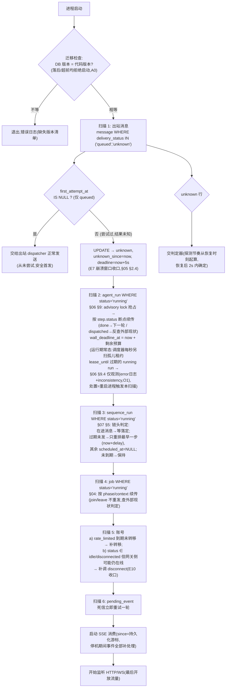

# 10 · 崩溃一致性总设计（可靠性总纲）

> 覆盖：§3 总则「每一条行为在服务任意时刻重启前后都必须成立」、A2 出站不变量、A5-8、B1 重启恢复。
> 本文是全部模块文档的汇总视图：事务边界清单、outbox 应用点、启动恢复扫描、全局不变量。

## 1. 事务边界清单（每个外部效果前的持久化点）

编号规则：`Txx` 事务 / `Exx` 外部效果。**铁律：任何 Exx 执行前，其意图与上下文必须已由某个已提交的 Txx 落库。**

| # | 外部效果 | 前置持久化点（事务内容） | 崩溃窗口的恢复语义 | 详见 |
|---|---|---|---|---|
| E1 | 网关 `POST /groups`（建群） | T1：job(phase=create) + group(creating) | 重发建群（旧网关群成孤儿，无 DB 关联，无害） | [04](04-group-module.md) §2 |
| E2 | 网关 `POST invite` | T2：job(phase=invite 意图 + context) | 重发 invite（幂等：返回新链接覆盖 context） | [04](04-group-module.md) §2 |
| E3 | 网关 `POST join` | T3：job(phase=joining, context.members[x]=dispatching) | 不重发——等 `member_joined` 或 10s 超时（申请可能已受理） | [04](04-group-module.md) §2.4 |
| E4 | 网关 `POST promote` | T4：job(phase=promote, context.promoteCalls=n) | 重发（调用计数已持久化，总数 ≤ 2 约束仍成立） | [04](04-group-module.md) §2 |
| E5 | 网关 `POST kick` | T5：step(status=tool_dispatched, kick_target) | **不重发**：查成员列表判定结果（2s 收敛） | [06](06-agent-module.md) §8.5/§9 |
| E6 | 网关 `POST leave` | T6：job(context.current=accountId, step=leave:x) | **不重发**：查成员列表判定是否已退 | [04](04-group-module.md) §3.3 |
| E7 | 网关 `POST send`（三种来源共用） | T7：message(queued, first_attempt_at=now) | **不重发**：first_attempt_at 非空 → 转 unknown 判定路径 | [05](05-messaging-module.md) §2 |
| E8 | 网关 `GET by-client-id`（unknown 判定） | 无副作用（只读探测），无需意图；探测结果写回条件更新 | 幂等，可自由重试 | [05](05-messaging-module.md) §2.4 |
| E9 | 网关 `POST connect` | 无前置（网关幂等：同 accountId 同 platformUserId）；结果事务 T9（状态 online + platform_user_id + ws_event） | 重发无害 | [03](03-account-module.md) §2 |
| E10 | 网关 `POST disconnect`（transition） | 前置事务 T10（状态已 disconnected/idle） | 恢复器补调（幂等：离线再 disconnect 无害） | [03](03-account-module.md) §3 |
| E11 | `/agent/turn` | T11：step(status=turn_dispatched + dispatch_payload 快照) + run 预算字段 | 用快照重发同轮（同 runId） | [06](06-agent-module.md) §3/§9 |
| E12 | `/agent/audit` | 无独立前置（审计属 step 内部子步骤，重试上限 3 由 step 事务追踪）；审计结论随 step 落库 | 重试计数以落库值为准 | [06](06-agent-module.md) §8.1 |
| E13 | agent `send_message` 创建出站 | T13：step(tool_dispatched, client_msg_id) + 幂等 key 行 + message(queued)（同一事务） | **不重发**：按 message 现状生成 tool_result；key PK 阻止二次创建 | [06](06-agent-module.md) §8.2/§9 |
| E14 | 任何 WS 推送 | T14：ws_event INSERT 与业务状态同一事务 | hub 只投已提交行；sinceSeq 补发以表为真值 | [08](08-realtime-module.md) §2 |

「这一行执行完就崩溃，重启后世界还一致吗」的逐条回答即上表右列——每类外部效果的崩溃答案都是**可判定的**（要么外部幂等可重发，要么有持久化凭据可反查外部现状）。

## 2. outbox 模式的应用点

本项目不设通用 outbox 表——**每类外部效果的业务表就是它的 outbox**：

| outbox 载体 | 待办判定（恢复扫描的 WHERE） | 消费者 |
|---|---|---|
| `message`（queued） | `delivery_status='queued'`（区分 first_attempt_at 是否为空） | 出站 dispatcher（[05](05-messaging-module.md) §2） |
| `message`（unknown） | `delivery_status='unknown'` | unknown 判定器（调度器驱动） |
| `job`（running） | `status='running'` | job 执行器 / 恢复器（[04](04-group-module.md)） |
| `agent_run`（running）+ step（非 done） | `status='running'` | run executor / 恢复器（[06](06-agent-module.md) §9） |
| `sequence_run`（running）+ step（pending） | `status='running'` | 序列调度器 / 恢复器（[07](07-sequence-module.md) §5） |
| `pending_event`（pending） | `status='pending' AND next_retry_at<=now()` | 死信重试 worker（[08](08-realtime-module.md) §1.4） |
| `account`（rate_limited） | `rate_limited_until<=now()` | 限流到期转移（[03](03-account-module.md) §5.3） |

模式统一为：**意图（含触发时刻/凭据）先落库 → 独立消费者按表驱动执行 → 结果条件更新写回**。消费者崩溃不影响意图存在，重启后扫描续传。

## 3. 启动恢复扫描

各扫描的恢复动作均已在其所属模块文档定义（图内标注章节）；本图是清单与顺序的汇总。顺序原则：**先恢复出站与运行中的编排（世界状态收敛），再恢复账号侧收口，最后开流量**。

## 4. 全局不变量清单（验收与测试的断言库）

以下不变量在任意时刻（含崩溃重启后）必须成立，测试逐条断言：

| # | 不变量 | 验证方式 |
|---|---|---|
| I1 | 网关已发出的每条我方消息，DB 必有对应记录（先落库后调用） | 任一时刻 kill -9 后重启，对比网关消息列表与 DB |
| I2 | 一条出站记录（client_msg_id）在网关至多对应一条消息（重发 ≤1 且须先确认未发出；恢复不重发尝试过的） | S5 + 恢复场景：网关计数 == 1 |
| I3 | 时间线无重复行：(group_id, msg_id) 唯一；own 消息回流合并为一行 | S2/S3 + 补投场景 |
| I4 | 每群至多一个 running agent run / running 序列 run（部分唯一索引） | S7 + 并发触发 |
| I5 | 账号状态只沿 A1 转移表变化；终态无出边；CAS 无后写覆盖 | A1 并发测试 |
| I6 | 终态副作用原子：成员移除 + queued→cancelled + 步骤 skipped + account_terminal 事件，要么全有要么全无 | 事务中途回滚测试（测试注入） |
| I7 | 推给前端的 WS 事件对应已持久化状态（同事务） | 崩溃后重放：无「先事件后状态」的窗口 |
| I8 | SSE 游标只推进连续前缀；停机/断线期间事件恢复后全部处理 | 停机期间网关产事件 → 重启 → 时间线齐全 |
| I9 | unknown 从进入起 5 秒内落定（by-client-id 可用时）；不可用期间保持 unknown，恢复后 2 秒内确定 | S 场景 + 503 开关 |
| I10 | agent run 恢复用同一 runId；已产生外部效果的工具不重放、不记失败 | A5-8：run 进行中 kill -9 ×4 个崩溃点 |
| I11 | 序列重启只重排最早过期步骤；不一次性全发 | B1：步骤排期中途 kill -9 |
| I12 | WS seq 全局单调；sinceSeq 补发不重复；断线 3 秒内补齐 | B4 |
| I13 | refresh 旧 token 复用 → 整会话（新旧 refresh + access）立即失效；logout 后 access 立即失效 | B3 |
| I14 | 所有契约时序数字不取整（12 步/60s/10–15s/5s/2s/10s/≤2 次/3 次/15min…） | 常量集中定义 + 快查表对照评审 |

## 5. 测试策略衔接（后端，Vitest + 真实 PostgreSQL）

- **崩溃注入**：测试助手提供 `withCrashPoint(name, fn)`——在事务提交前后、外部调用前后可注入 process exit；恢复断言走重启后的 DB 状态与外部 mock 计数；
- **并发注入**：两连接并发 CAS / 并发启动序列 / 并发触发 run——断言恰好一个成功；
- **场景开关**：mock 网关/agent 的故障开关（S1–S8 + §2.2 恶劣行为清单）在集成测试中逐个打开；
- 每个不变量 I1–I14 至少一个对应测试用例（映射关系在实现仓库的测试计划中维护）。

## 6. 风险登记

| 风险 | 影响 | 缓解 |
|---|---|---|
| advisory lock 依赖连接存活（心跳） | 长事务/网络抖动导致锁意外释放 → 双执行器 | 执行器关键写全部仍是条件更新（锁只是优化，不是正确性来源）；连接 keepalive + 执行前 re-check step 状态 |
| `LISTEN/NOTIFY`（O4 延后，本期不实现） | 多实例时 WS 实时投递缺失 | 单实例（默认）进程内通知不受影响；启用多实例时再实现 NOTIFY + 兜底轮询（§08 §2.2 预留接口）；正确性不受影响（`ws_event` 表是真值，sinceSeq 补发可用） |
| 恢复扫描的步进语义与调度器竞态 | 同一 run 双恢复 | advisory lock + step 条件更新双保险 |
| 迁移版本检查过严（开发期频繁加迁移） | 启动失败烦扰 | 检查是 A0 要求，保留；开发流程「先跑 db:migrate」写入 README |
