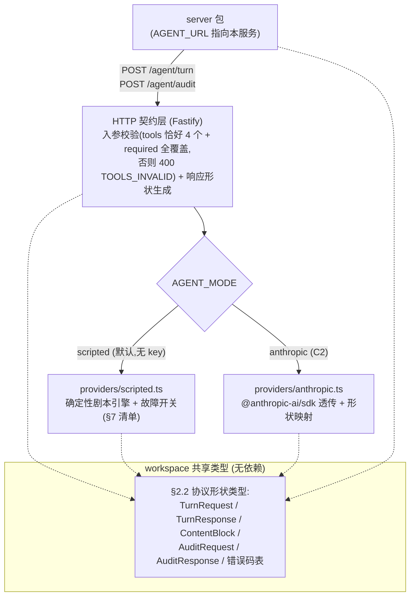
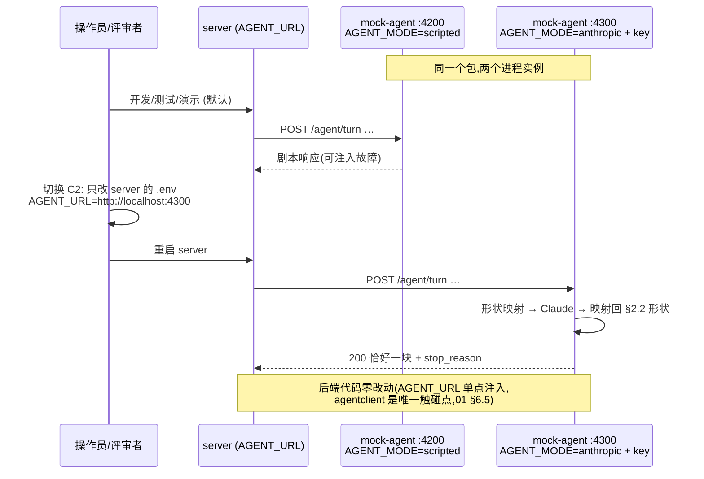

# 12 · mock-agent 服务设计（单包双 provider）

> 覆盖：§2.2 Agent 服务契约的模拟（mock-agent 包）与 C2 真实 LLM 接入。
> 定位：mock-agent 是**一等交付物**（[analysis/00-overview.md](../analysis/00-overview.md) 考点：契约即验收基准），不是一次性脚手架；它同时是后端 A5 开发的依赖项（实现顺序先行）。

## 1. 为什么必须是「模拟器 + 真实 LLM」双形态（rationale）

1. **可演示**：交付物是 public repo，评审者没有 LLM key——没有确定性模拟器，agent 相关的一切（A5、S5/S6、页面 3/4）都不可演示。
2. **可复现**：S5/S6 与 §2.2「可能出现的（恶劣）行为」清单要求**按需、确定性**复现；真实 LLM 靠 prompt 诱导坏行为不可复现，测试会 flaky。
3. **可测试**：后端 Vitest 必须离线、确定性运行（AGENTS.md §4：测试连真实 Postgres，但外部服务在测试中以可控形态驱动）。

## 2. 架构：一个包、一个 HTTP 契约层、两个 provider

`mock-agent/`（包名保持 AGENTS.md 现名）内只有**一个 HTTP 契约层**，按 `AGENT_MODE` 选择 provider：

- **无 DB、无状态**：进程内仅有 scripted 的剧本游标（`Map<runId, 游标>`，重启清零——mock 可接受，后端不依赖其状态）。
- **类型共享**：§2.2 协议形状类型在 workspace 内共享，server 的 `agentclient` 与两个 provider 用同一份类型——「一个块 / stop_reason 一致 / tool_result 在 user 消息」等形状约束编译期锁定（对应 [06](06-agent-module.md) §12 风险 1 的共享类型方案）。

### 2.1 无状态全量历史规约（承接 [06](06-agent-module.md) §12 评审结论）

两个 provider 都必须遵守：

- **响应只由请求里的 `messages` 决定，不得把「收到几次请求」当对话轮次**——不存在「重复请求会把会话推进两次」的增量状态，`runId` 只是会话键；
- **同 runId + 相同 messages 的重复请求（后端崩溃恢复重发）→ 返回新响应**，按正常校验处理；
- scripted 的剧本按 `(runId, 调用序号)` 推进故障序列是它的**测试功能本体**（如 S6 三连），不违反本规约：每个剧本项都是「对当前请求历史的合法下一步响应」（或显式的坏响应注入），绝不因「请求重复」而改变对同一历史的响应语义；
- anthropic provider 天然满足（Anthropic Messages API 本身无状态，历史在请求里）。

## 3. `providers/scripted.ts` — 确定性剧本引擎（默认形态）

- **剧本（scenario）**：有序步骤列表，每步为「响应模板」（合法 tool_use / end_turn / finish）或「故障注入」（§7 清单中的任一开关形态）；按 `(runId, 调用序号)` 推进，剧本播完后回落到默认行为（合理 agent：`get_recent_messages → send_message → finish`）。
- **开关集**：环境变量 / 进程内 HTTP 管理端点（mock 包内部端点，如 `POST /_test/scenario`）设定——测试用例在 arrange 阶段装剧本、断言后端行为，实现「离线、确定性」。
- **`/agent/audit` 的 scripted 行为**：确定性 `pass` / `fail` / 坏响应开关（500、非 JSON、缺 `verdict`、`verdict` 为别的值、慢、不返回），覆盖契约全部故障形态。
- **用途**：开发、测试（后端 Vitest 的 A5/S5/S6 用例）、演示默认形态；无 key 开箱即用。

## 4. `providers/anthropic.ts` — C2 真实 LLM（Claude）

- `@anthropic-ai/sdk` 透传：§2.2 协议本就是 Anthropic Messages tool-use 形状，**进出各做一次形状映射**：
  - 请求方向：`messages`（块数组）→ SDK `messages.create` 参数（近同构，`tools` → SDK tools 格式，触发上下文 text 原样作为首条 user 消息）；
  - 响应方向：SDK 返回的 content 块可能多个 → 取首个有效块并强制「恰好一个块」形状（多块时截取第一个 tool_use / text，其余丢弃——保证我方契约形状）；`stop_reason` 映射（`tool_use → tool_use`，`end_turn → end_turn`，其余映射为 `end_turn` + text 兜底块）。
- **`/agent/audit` 的 anthropic 行为**：judge prompt——让模型只输出 `{ "verdict": "pass"|"fail", "reason": "…" }` 的 JSON；严格校验输出，**解析失败/非约定值 → 返回 500**（落在契约「拿不到明确结论」的故障形态上，后端 06 §8.1 的无结论路径因此也被真实测到）。
- **Claude 优先、不做 Gemini**：Gemini function calling 形状不同，需要额外适配层，48h 内不值得（取舍记录）。

## 5. C2「独立服务」语义与部署视图

同一包以不同 env 起两个实例：scripted 实例（开发/测试/演示，如 `:4200`）与 anthropic 实例（C2 演示，如 `:4300`）；**后端只改 `AGENT_URL` 即可切换**（契约要求，[01](01-architecture.md) §6.5 边界的落点）：

## 6. env 矩阵与技术栈

| 变量 | 必填 | 默认 | 说明 |
|---|---|---|---|
| `PORT` | 是 | — | HTTP 监听端口（默认实例 `:4200`） |
| `AGENT_MODE` | 否 | `scripted` | `scripted` \| `anthropic` |
| `ANTHROPIC_API_KEY` | anthropic 模式必填 | — | **只进本地 `.env`，绝不提交**（public repo；`.gitignore` + `.env.example` 双保险） |
| `LLM_MODEL` | 否 | `claude-sonnet-4-5`【设计值】 | anthropic 模式的模型 id |

技术栈：Node ≥ 22 + TypeScript strict；HTTP 框架与 server 包相同（Fastify）；`@anthropic-ai/sdk`；pnpm workspace 包。

## 7. 故障开关清单（契约行为 ↔ 后端防御分支映射表）

这张表同时是 **mock 实现的 spec** 与**后端测试用例的 checklist**。逐条覆盖 §2.2「可能出现的（恶劣）行为」全部条目、audit 故障形态、S5/S6 场景与恢复规约；正常路径（合法 tool_use / end_turn / finish / audit pass）由默认剧本覆盖，不列开关。

| # | 开关（命名进代码） | 注入的契约行为 | 契约出处 | 后端防御分支 |
|---|---|---|---|---|
| 1 | `bad_json_raw` | 响应体不是合法 JSON | §2.2 行为 1 | [06](06-agent-module.md) §4 路径 B（`BAD_JSON`） |
| 2 | `bad_json_fenced` | 合法 JSON 外套 markdown 代码围栏 | §2.2 行为 1 | 同上 |
| 3 | `bad_json_wrapped` | JSON 前后夹一段文字 | §2.2 行为 1 | 同上 |
| 4 | `shape_invalid` | JSON 合法但形状不符（缺 `stop_reason` / 块数 ≠ 1 / `stop_reason` 与块类型不一致） | §2.2 §2（BAD_JSON 第三层） | 同上 |
| 5 | `unknown_tool` | 调用不在 `tools` 里的工具 | §2.2 行为 2 | [06](06-agent-module.md) §4 路径 A（`UNKNOWN_TOOL`） |
| 6 | `invalid_input` | 入参不符合 `input_schema` | §2.2 行为 2 | [06](06-agent-module.md) §4 路径 A（`INVALID_INPUT`） |
| 7 | `duplicate_tool_use_id` | 同一 `tool_use.id` 用两次（重试用新 id 是合法行为，本开关测非法路径） | §2.2 行为 3 | [06](06-agent-module.md) §4（UNIQUE 检测 → 路径 B `DUPLICATE_TOOL_USE_ID`） |
| 8 | `send_timeout_key_retry` | 拿到 `send_message` 结果后（尤其 `SEND_TIMEOUT`）用同一 `idempotency_key` 再调一次 | §2.2 行为 4 / S5 | [06](06-agent-module.md) §8.2（幂等命中：不再发送不再审计，返回当前状态） |
| 9 | `endless_tools` | 一直调工具不结束 | §2.2 行为 5 | [06](06-agent-module.md) §5（12 步 / 60s 预算终结） |
| 10 | `repeat_get_recent` | 连续多次同样入参调 `get_recent_messages` | §2.2 行为 5 | [06](06-agent-module.md) §7.1（正常执行 + 预算兜底） |
| 11 | `huge_limit` | `get_recent_messages { limit: 100000 }` | §2.2 行为 6 | [06](06-agent-module.md) §7.1（钳制 50） |
| 12 | `slow_turn` | 响应慢（约 8s，可配时长） | §2.2 行为 7 | [06](06-agent-module.md) §5（turn 超时 10–15s 可配 → 正常或 `TURN_TIMEOUT` 视配置） |
| 13 | `hang_turn` | 一直不返回 | §2.2 行为 7 | [06](06-agent-module.md) §4（`TURN_TIMEOUT` 计协议错误；迟到响应丢弃） |
| 14 | `audit_500` | audit 返回 500 | §2.2 行为 8 | [06](06-agent-module.md) §8.1（无结论重试，≤3 次） |
| 15 | `audit_bad_body` | audit 200 但 body 非 JSON / 缺 `verdict` / `verdict` 为别的值 | §2.2 行为 8 | 同上（3 次无结论 → §8.3 `blocked`） |
| 16 | `audit_slow` / `audit_hang` | audit 响应慢 / 不返回 | §2.2 行为 8 | 同上（耗时计入 60s 墙钟） |
| 17 | `s6_sequence` | 剧本三连：坏 JSON → 未知工具 → 正常结束 | S6 | [06](06-agent-module.md) §4（run 以 `final`/`budget_exhausted`/`protocol_errors` 之一结束，服务不崩，每步有 `kind`/`rawResponse`） |
| 18 | `same_runid_redispatch` | 同 runId 相同 messages 的重复请求 → 返回新响应（恢复重发场景） | §2.2 §1（runId 会话键）+ [06](06-agent-module.md) §12 规约 | [06](06-agent-module.md) §9.1 REDISPATCH（重发同轮、按正常校验处理、会话不错位） |
| 19 | `tools_invalid_probe` | 收到不合规 `tools`（数量 ≠ 4 / required 不全覆盖）→ 400 `TOOLS_INVALID` | §2.2 §1 | [06](06-agent-module.md) §6（后端 tools 常量保证永不触发；本开关反测后端常量正确性） |

> `audit_slow` / `audit_hang` 在 scripted 中为确定性时长（如 6s / 永不返回）；anthropic 模式不提供故障开关（真实服务，坏行为靠 scripted 复现）。

## 8. 与 server 包的关系边界

- server 经 `agentclient`（[01](01-architecture.md) §6.5）以 §2.2 契约访问本服务，**不感知 provider 差异**；
- 后端 Vitest 的 A5 / S5 / S6 用例：起 scripted 实例（或进程内直接装配 provider）+ 故障开关，断言 run 状态、steps 与消息唯一性；
- 本包不做任何业务决策（账号选择、审计门禁、幂等都在 server——mock 只按契约响应）；
- gateway mock（mock-gateway）的设计不在本文范围。

## 9. 实现顺序与验收

1. `scripted` 默认剧本（合理 agent 三步）→ 后端 A5 主循环开发先行依赖；
2. §7 开关 1–19 逐个落地，每个开关对应后端至少一个 Vitest 用例（映射表即 checklist）；
3. `anthropic` provider（C2）：形状映射 + judge prompt，`AGENT_MODE=anthropic` 起独立实例演示「只改 `AGENT_URL`」切换；
4. 验收：S5、S6 在 scripted 下确定性复现；C2 演示脚本（README）：起双实例 → 改 env → 重启 server → 同一前端页面观察真实 LLM run。
