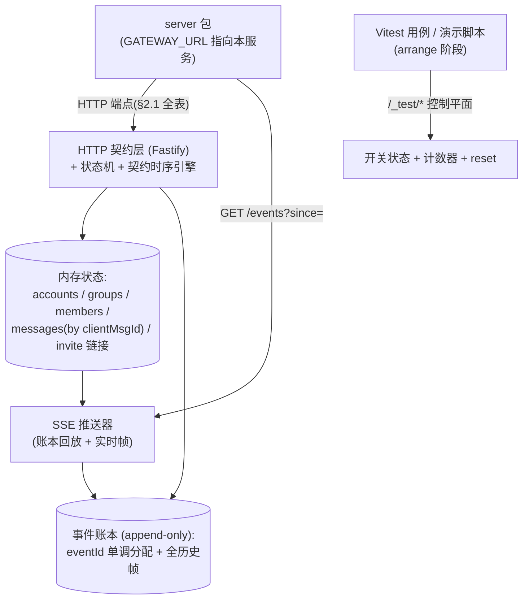

# 14 · mock-gateway 服务设计（消息网关模拟）

> 覆盖：§2.1 网关契约的模拟（mock-gateway 包）——契约重述见 [analysis/02-gateway-contract.md](../analysis/02-gateway-contract.md)，本文只写**实现设计**。
> 定位：与 [12-agent-service.md](12-agent-service.md) 对称的另一半「契约即验收基准」——S1–S8 中 S1–S5 的外部表现全部由它驱动（S6 归 mock-agent，S7/S8 由后端自身保证、用它**计数验证**）；后端 A2/A3/B2 的集成测试全部依赖它的故障开关保真度（G1，审查报告 §2.1）。
> 红线（宪法 §3-8）：**禁止为了让测试变绿而弱化本文件的任何契约行为**。

## 1. 架构：单进程、内存状态、事件账本、`/_test` 控制平面

- **无 DB、无持久化**：全部状态在内存（`Map`），`/_test/reset` 一键清空——mock 的可重置性就是它的测试价值。
- **事件账本 append-only**：每条推送给任何消费者的帧都先入账本（`eventId` + `type` + `data`）；SSE 连接 = 「按 `since` 回放账本 + 订阅实时帧」，天然满足「保留全部历史 + `since` 独占语义补拉」。
- **`eventId` 分配器进程生命周期单调、跨 reset 不复用**（关键坑）：`/_test/reset` 清空业务状态与账本内容，但**不回退 eventId 计数器**（可显式传 `{ startEventId }` 抬高）。否则 reset 后新事件携带小 id，与 server 侧 `gateway_event` 账本 PK / 连续前缀游标（[08](08-realtime-module.md) §1.3）相撞——server 会把新事件当重复吸收或落在游标之前，测试静默失真。集成测试约定：reset mock 的同时重建 server 测试库（每用例独立库本来就是 Vitest 基建）。

## 2. 状态模型（内存）

| 实体 | 字段 | 契约语义来源 |
|---|---|---|
| account | `accountId → { platformUserId(确定性派生,同 id 恒同值), online, suspended, sessionExpired, rateLimitedUntil? }` | §2.1「同 accountId 每次 connect 返回同一 platformUserId」；suspended/session_expired 后**所有请求**回同码 |
| group | `groupId → { creator, members: Set<puid>, writeForbidden, invite?: { link, readyAt, expireAt? } }` | 建群即含 creator；解散/禁言开关置 `writeForbidden` |
| message | `clientMsgId → { groupId, senderPuid, msgId, text, sentAt, landed }` | **网关不按 clientMsgId 去重**——同 id 两条是两条落地记录（by-client-id 返回最早一条，契约 §2.1） |
| 账本帧 | `{ eventId, type, data, emittedAt }` | at-least-once / 乱序 ≤1s / 补投由推送器按开关修饰后投递 |

`POST /groups` 的网关群 id 与外部用户成员（供 `external_member_events` 开关）由 mock 自造（`gw-<seq>` / `ext-<seq>`）。

## 3. 契约时序引擎（数字照抄，全部可配为固定值保确定性）

默认在契约区间内**随机**（贴近真实），`/_test/scenario` 可钉死为定值：

| 行为 | 契约值 | 实现要点 |
|---|---|---|
| send 202 延迟 | 1–2s | 定时器后回 202；开关 `send_accept_slow` 可钉值 |
| `message_sent` 推送 | 50–2000ms | 落地即分配 msgId/sentAt、入账本 |
| 504 后落地 | 已被接收则 **2s 内**落地并推事件；S5 编排为 **1.5s** | `send_504_land_1500` |
| kick 响应 | 1–5s；504 后成员列表 **2s 内收敛** | 收敛=无论响应如何，2s 后成员列表反映真值（踢出与否独立可配） |
| join → `member_joined` | 100–1500ms，**或永不到** | `member_joined_delay` / `member_joined_never` |
| invite | `readyAfterMs` 0 或数秒；链接任意时刻可过期 | `invite_not_ready` / `invite_expired` |
| 乱序窗口 | 相邻事件 ≤1s | 推送器对相邻帧按开关交换投递顺序 |
| 补投 | eventId 新、msgId/sentAt 原值，不受窗口限制 | `offline_backlog`：断开 SSE 后产生的帧在重连回放时全部重发 |

## 4. `/_test` 控制平面（测试 arrange 的唯一入口）

| 端点 | 作用 |
|---|---|
| `POST /_test/scenario { switch, params? , target? }` | 打开开关（`target` 指定账号/群/clientMsgId；`params` 钉死时序值）；同一开关重复调用=覆盖参数 |
| `POST /_test/scenario/clear { switch? }` | 关闭指定/全部开关 |
| `POST /_test/reset { startEventId? }` | 清空业务状态+账本（eventId 计数器不回退，§1）；重置计数器 |
| `GET /_test/counters` | **验收断言的真值来源**：`sendCallsByAccount`（S4：限流期内=0）、`sendCallsByClientMsgId`（S5：恰好 1）、`landedMessages`（S8：0）、`kickCalls`、`framesEmitted` |
| `POST /_test/emit { type, data }` | 手动注入事件（如 `account_status`、外部成员 `member_joined`）——只入账本，走正常 SSE 投放 |

## 5. 故障开关清单（契约行为 ↔ 后端防御分支映射表）

与 [12](12-agent-service.md) §7 同构：本表是 **mock 实现的 spec** 与**后端测试用例的 checklist**（汇总进 [server/VITEST_PLAN.md](../../server/VITEST_PLAN.md)）。正常路径（202/200/事件按区间推送）由默认行为覆盖，不列开关。

| # | 开关 | 注入的契约行为 | 契约出处 | 后端防御分支 | 场景 |
|---|---|---|---|---|---|
| 1 | `send_accept_slow` | send 202 延迟 1–2s（可钉值） | §2.1 | dispatcher send 超时 8s 内等待 | S1 |
| 2 | `message_sent_delay` | `message_sent` 延迟（区间或钉值） | §2.1 | accepted→sent 流转 + WS 原地更新 | S1 |
| 3 | `dup_push_all` | **每个事件推两次** | §2.1 / S2 | `gateway_event` PK、`(groupId,msgId)` 唯一、agent 触发幂等（[08](08-realtime-module.md) §1.2 / [05](05-messaging-module.md) §3/§4.4） | S2 |
| 4 | `reorder_1s` | 相邻事件乱序 ≤1s（含 `message` 先于 `message_sent`） | §2.1 | 连续前缀游标（[08](08-realtime-module.md) §1.3）+ `finalizeSent` 合并（[05](05-messaging-module.md) §4.3，D1-3） | — |
| 5 | `offline_backlog` | 断线期间事件补投（sentAt 原值任意早） | §2.1 | keyset 排序 + 去重（[05](05-messaging-module.md) §3/§5） | — |
| 6 | `rate_limit` | send → `429 { retryAfterSeconds }`；**期内任何 send 再 429 且计时重置** | §2.1 / A2 | 限流硬闸门（[03](03-account-module.md) §5）；counters 断言零试探 | S4 |
| 7 | `send_504_land_1500` | 第一次 send → 504，**1.5s 后落地**并推 `message_sent` | §2.1 / S5 | unknown 判定（[05](05-messaging-module.md) §2.4） | S5 |
| 8 | `send_504_not_sent` | send → 504 且确实未发出（by-client-id 恒 404） | §2.1 | 判定器「确认未发出→重发一次」（resend_count≤1） | — |
| 9 | `by_client_id_503` | by-client-id → 503（可配恢复时刻） | §2.1 | unknown 保持、恢复后 2s 内落定 | — |
| 10 | `gateway_503_all` | 所有端点 503（可配时长） | §2.1 | 出站/连接退避重试 | — |
| 11 | `account_suspended_403` | 指定账号所有请求 → 403 ACCOUNT_SUSPENDED | §2.1 | 终态原子副作用（[03](03-account-module.md) §4） | — |
| 12 | `session_expired_401` | 指定账号所有请求 → 401 SESSION_EXPIRED | §2.1 | 同上 | — |
| 13 | `account_status_event` | 推 `account_status` + **自动移出所有群**并逐群推 `member_left` | §2.1 | 事件路径终态入口（[03](03-account-module.md) §1/§4） | — |
| 14 | `group_write_forbidden` | 指定群 send → 403 GROUP_WRITE_FORBIDDEN（解散/禁言） | §2.1 / A2 | 群 unreachable 级联（[04](04-group-module.md) §1） | — |
| 15 | `message_failed_event` | 推 `message_failed`（code 可配） | §2.1 | accepted→failed 与按码分流（[05](05-messaging-module.md) §2.5） | — |
| 16 | `sender_not_in_group` | send → 403 SENDER_NOT_IN_GROUP | §2.1 | 该条 failed 同名码 | — |
| 17 | `account_offline_409` | 未 connect/已 disconnect 账号操作 → 409 ACCOUNT_OFFLINE | §2.1 | 各调用方错误分支（send/join/promote/kick/leave） | — |
| 18 | `member_joined_never` | join 202 但 `member_joined` 永不到 | §2.1 | JOIN_TIMEOUT 10s（[04](04-group-module.md) §2.2） | — |
| 19 | `member_joined_delay` | `member_joined` 延迟 100–1500ms（可钉值） | §2.1 | 建群等待与成员投影 | — |
| 20 | `invite_not_ready` | invite `readyAfterMs>0`；就绪前 join → 409 INVITE_NOT_READY | §2.1 / B2 | 等待后重试（[04](04-group-module.md) §2.2） | — |
| 21 | `invite_expired` | join → 410 INVITE_EXPIRED | B2 | 重申链接仅一次 | — |
| 22 | `already_member` | 已在群账号 join → 409 ALREADY_MEMBER 且**不推事件** | §2.1 / B2 | job 事务 UPSERT 成员行（[04](04-group-module.md) §2.2，D2-2） | — |
| 23 | `promote_not_member_yet` | promote → 409 NOT_MEMBER_YET（可配出现次数） | A2 | 重试、总调用 ≤2（[04](04-group-module.md) §2.2） | — |
| 24 | `kick_slow` / `kick_504` | kick 响应 1–5s（可钉值）/ 504；504 后成员列表 2s 内收敛，「实际是否踢出」独立可配 | §2.1 | kick 判定（[06](06-agent-module.md) §8.5） | — |
| 25 | `owner_left_on_kick` / `kick_no_permission` | kick → 409 OWNER_LEFT / 403 NO_PERMISSION | §2.1 / A2 | 同名码透传（表内码，X-1） | — |
| 26 | `leave_500` | leave → 500（没退成） | §2.1 / B2 | leave-all `errors[]`、群主不退（[04](04-group-module.md) §3.2） | — |
| 27 | `media_message` / `media_expire_404` | `message` 带 `mediaUrl`；`GET /media/:id` 过期 404 | §2.1 / C1 | C1 下载、`media_expired` inconsistency（[05](05-messaging-module.md) §7） | — |
| 28 | `external_member_events` | 外部用户（非服务账号）进出群推成员事件 | §2.1 | 不建行分流（[04](04-group-module.md) §4） | — |

> S3（自己消息回流）不是开关——契约明文「网关不区分消息来自谁」，是**默认行为**：任何落地消息都推 `message` 事件（含服务账号发出的），后端靠 [05](05-messaging-module.md) §3/§4.4 合并与不触发。S6 归 mock-agent（[12](12-agent-service.md) §7-17）；S7/S8 是后端自身行为，本服务只提供 counters 做「网关零收到」断言。

## 6. env 与技术栈

| 变量 | 必填 | 默认 | 说明 |
|---|---|---|---|
| `PORT` | 是 | — | 默认实例 `:4100`（AGENTS.md 端口约定） |
| `GATEWAY_SEED_ACCOUNTS` | 否 | `acc-01,acc-02,acc-03,acc-04` | 预置账号 id（与 server seed 对齐） |

技术栈：Node ≥ 22 + TypeScript strict + Fastify（与 server/mock-agent 同栈）；SSE 用原生 `text/event-stream` 写帧；无 DB、无外部依赖。

## 7. 与 server 包的关系边界

- server 经 `gateway/` client（[01](01-architecture.md) §6.5）访问本服务，不感知开关存在；
- 后端 Vitest：每用例 arrange 阶段 `POST /_test/scenario` 装开关 + 断言后从 `GET /_test/counters` 读计数；**mock 进程可以是测试内起的子进程**（或 workspace 内直接 import 装配，与 mock-agent 的 scripted 同法）；
- 本包不做任何业务决策（重发控制、幂等、限流回避全在 server——mock 只按契约响应与计数）；
- mock-agent 的设计见 [12](12-agent-service.md)，两包互不依赖。

## 8. 实现顺序与验收

1. 正常路径：connect/disconnect 幂等、建群、invite/join/`member_joined`（区间延迟）、send 202→`message_sent`、SSE 全历史回放（`since` 独占）——P1 阶段交付，后端 A2 入站联调的前提；
2. 开关 1–3、6、7（S1/S2/S4/S5 的直接驱动）——P2/P3/P4 阶段随对应后端模块落地；
3. 其余开关随 VITEST_PLAN 的用例推进逐个补齐，每个开关对应后端至少一个用例（映射表即 checklist）；
4. 验收：`pnpm demo:s1` … `pnpm demo:s8` 每场景一条命令可复现（依赖本包开关 + counters；见交付层 README 规划）。
